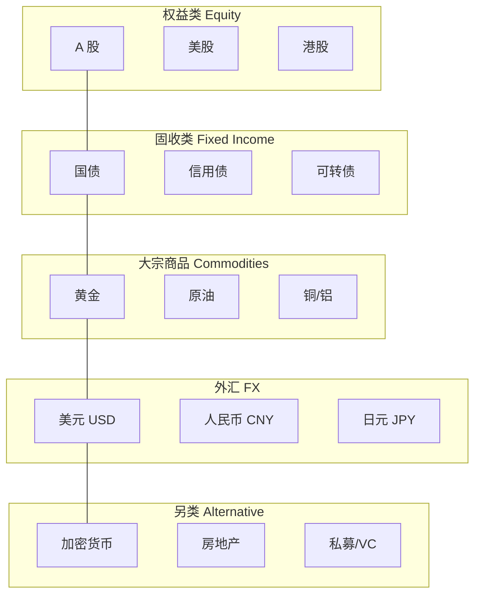

# 💰 资产研究 | Asset Research

> 核心目标：深入理解每类资产的本质、驱动因素、估值方法和风险特征。

---

## 资产类别全景

---

## 各资产核心特征

| 资产 | 本质 | 收益来源 | 主要风险 | 与利率关系 |
|------|------|----------|----------|-----------|
| 股票 | 公司所有权 | 盈利增长 + 估值扩张 | 业绩、情绪 | 负相关 |
| 债券 | 借条 | 票息 + 价差 | 利率、信用 | 强负相关 |
| 黄金 | 货币替代品 | 避险 + 抗通胀 | 实际利率 | 负相关 |
| 原油 | 工业血液 | 供需缺口 | 地缘、替代 | 弱相关 |
| 美元 | 全球储备货币 | 利差 + 避险 | 去美元化 | 正相关 |
| BTC | 数字黄金/风险资产 | 叙事 + 流动性 | 监管、技术 | 负相关 |
| 房地产 | 土地 + 建筑 | 租金 + 增值 | 利率、政策 | 负相关 |

---

## 模块导航

| 目录 | 内容 | 关键问题 |
|------|------|----------|
| [a-shares/](./a-shares/) | A 股市场 | 政策市如何生存？ |
| [us-stocks/](./us-stocks/) | 美股市场 | 为什么长期向上？ |
| [hk-shares/](./hk-shares/) | 港股市场 | 为什么总是"价值陷阱"？ |
| [bonds/](./bonds/) | 债券市场 | 利率怎么影响债券价格？ |
| [commodities/](./commodities/) | 大宗商品 | 供需分析框架 |
| [commodities/gold/](./commodities/gold/) | 黄金专题 | 黄金到底在定价什么？ |
| [fx/](./fx/) | 外汇市场 | 汇率由什么决定？ |
| [crypto/](./crypto/) | 加密货币 | BTC 的价值锚在哪？ |
| [real-estate/](./real-estate/) | 房地产 | 中国房地产周期走到哪了？ |

---

## 跨资产思维

学习单个资产是基础，但真正的能力是**理解资产之间的关联**：

- 美债收益率上升 → 股票估值承压 → 但银行股受益
- 美元走强 → 黄金承压 → 新兴市场资金外流
- 油价上涨 → 通胀预期上升 → 加息预期升温

详见 → [全球经济关联分析](../04-global-economy/connections/)

---

## 研究模板

每个资产的研究笔记建议包含：

1. **本质**：这个资产到底是什么？
2. **驱动因素**：什么决定它的价格？
3. **估值方法**：怎么判断贵不贵？
4. **风险特征**：最大的风险是什么？
5. **与其他资产的关系**：和谁正相关？和谁负相关？
6. **当前状态**：现在处于什么位置？
