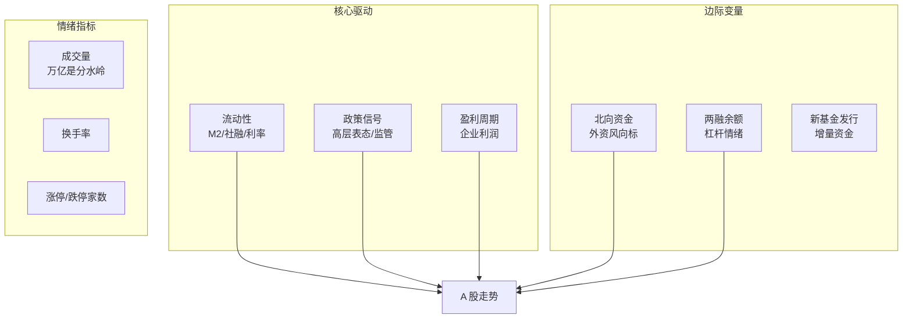
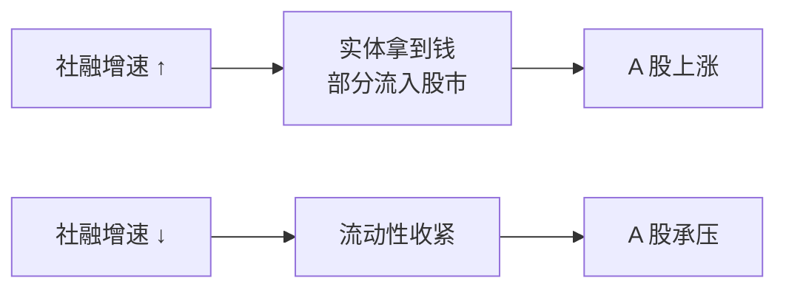
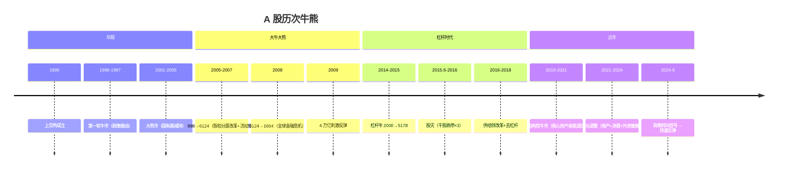
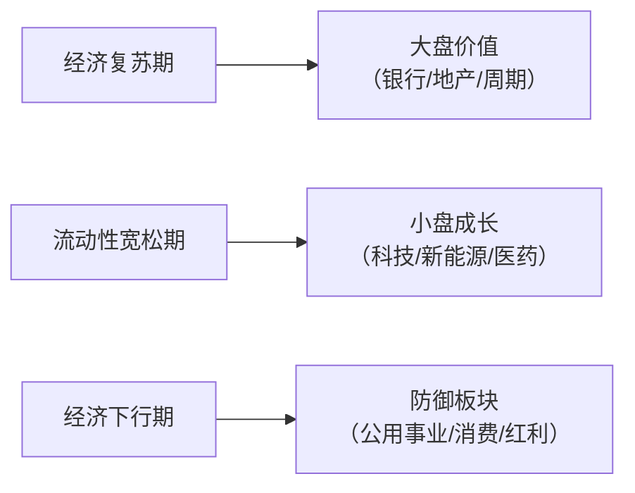
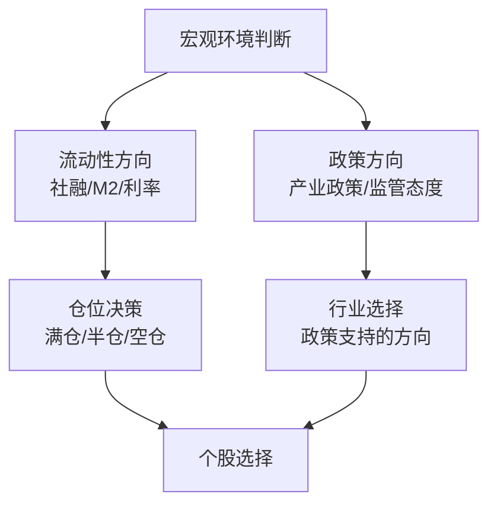

# 🇨🇳 A 股市场 | China A-Shares

`🟡 进阶`

> 核心问题：A 股为什么"牛短熊长"？散户如何在政策市中生存？

---

## 一句话总结

**A 股 = 政策驱动 + 散户博弈 + 流动性主导。理解政策意图比看财报更重要。**

---

## A 股的独特性

```mermaid
graph TB
    A[A 股特征] --> B[散户占比高<br/>交易量 ~60-70%]
    A --> C[政策影响大<br/>"政策底"→"市场底"]
    A --> D[牛短熊长<br/>暴涨暴跌]
    A --> E[板块轮动快<br/>主题炒作盛行]
    A --> F[与经济基本面<br/>相关性弱于美股]
    A --> G[流动性驱动<br/>M2/社融是领先指标]
```

### A 股 vs 美股：为什么走势差异这么大？

| 维度 | A 股 | 美股 |
|------|------|------|
| 投资者结构 | 散户主导 | 机构主导 |
| 上市制度 | 注册制（2023 全面） | 注册制（成熟） |
| 退市制度 | 不完善（壳价值） | 严格（优胜劣汰） |
| 做空机制 | 弱（融券难） | 强 |
| 分红文化 | 弱（在改善） | 强 |
| 回购 | 少 | 大量（支撑股价） |
| 衍生品 | 少 | 丰富 |
| 外资占比 | ~5% | 全球资金 |

---

## A 股的驱动因素



### 流动性是 A 股的命脉



> 📊 经验规律：**社融增速拐点领先 A 股约 1-2 个季度**。

---

## A 股的周期与历史



---

## A 股的主要指数

| 指数 | 代码 | 覆盖 | 特点 |
|------|------|------|------|
| 上证指数 | 000001 | 上交所全部 | 失真（大权重股拖累） |
| 沪深 300 | 000300 | 沪深最大 300 只 | A 股核心资产 |
| 中证 500 | 000905 | 中盘股 | 成长性更强 |
| 中证 1000 | 000852 | 小盘股 | 高波动 |
| 创业板指 | 399006 | 创业板前 100 | 科技/成长 |
| 科创 50 | 000688 | 科创板前 50 | 硬科技 |

### 风格轮动



---

## A 股投资框架

### 自上而下



### 关键信号

| 信号 | 含义 | 操作参考 |
|------|------|----------|
| 社融连续回升 | 流动性改善 | 逐步加仓 |
| 高层喊话"提振信心" | 政策底出现 | 关注但不急 |
| 成交量持续 >1.5 万亿 | 赚钱效应扩散 | 牛市中期 |
| 新基金爆款频出 | 散户大量入场 | 牛市后期，警惕 |
| 社融增速见顶回落 | 流动性拐点 | 逐步减仓 |
| IPO 加速 + 减持潮 | 供给压力 | 谨慎 |

---

## 北向资金（外资）

```mermaid
graph TB
    A[北向资金] --> B[通过沪港通/深港通<br/>进入 A 股的外资]
    A --> C[被称为"聪明钱"<br/>但近年有效性下降]
    A --> D[主要买：<br/>消费/金融/新能源龙头]
    A --> E[影响因素：<br/>美元/中美利差/地缘]
```

---

## 核心概念速查

| 术语 | 英文 | 一句话解释 |
|------|------|-----------|
| 北向资金 | Northbound Flow | 外资通过港股通买 A 股 |
| 两融 | Margin Trading | 融资（借钱买）+ 融券（借股卖） |
| 涨跌停 | Price Limit | 单日最大涨跌幅限制 |
| 注册制 | Registration System | 企业满足条件即可上市 |
| 社融 | Total Social Financing | 实体经济获得的全部融资 |
| 政策底 | Policy Bottom | 政策开始转向支持的时点 |
| 市场底 | Market Bottom | 股价真正见底（通常滞后政策底） |
| 壳价值 | Shell Value | 上市资格本身的价值（退市少导致） |

---

## 延伸思考

1. A 股能走出"慢牛"吗？需要什么条件？
2. 注册制 + 退市常态化会如何改变 A 股生态？
3. 外资占比提升对 A 股定价体系的影响？
4. 为什么 A 股总是"满仓踏空，空仓暴跌"？

---

## 相关链接

- [股票基础](../../00-foundations/level-1-beginner/04-stocks-101.md)
- [中国经济](../../04-global-economy/china/)
- [全球经济关联](../../04-global-economy/connections/)
- [估值方法](../../02-methodology/valuation/)
