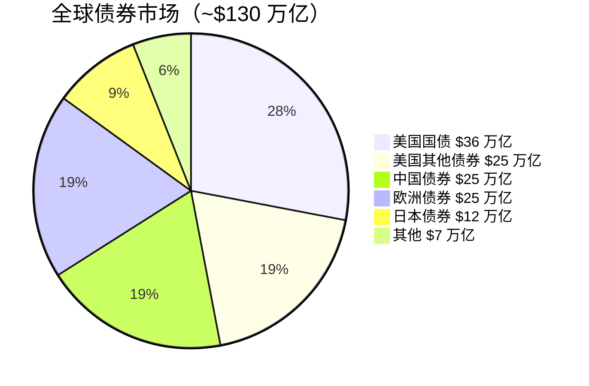
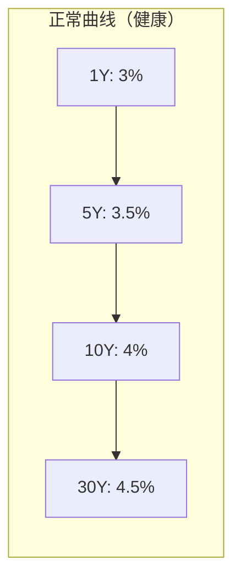
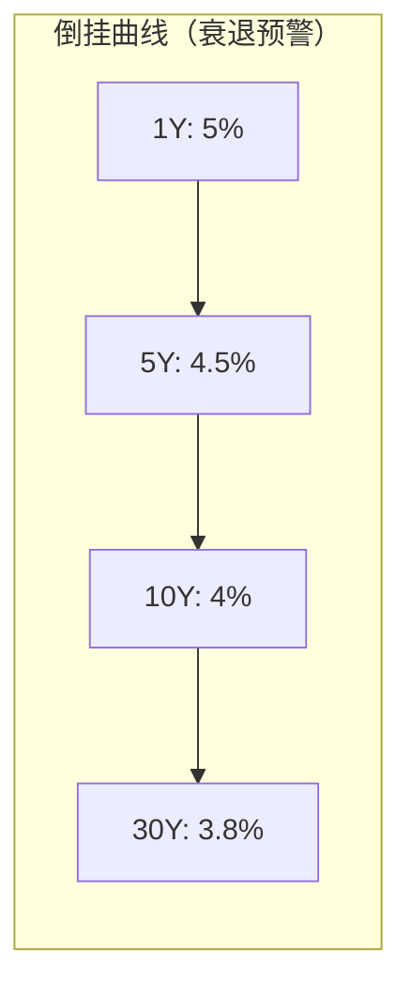
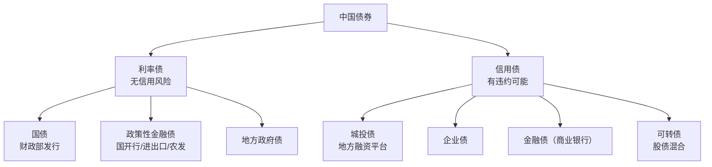
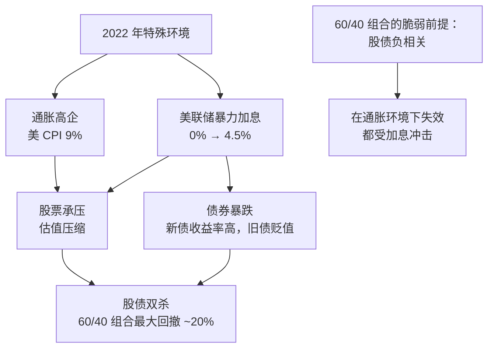
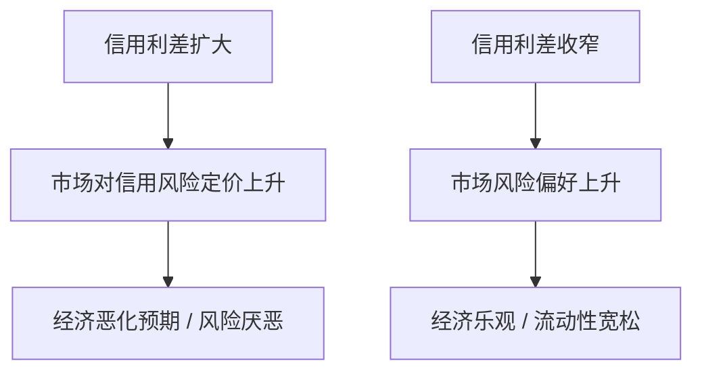
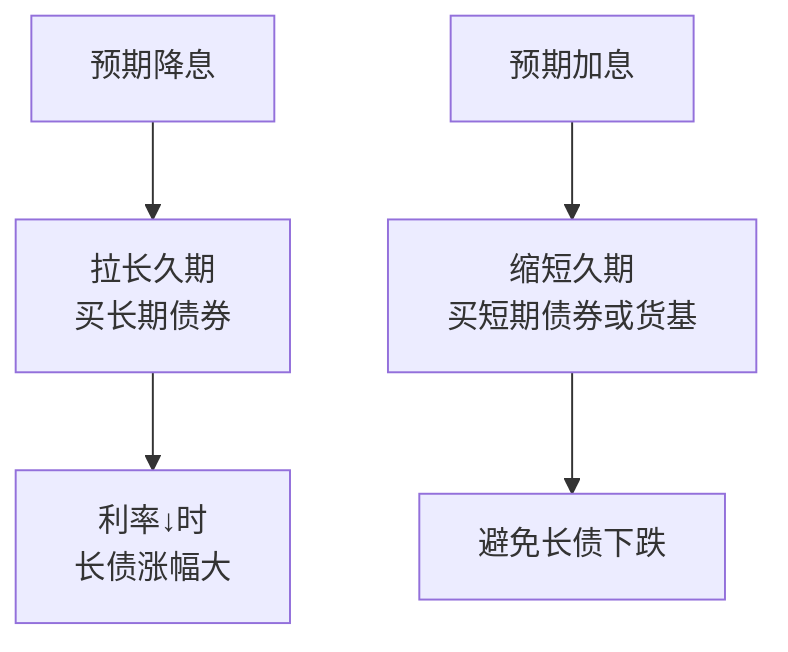
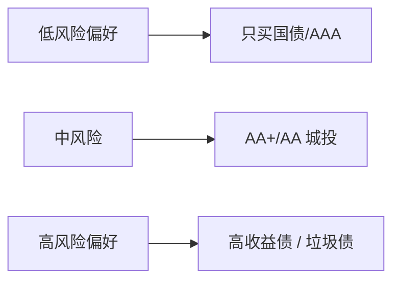
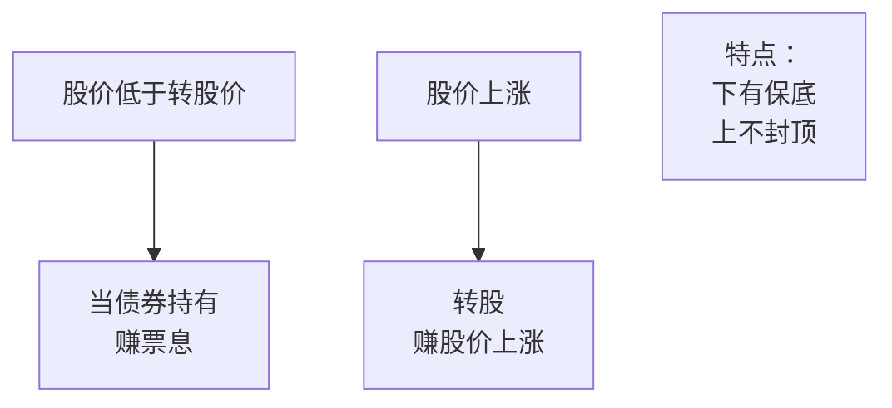
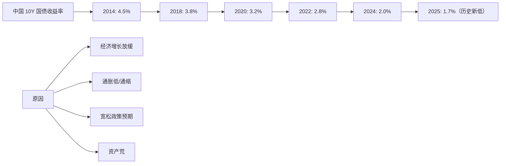

# 📄 债券市场 | Bond Market

`🟡 进阶`

> 核心问题：债券到底怎么交易？为什么 2022 年股债双杀？怎么用债券做配置？

---

## 一句话总结

**债券市场比股票市场大得多，是金融体系的"地基"。理解债券，就理解了利率，就理解了所有资产的定价基础。**

---

## 全球债券市场规模



> 📊 全球股票市场 ~$110 万亿，债券市场 ~$130 万亿。**债券市场比股市更大、更"聪明"**——所谓"债市永远是对的"。

---

## 收益率曲线 | Yield Curve

### 正常 vs 倒挂





### 收益率曲线的关键信号

| 形态 | 含义 | 历史案例 |
|------|------|----------|
| 陡峭化（长端>短端，差距大） | 经济复苏预期 | 2009、2020 |
| 平坦化 | 经济见顶 | 2018、2022 |
| 倒挂（短>长） | 衰退预警 | 2007、2019、2022-2024 |
| 陡峭化（衰退后） | 降息周期开始 | 2024 后期 |

---

## 中国债券市场



### 中国债券收益率参考（2025）

| 品种 | 收益率 |
|------|--------|
| 国债 1Y | ~1.4% |
| 国债 10Y | ~2.0% |
| 国债 30Y | ~2.3% |
| AAA 企业债 5Y | +50bp（vs 国债） |
| AA 城投债 3Y | +100-200bp |

> 💡 中国 10Y 国债收益率创历史新低，说明市场对长期经济和通胀预期偏悲观。

---

## 2022 年股债双杀：为什么？



> 💡 这就是为什么有人开始讨论"60/30/10"（股/债/商品）的新均衡。

---

## 信用利差 (Credit Spread)

```
信用利差 = 信用债收益率 - 国债收益率（同期限）
```



历史关键节点：
- 2008 金融危机：美国高收益债利差飙升至 20%+
- 2020 疫情：高收益债利差短期飙升至 11%
- 2022 加息：利差扩大但未到危机级
- 平时：高收益债利差 3-5%

---

## 债券投资策略

### 1. 久期管理



### 2. 信用下沉



### 3. 可转债策略

可转债 = 债券底（保本）+ 转股权（弹性）



---

## 中国债券的特殊问题

### 1. 城投债：刚兑信仰打破？

```mermaid
graph TB
    A[城投债] --> B[地方融资平台发行]
    A --> C[历史上未有公开违约<br/>"刚兑信仰"]
    A --> D[2023+ 化债大背景下<br/>风险增加]
    A --> E[尾部尾部地区<br/>已开始展期/重组]
```

### 2. 中国债券收益率创新低



### 3. 中美利差倒挂


---

## 怎么投债券？

| 工具 | 适合 |
|------|------|
| 货币基金 | 应急金、闲钱 |
| 短债基金 | 1-3 年闲置资金 |
| 中长期纯债基金 | 3 年以上配置 |
| 国债 ETF (511010) | 直接配置利率债 |
| 可转债基金 | 想要"债的稳+股的弹"的人 |
| 美元债 QDII | 想要美元资产的人 |

---

## 核心概念速查

| 术语 | 英文 | 一句话解释 |
|------|------|-----------|
| 收益率 | Yield | 持有债券的年化回报 |
| 久期 | Duration | 利率敏感度 |
| 信用利差 | Credit Spread | 信用债 vs 国债的利差 |
| 收益率曲线 | Yield Curve | 不同期限债券收益率连线 |
| 倒挂 | Inversion | 短期收益率 > 长期收益率 |
| 刚兑 | Implicit Guarantee | 隐性政府担保 |
| 违约 | Default | 发行人无法偿还 |
| 评级 | Rating | AAA/AA/A/BBB/BB/B... |

---

## 延伸思考

1. 中国国债收益率会跌到日本水平（接近 0%）吗？
2. 美国财政赤字这么大，长期美债还能买吗？
3. 在低利率环境下，债券作为配置工具还有意义吗？

---

## 相关链接

- [债券基础](../../00-foundations/level-1-beginner/05-bonds-101.md)
- [利率与通胀](../../00-foundations/level-1-beginner/02-interest-and-inflation.md)
- [全球经济关联](../../04-global-economy/connections/)
