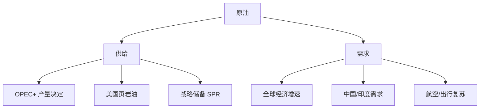
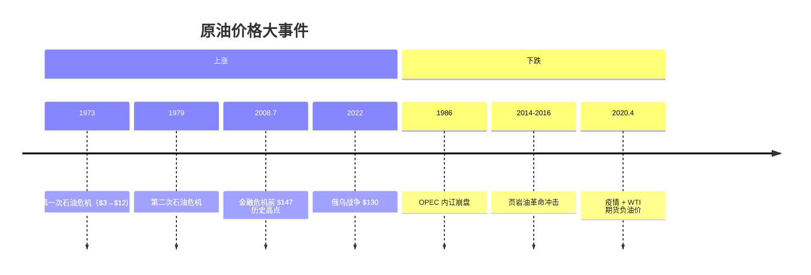
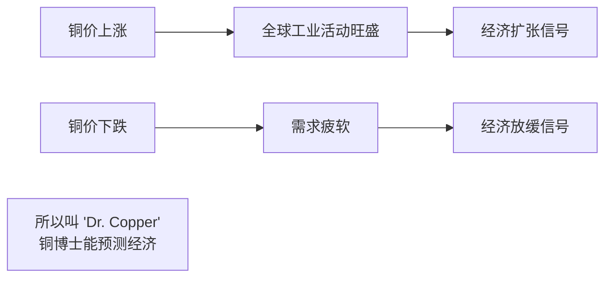
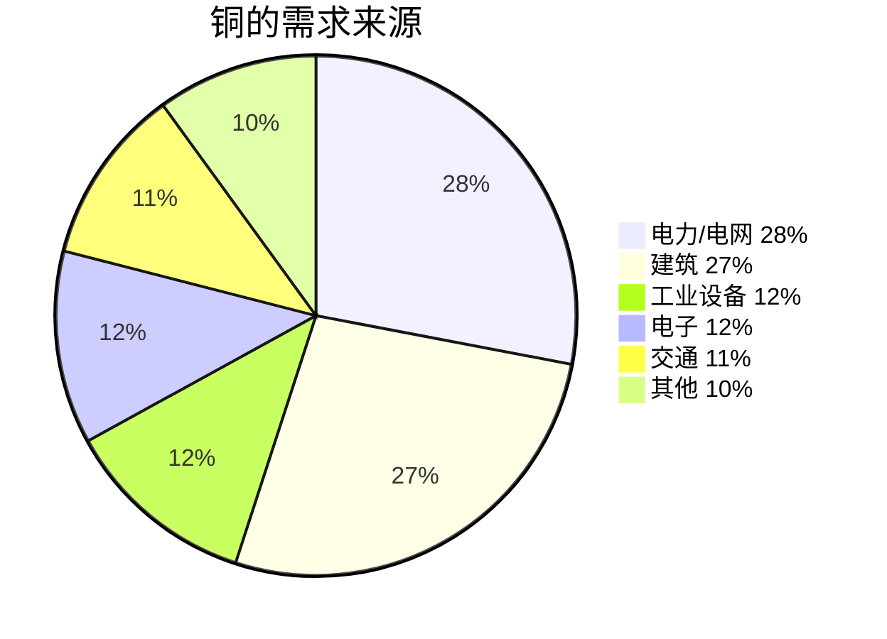
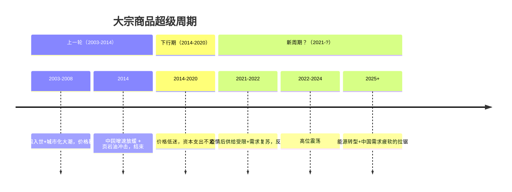
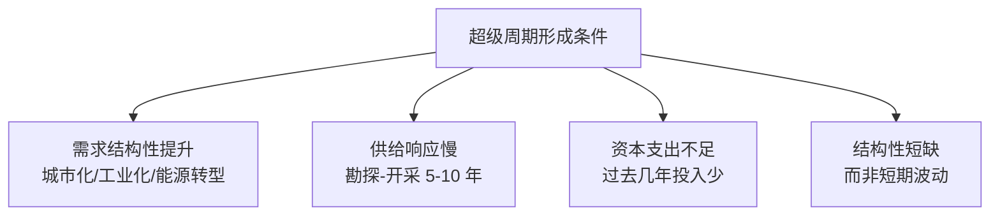
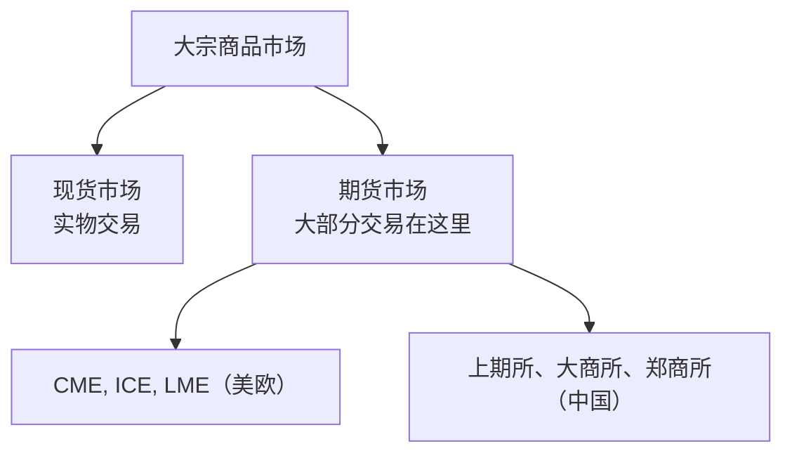
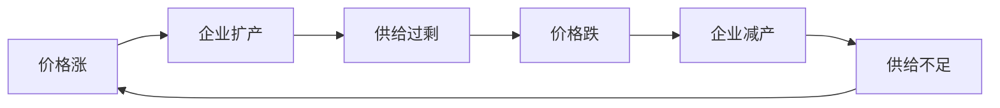

# 🛢️ 大宗商品 | Commodities

`🟡 进阶`

> 核心问题：石油、铜、铁矿、农产品的价格由什么决定？大宗商品周期怎么看？

---

## 一句话总结

**大宗商品 = 实体经济的血液 + 通胀的温度计 + 地缘政治的反映。"中国需求 + 美元定价"是过去 20 年的核心叙事。**

---

## 大宗商品分类

```mermaid
graph TB
    COMM[大宗商品] --> A[能源]
    COMM --> B[金属]
    COMM --> C[农产品]
    COMM --> D[贵金属]
    
    A --> A1[原油 WTI/Brent]
    A --> A2[天然气]
    A --> A3[煤炭]
    
    B --> B1[铜<br/>"经济医生"]
    B --> B2[铝]
    B --> B3[铁矿石]
    B --> B4[锂/钴/镍<br/>电池金属]
    
    C --> C1[大豆/玉米/小麦]
    C --> C2[棉花/糖]
    C --> C3[猪/牛]
    
    D --> D1[黄金<br/>金融属性]
    D --> D2[白银]
    D --> D3[铂/钯]
```

---

## 各品种核心驱动

| 品种 | 主要驱动 | 关键风险 |
|------|----------|----------|
| 原油 | OPEC+ 政策、美国库存、中国需求 | 地缘冲突、能源转型 |
| 铜 | 全球工业活动、电气化趋势 | 中国地产、美元强弱 |
| 铁矿石 | 中国钢铁需求 | 中国房地产 |
| 黄金 | 实际利率、央行购金、避险 | 美联储紧缩 |
| 锂 | 电动车销量、产能扩张 | 产能过剩 |
| 大豆 | 中美贸易、天气、生猪存栏 | 政策、天气 |

---

## 原油 | Crude Oil



### 油价历史



---

## 铜 | Copper —— "Dr. Copper"



### 铜的需求结构



> 💡 电气化和能源转型（电动车、光伏、电网）是铜的长期需求增量。

---

## 大宗商品超级周期



### 超级周期的驱动



---

## 中国对大宗商品的影响

中国是大多数大宗商品的最大消费国：

| 品种 | 中国占全球需求 |
|------|---------------|
| 铁矿石 | ~70% |
| 铜 | ~55% |
| 铝 | ~60% |
| 煤炭 | ~50% |
| 原油 | ~15%（最大进口国） |
| 大豆 | ~30%（最大进口国） |

> 💡 这就是为什么"中国房地产周期"会影响全球大宗商品价格。

---

## 商品市场的特点

### 1. 期货为主



### 2. 强周期性



### 3. 高波动

| 资产 | 年化波动率 |
|------|-----------|
| 美股 | 15-18% |
| 黄金 | 15-18% |
| 铜 | 25-30% |
| 原油 | 35-50% |
| 锂矿股 | 60%+ |

---

## 怎么投资大宗商品？

### 工具选择

| 工具 | 优点 | 缺点 |
|------|------|------|
| 商品 ETF（如黄金 ETF） | 简单、流动性好 | 部分有 contango 损耗 |
| 商品期货 | 直接、可杠杆 | 高风险、需专业 |
| 商品股票（中石油/紫金/赣锋） | 有股息、有杠杆 | 公司经营风险 |
| QDII 商品基金 | 投海外 | 费率高 |

### Contango 与 Backwardation

```mermaid
graph TB
    A[期货价格 vs 现货价格] --> B[Contango<br/>期货 > 现货]
    A --> C[Backwardation<br/>期货 < 现货]
    
    B --> B1[滚动期货 ETF<br/>每次"高买低卖"<br/>损耗收益]
    C --> C1[滚动期货 ETF<br/>每次"低买高卖"<br/>增厚收益]
```

> ⚠️ 长期持有"原油 ETF"经常因 contango 长期亏钱，即便油价上涨。

---

## 关键数据跟踪

| 数据 | 频率 | 关注 |
|------|------|------|
| EIA 原油库存 | 每周三 | 油价短期波动 |
| OPEC+ 会议 | 月度 | 产量决定 |
| 美元指数 DXY | 实时 | 商品计价货币 |
| 中国 PMI | 月度 | 工业需求 |
| 全球航运指数 BDI | 实时 | 大宗商品运输需求 |
| LME 库存 | 实时 | 金属现货供需 |

---

## 核心概念速查

| 术语 | 英文 | 一句话解释 |
|------|------|-----------|
| 现货 | Spot | 实物即时交易 |
| 期货 | Futures | 约定未来交割 |
| 升水 | Contango | 期货价 > 现货价 |
| 贴水 | Backwardation | 期货价 < 现货价 |
| OPEC+ | — | 石油输出国组织扩展 |
| LME | London Metal Exchange | 伦敦金属交易所 |
| BDI | Baltic Dry Index | 波罗的海干散货指数 |
| 超级周期 | Supercycle | 大宗商品的长期上涨周期 |

---

## 相关链接

- [黄金专题](./gold/)
- [全球经济关联](../../04-global-economy/connections/)
- [经济周期](../../00-foundations/level-2-intermediate/02-business-cycle.md)
