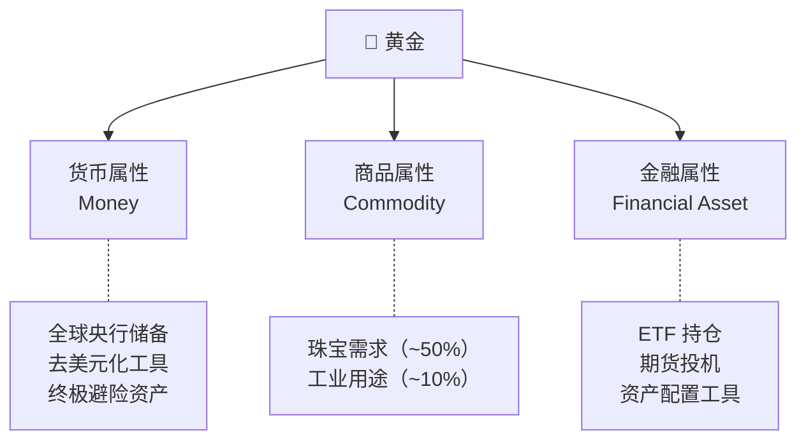
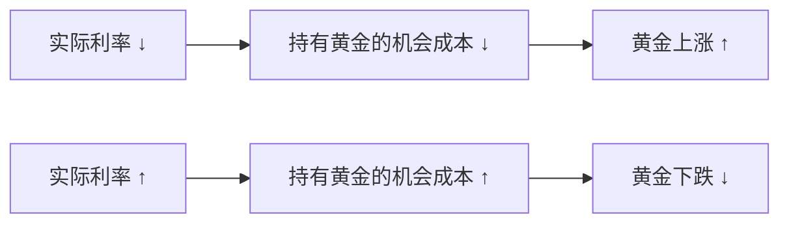
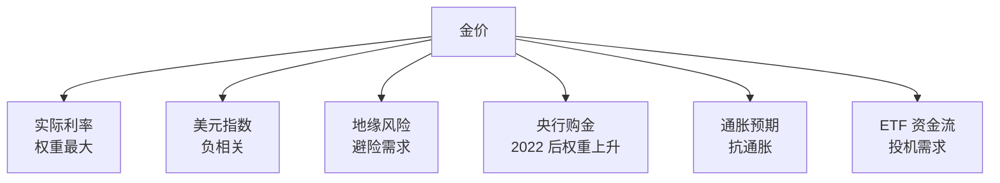
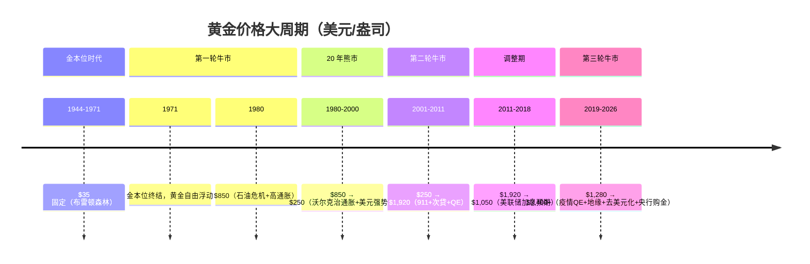
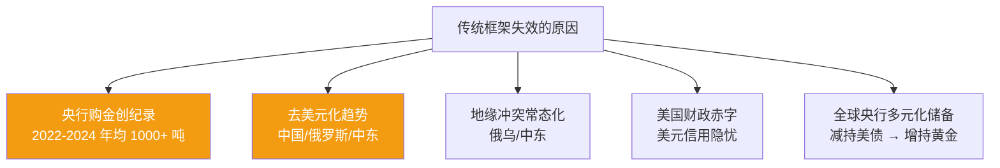
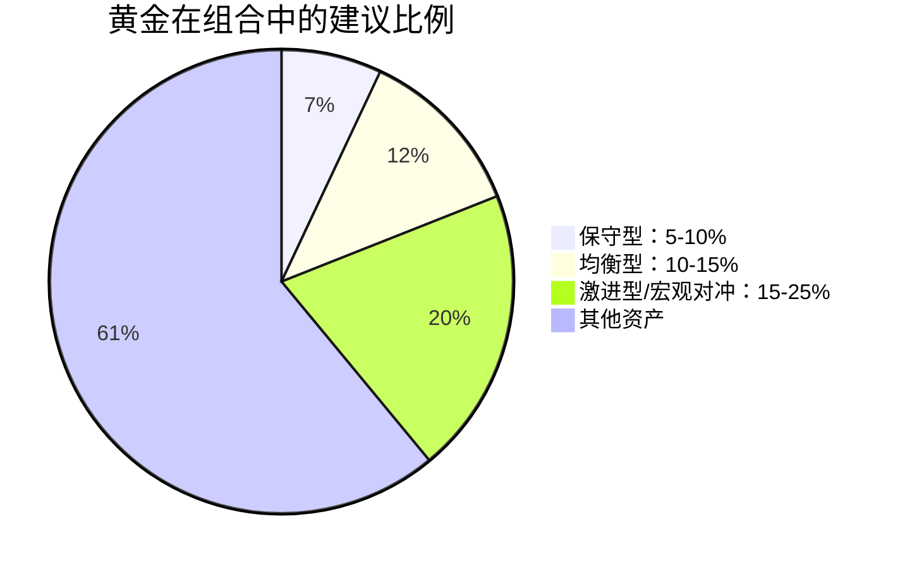

# 🥇 黄金 | Gold

`🟡 进阶`

> 核心问题：黄金到底在定价什么？为什么几千年来人类一直认为它有价值？

---

## 一句话总结

**黄金 = 对法定货币体系的不信任票。实际利率下降 / 地缘风险上升 / 美元信用动摇时，黄金上涨。**

---

## 黄金的多重身份

---

## 黄金定价的核心框架

### 第一性原理：实际利率

**为什么？** 黄金不生息（没有利息、没有分红）。当债券能给你 5% 真实回报时，持有黄金的"代价"很高；当实际利率为负时，持有黄金反而是"免费"的。

> 📊 历史上，黄金价格与美国 10 年期 TIPS（通胀保护债券）收益率高度负相关。

### 多因子定价模型

---

## 黄金的历史大周期

---

## 2022-2026 黄金牛市的特殊性

传统框架（实际利率）在 2022 年后"失效"了：美联储暴力加息，实际利率大幅转正，但黄金不跌反涨。为什么？

### 新定价范式

| 旧框架（2000-2021） | 新框架（2022+） |
|---------------------|-----------------|
| 实际利率主导 | 实际利率 + 央行购金 + 地缘溢价 |
| ETF 资金流是关键边际 | 央行成为最大边际买家 |
| 美元强 = 金弱 | 美元强但金也强（信用问题） |
| 投机属性为主 | 货币属性回归 |

---

## 黄金 vs 其他资产

| 对比 | 黄金 | BTC | 美债 |
|------|------|-----|------|
| 历史 | 5000 年 | 15 年 | 200+ 年 |
| 波动性 | 中（年化 ~15%） | 极高（年化 ~70%） | 低 |
| 收益来源 | 纯价格变动 | 纯价格变动 | 票息 + 价格 |
| 抗通胀 | ✅ 长期有效 | ❓ 待验证 | ❌ 通胀侵蚀 |
| 避险 | ✅ 强 | ❌ 目前不是 | ✅ 美债是 |
| 央行持有 | ✅ 大量 | ❌ 极少 | ✅ 大量 |
| 供给 | 年增 ~1.5% | 固定递减 | 无限（政府发） |

---

## 如何配置黄金？

### 配置工具

| 工具 | 优点 | 缺点 |
|------|------|------|
| 实物金条/金币 | 真正持有、极端避险 | 存储成本、买卖价差大 |
| 黄金 ETF（如 518880） | 流动性好、费用低 | 不是实物 |
| 纸黄金 | 门槛低 | 银行信用风险 |
| 黄金期货 | 可杠杆、双向 | 高风险、需专业知识 |
| 金矿股 | 杠杆效应（金价涨矿股涨更多） | 公司经营风险 |

### 配置建议

> 💡 黄金的核心作用不是赚大钱，而是**在其他资产暴跌时提供保护**（负相关性）。

---

## 关键数据跟踪

| 指标 | 来源 | 为什么重要 |
|------|------|-----------|
| 美国 10Y TIPS 收益率 | FRED | 实际利率，金价核心驱动 |
| 美元指数 DXY | TradingView | 负相关 |
| 全球央行购金数据 | 世界黄金协会 (WGC) | 最大边际买家 |
| SPDR Gold ETF 持仓 | GLD 官网 | 西方投资者情绪 |
| COMEX 黄金期货持仓 | CFTC COT 报告 | 投机头寸 |
| 地缘风险指数 | GPR Index | 避险需求 |

---

## 核心概念速查

| 术语 | 英文 | 一句话解释 |
|------|------|-----------|
| 实际利率 | Real Interest Rate | 名义利率 - 通胀预期 |
| TIPS | Treasury Inflation-Protected Securities | 美国通胀保护债券 |
| 央行购金 | Central Bank Gold Buying | 各国央行增持黄金储备 |
| 伦敦金 | XAU/USD | 国际现货黄金价格 |
| COMEX | — | 纽约商品交易所（黄金期货） |
| WGC | World Gold Council | 世界黄金协会 |
| 去美元化 | De-dollarization | 减少对美元依赖的趋势 |

---

## 延伸思考

1. 如果美元失去储备货币地位，黄金会涨到多少？
2. BTC 会取代黄金的地位吗？（数字黄金 vs 实物黄金）
3. 央行购金潮会持续多久？什么时候会停？
4. 黄金 ETF 持仓下降但金价上涨，说明什么？

---

## 相关链接

- [货币的本质](../../00-foundations/level-1-beginner/01-money.md)（金本位历史）
- [全球经济关联 → 美元与黄金](../../04-global-economy/connections/)
- [加密货币](../crypto/)（BTC vs Gold 对比）
