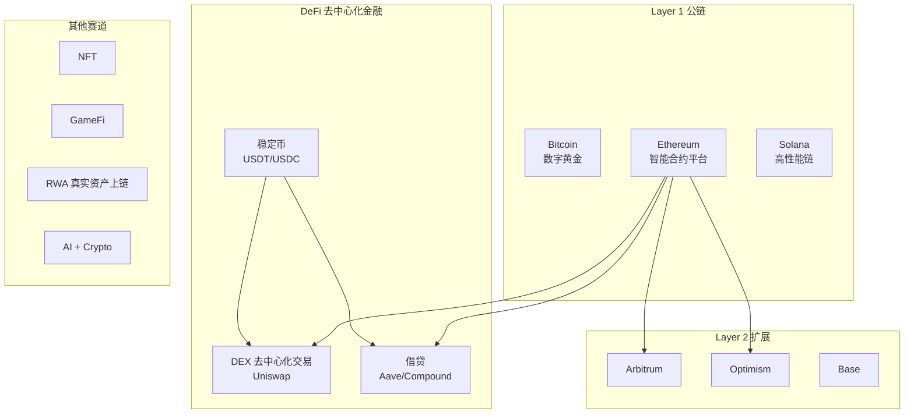
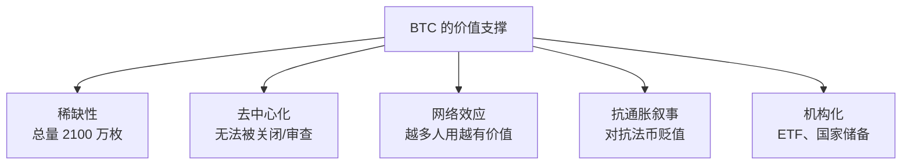
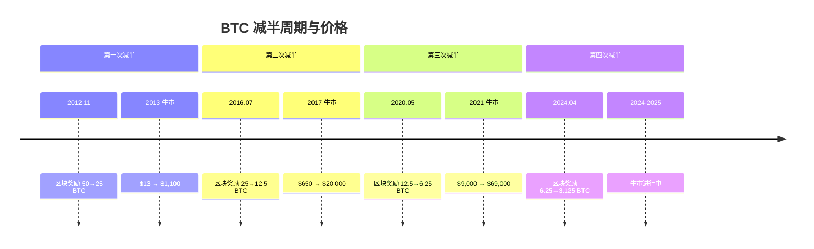
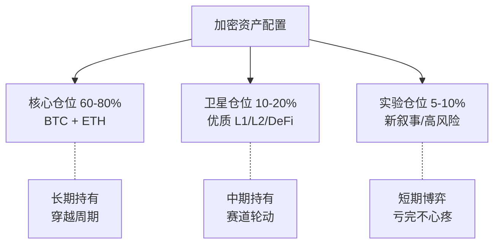

# 🪙 加密货币 | Crypto Assets

`🟡 进阶` 

> 核心问题：加密货币到底有没有价值？它在全球资产配置中扮演什么角色？

---

## 加密货币全景图

---

## BTC 的价值逻辑

### 为什么 BTC 有价值？

### BTC 的周期：减半驱动

### BTC 与宏观环境

| 宏观环境 | BTC 表现 | 原因 |
|----------|----------|------|
| 流动性宽松（低利率、QE） | 🟢 利好 | 风险偏好上升，资金寻找高收益 |
| 流动性收紧（加息、QT） | 🔴 利空 | 风险偏好下降，资金回流美元 |
| 美元走弱 | 🟢 利好 | 替代性价值储存需求上升 |
| 地缘危机 | 🟡 不确定 | 短期避险卖出，长期可能受益 |
| 监管利好（ETF 获批） | 🟢 利好 | 机构资金入场通道打开 |
| 监管打压 | 🔴 利空 | 合规风险上升 |

---

## 加密市场的独特风险

| 风险 | 说明 |
|------|------|
| 波动性极高 | 单日 ±20% 常见，心理承受力要求高 |
| 监管不确定性 | 各国政策随时可能变化 |
| 技术风险 | 智能合约漏洞、黑客攻击 |
| 流动性风险 | 小币种可能归零 |
| 交易所风险 | FTX 暴雷的教训 |
| 杠杆清算 | 合约交易极易爆仓 |

---

## 投资框架建议

### 关键原则

1. **只投你能承受归零的钱**
2. **BTC 是加密世界的"沪深 300"**——不知道买什么就买 BTC
3. **牛市赚的钱，熊市会还回去**——学会止盈
4. **远离合约杠杆**（除非你是专业交易员）
5. **自己保管私钥** > 放交易所（Not your keys, not your coins）

---

## 待深入研究

- [ ] BTC 作为"数字黄金"的论证与反驳
- [ ] ETH 的价值捕获模型（EIP-1559 + Staking）
- [ ] 稳定币的系统性风险（USDT 储备问题）
- [ ] DeFi 的真实收益来源
- [ ] 加密货币与传统金融的融合趋势（RWA、ETF）
- [ ] 各国监管框架对比

---

## 相关链接

- [全球经济关联 → 加密货币部分](../../04-global-economy/connections/)
- [方法论 → 量化](../../02-methodology/quant/)（链上数据分析）
- [数据源](../../08-resources/data-sources.md)（Glassnode、Dune 等）
