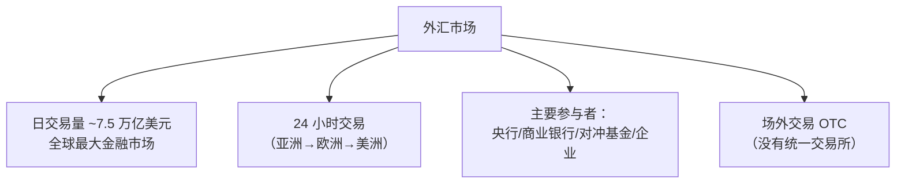
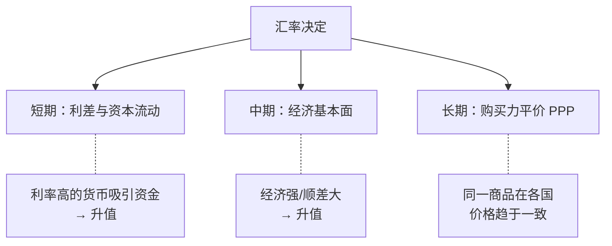
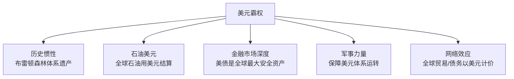
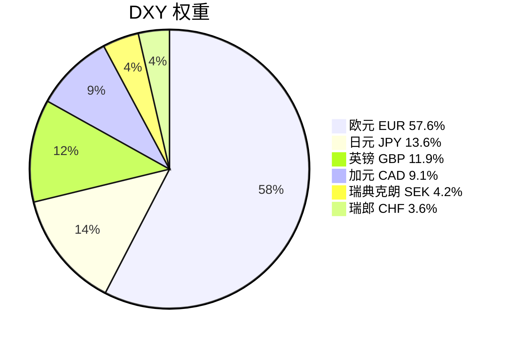
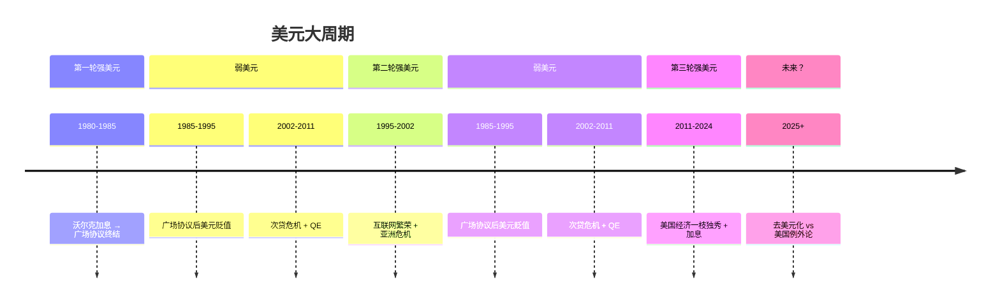
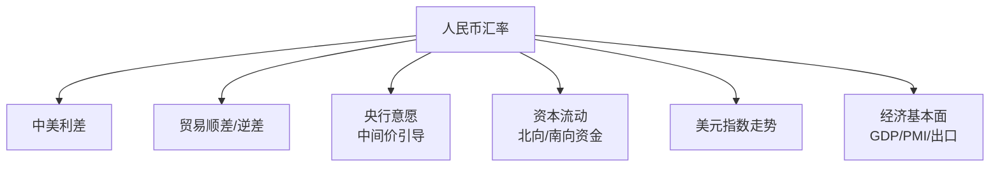
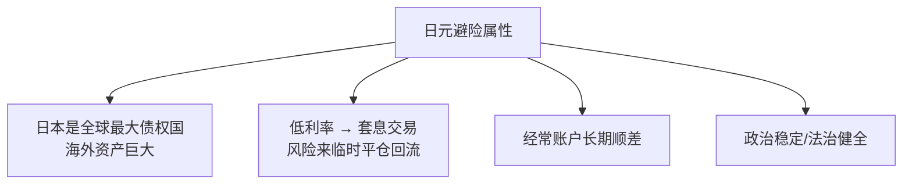
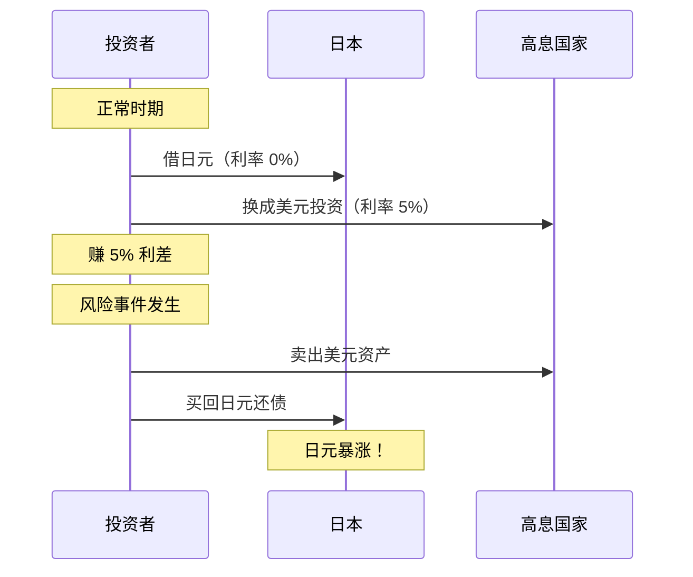

# 💱 外汇市场 | Foreign Exchange (FX)

`🟡 进阶`

> 核心问题：汇率由什么决定？美元为什么是全球霸权货币？人民币会取代美元吗？

---

## 一句话总结

**汇率 = 两种货币的相对价格，由利差、贸易、资本流动和预期共同决定。**

---

## 外汇市场基础

### 主要货币对

| 货币对 | 代码 | 别名 | 日均交易量占比 |
|--------|------|------|---------------|
| 欧元/美元 | EUR/USD | Fiber | ~23% |
| 美元/日元 | USD/JPY | Gopher | ~17% |
| 英镑/美元 | GBP/USD | Cable | ~10% |
| 美元/人民币 | USD/CNY | — | ~7% |
| 美元/瑞郎 | USD/CHF | Swissy | ~4% |

---

## 汇率决定理论

### 短期：利差驱动 (Interest Rate Differential)

### 中期：经常账户 (Current Account)

| 顺差国（出口 > 进口） | 逆差国（进口 > 出口） |
|----------------------|----------------------|
| 中国、德国、日本 | 美国、英国 |
| 外国人需要买本币付款 → 本币有升值压力 | 需要卖本币买外币 → 本币有贬值压力 |

### 长期：购买力平价 (PPP)

> 一个巨无霸在美国卖 $5.5，在中国卖 ¥25。
> PPP 汇率 = 25/5.5 ≈ 4.5
> 实际汇率 ≈ 7.2
> → 人民币按 PPP 被"低估"了约 37%

---

## 美元霸权 | Dollar Hegemony

### 为什么美元是全球储备货币？

### 美元指数 (DXY) 构成

> ⚠️ DXY 不包含人民币！所以 DXY 强不一定代表美元对人民币强。

### 美元周期

---

## 人民币 | CNY/CNH

### 在岸 vs 离岸

| | 在岸人民币 CNY | 离岸人民币 CNH |
|--|---------------|---------------|
| 交易地点 | 中国大陆 | 香港/伦敦/新加坡 |
| 管制程度 | 央行管控 | 相对自由 |
| 波动性 | 小 | 大 |
| 价格发现 | 受央行中间价引导 | 市场供需决定 |

### 人民币汇率的决定因素

### 人民币国际化进展

| 指标 | 现状 (2025) | 趋势 |
|------|-------------|------|
| 全球支付占比 | ~4.5% | ↑ 缓慢上升 |
| 全球储备占比 | ~2.5% | ↑ |
| 跨境贸易结算 | 中俄/中东部分用人民币 | ↑ |
| 与美元差距 | 巨大（美元 ~58% 储备） | 短期难以撼动 |

---

## 日元 | JPY —— 特殊的避险货币

### 为什么日元是避险货币？

### 套息交易 (Carry Trade) 与日元

> 📊 2024 年 7 月日元 Carry Trade 大规模平仓，导致全球股市闪崩。这就是汇率如何影响全球资产的典型案例。

---

## 汇率对资产的影响

| 汇率变动 | 对 A 股 | 对美股 | 对黄金 | 对加密 |
|----------|---------|--------|--------|--------|
| 人民币贬值 | ↓ 外资流出 | 中性 | ↑ 人民币计价 | 中性 |
| 美元走强 | ↓ | 中性偏负 | ↓ | ↓ |
| 日元暴涨 | ↓ 风险事件 | ↓ | ↑ 避险 | ↓ |

---

## 核心概念速查

| 术语 | 英文 | 一句话解释 |
|------|------|-----------|
| 汇率 | Exchange Rate | 一种货币换另一种的价格 |
| DXY | Dollar Index | 美元对一篮子货币的强弱 |
| 套息交易 | Carry Trade | 借低息货币投高息资产 |
| 购买力平价 | PPP | 同一商品各国价格应趋同 |
| 资本管制 | Capital Control | 限制资金跨境流动 |
| 中间价 | Central Parity Rate | 央行每日设定的汇率参考 |
| 外汇储备 | FX Reserves | 央行持有的外币资产 |

---

## 延伸思考

1. 美元会失去储备货币地位吗？如果会，需要多久？
2. 人民币完全自由浮动会怎样？（→ 资本管制的两难）
3. 数字货币（CBDC）会改变国际货币体系吗？
4. 为什么说"不可能三角"限制了央行的选择？

---

## 相关链接

- [利率与通胀](../../00-foundations/level-1-beginner/02-interest-and-inflation.md)
- [全球经济关联](../../04-global-economy/connections/)
- [美国经济](../../04-global-economy/us/)
- [中国经济](../../04-global-economy/china/)
