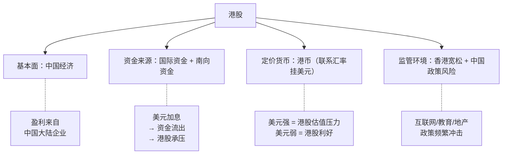
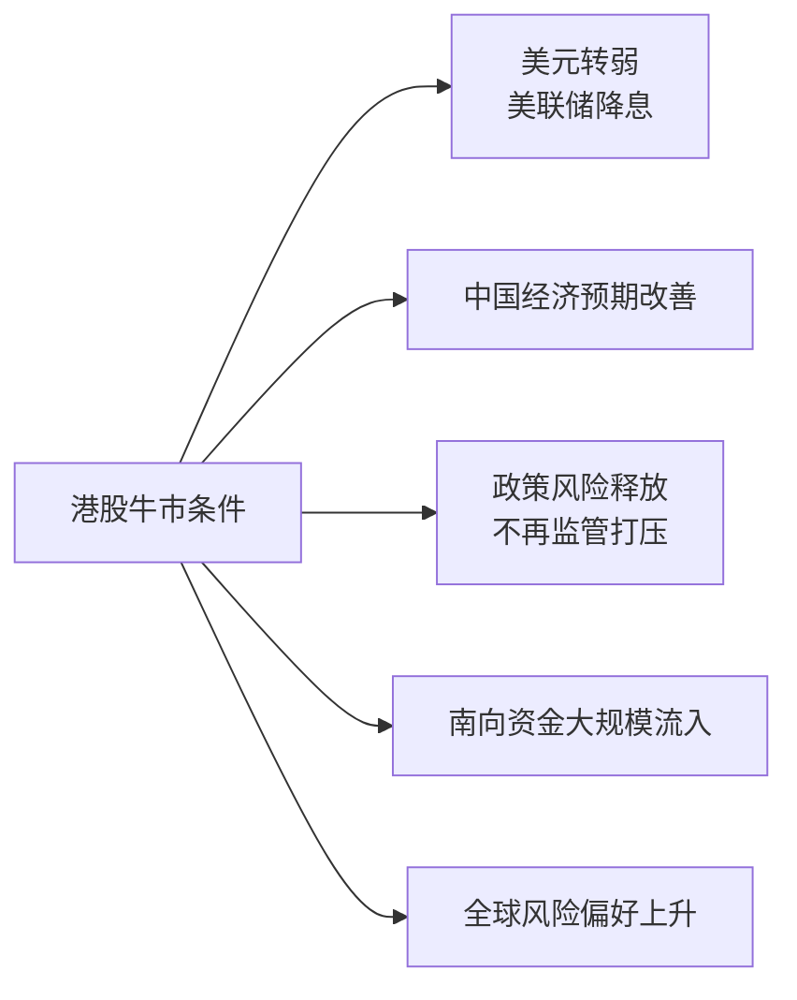
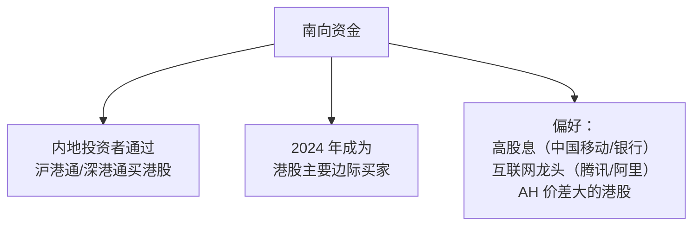

# 🇭🇰 港股市场 | Hong Kong Stocks

`🟡 进阶`

> 核心问题：港股为什么总是"价值陷阱"？什么时候才能走出来？

---

## 一句话总结

**港股 = 中国资产 + 国际定价 + 离岸市场。基本面看中国，估值看美元，资金看全球风险偏好。三重夹击下长期低估。**

---

## 港股的特殊性



---

## 港股核心指数

| 指数 | 代码 | 覆盖 | 特点 |
|------|------|------|------|
| 恒生指数 | HSI | 50 只蓝筹 | 港股大盘 |
| 恒生科技指数 | HSTECH | 30 只科技股 | 中概互联网为主 |
| 恒生中国企业指数（H 股） | HSCEI | 大型 H 股 | 央企/金融为主 |
| MSCI 中国 | MXCN | 全球视角 | 含 A/H/中概股 |

---

## 港股的"价值陷阱"逻辑

```mermaid
graph TB
    A[港股估值长期低于全球] --> B[原因 1：流动性差<br/>日均成交不到 A 股 1/5]
    A --> C[原因 2：海外资金流动性敏感<br/>美元紧 = 卖港股]
    A --> D[原因 3：政策风险溢价<br/>互联网/教育冲击]
    A --> E[原因 4：港币联系汇率<br/>=被动跟随美元周期]
    A --> F[原因 5：缺乏内地散户<br/>没有"政策刺激→散户入场"逻辑]
    
    G[结果] --> H["P/E 长期 8-10x<br/>vs A 股 12-15x<br/>vs 美股 20x+"]
```

---

## 什么时候港股会涨？



历史上港股大牛市的共同点：
- 1996-1997（红筹热）
- 2003-2007（中国入世+全球流动性）
- 2009-2011（4 万亿+QE）
- 2016-2018（沪港通+南向）
- 2024.9-?（政策转向？）

---

## 南向资金 (Southbound Flow)



> 💡 南向资金的崛起改变了港股的定价逻辑——以前主要看欧美资金脸色，现在中国资金影响越来越大。

---

## AH 溢价

```
AH 溢价指数 = (A 股价格 / H 股价格) × 100

> 100：A 股比 H 股贵
< 100：H 股比 A 股贵
```

历史上 AH 溢价长期 > 100，意味着同一公司的 A 股比 H 股贵。原因：
- A 股流动性更好
- A 股投资者结构（散户 + 政策溢价）
- 港股有外资抛压

> 💡 AH 溢价过高（如 >150）时，**买 H 股相对划算**（当然要先解决"价值陷阱"问题）。

---

## 港股投资逻辑

### 适合港股的策略

| 策略 | 说明 |
|------|------|
| 高股息 | 港股股息率 5-8% 的公司不少（银行/电信/能源） |
| 中概互联网 | 腾讯/阿里/美团等独有标的 |
| AH 价差套利 | 折价大的 H 股 |
| 周期股 | 价格便宜，弹性大（地产/有色） |

### 不适合港股的策略

| 策略 | 原因 |
|------|------|
| 趋势跟踪 | 流动性差，容易假突破 |
| 小盘股 | 老千股多，监管弱 |
| 短期博弈 | 海外资金敏感，波动大 |

---

## 港股的"老千股"风险

| 老千股特征 | 说明 |
|-----------|------|
| 频繁供股 | 摊薄股东权益 |
| 大股东减持 | 套现 |
| 股价长期低位震荡 | 让散户失去耐心 |
| 关联交易 | 利益输送 |

> ⚠️ 港股小盘股（市值 < 50 亿港币）的"老千股"占比不低。**没有研究能力的投资者，建议只买大蓝筹或 ETF**。

---

## 主要 ETF（中国投资者可买）

| ETF | 代码 | 跟踪 |
|-----|------|------|
| 恒生 ETF | 159920 | 恒生指数 |
| 恒生科技 ETF | 513130 | 恒生科技指数 |
| H 股 ETF | 510900 | 恒生中国企业指数 |
| 中概互联 ETF | 513050 | 中概股 |
| 港股通央企红利 ETF | — | 央企红利 |

---

## 核心概念速查

| 术语 | 英文 | 一句话解释 |
|------|------|-----------|
| 恒指 | HSI | 香港股市基准指数 |
| H 股 | H Shares | 在港上市的中国大陆公司 |
| 红筹股 | Red Chip | 注册在境外但主要业务在中国 |
| AH 溢价 | A-H Premium | 同公司 A 股相对 H 股的溢价 |
| 南向资金 | Southbound | 内地买港股的资金 |
| 北向资金 | Northbound | 外资通过港股通买 A 股 |
| 联系汇率 | Currency Peg | 港币 7.75-7.85 兑 1 美元 |

---

## 延伸思考

1. 港股的"折价"会一直存在吗？
2. 中概股从美股回归港股是好事还是坏事？
3. 如果香港金融中心地位下降，港股会怎样？

---

## 相关链接

- [A 股市场](../a-shares/)
- [中国经济](../../04-global-economy/china/)
- [美元与外汇](../fx/)
