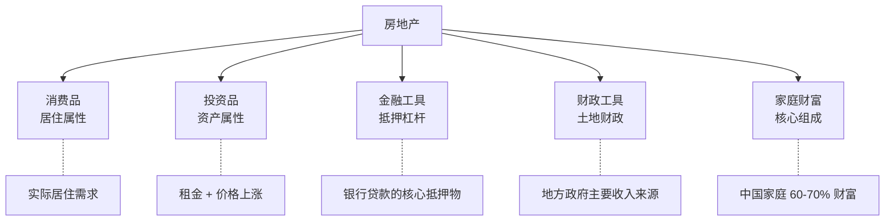
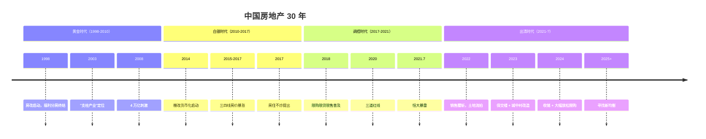
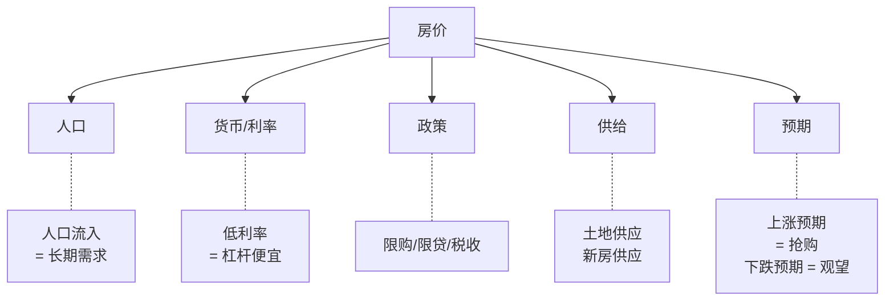
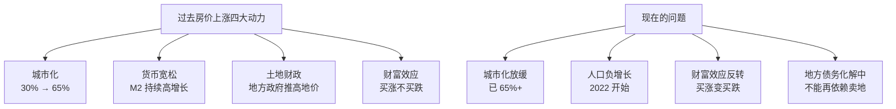
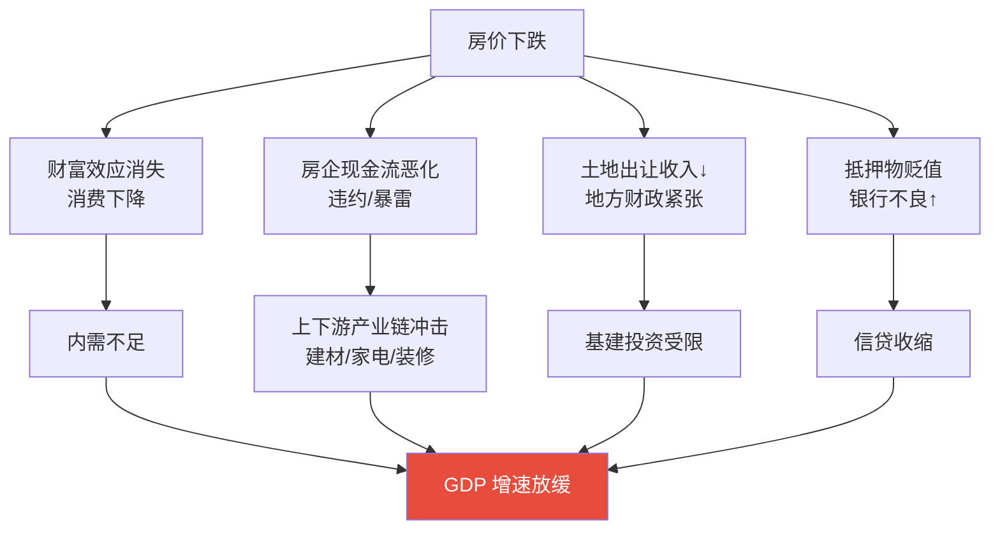
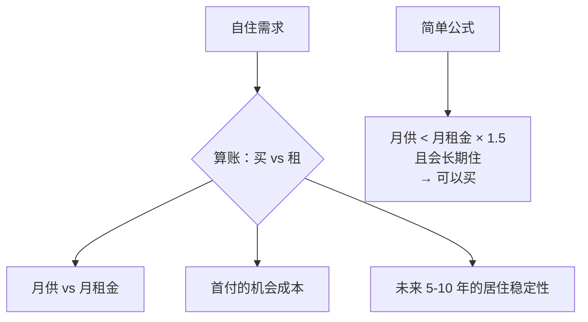
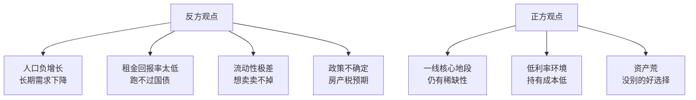

# 🏠 房地产 | Real Estate

`🟡 进阶`

> 核心问题：房地产真的"永远涨"吗？中国房地产周期走到哪了？现在该买还是卖？

---

## 一句话总结

**房地产 = 巨大的杠杆资产 + 实物属性 + 政策敏感型。它不是"无风险资产"，而是"被时代红利掩盖了风险的资产"。**

---

## 房地产的多重属性



---

## 中国房地产周期



---

## 中国房地产的"三个时代"

| 时代 | 特征 | 典型表现 |
|------|------|----------|
| 黄金时代（1998-2010） | 城市化 + 货币化 | 房价持续上涨，闭眼买都赚 |
| 白银时代（2010-2017） | 分化加剧 | 一线领涨，三四线滞涨 |
| 出清时代（2021-?） | 调整周期 | 量价齐跌，房企暴雷 |

---

## 影响房价的核心因素



### 中国房价的"四大支柱"



---

## 中国 vs 日本 vs 美国房地产周期

| 维度 | 日本（1990s 泡沫） | 美国（2008 次贷） | 中国（2021+） |
|------|-------------------|------------------|--------------|
| 触发 | 加息刺破泡沫 | 次贷违约 | 三道红线 + 房企暴雷 |
| 跌幅 | 一线 -60%（持续 20 年） | 全国 -30%（4 年） | 一线 -10%, 三四线 -30%（进行中） |
| 政策应对 | 慢，错过窗口 | 快，QE + 救助 | 中等，逐步放松 |
| 后果 | 失去的 30 年 | 8 年恢复 | 待观察 |

> 💡 核心问题不是"会跌多少"，而是"会跌多久"。日本经验显示：**资产负债表衰退可能持续 10-20 年**。

---

## 房地产对经济的影响链



> 💡 这就是为什么中国不能让房地产"硬着陆"——它牵动的是整个经济链条。

---

## 个人投资视角：买不买房？

### 自住房



### 投资房

| 收益来源 | 说明 |
|----------|------|
| 租金回报 | 一线城市租金回报率 1.5-2%（远低于国债） |
| 价格上涨 | 黄金时代的主要收益来源，现在不确定 |
| 杠杆收益 | 首付 30% = 3 倍杠杆放大 |

### 现在买投资房合理吗？



> 💡 这是个见仁见智的问题。但需要明白：**过去 20 年的"房产神话"已经结束**。未来的房产投资需要更精准的城市/地段选择。

---

## 美国房地产 vs 中国房地产

| 维度 | 美国 | 中国 |
|------|------|------|
| 持有成本 | 1-2% 房产税/年 | 暂无 |
| 杠杆 | 30 年固定利率（很多 3% 锁定） | 浮动利率 |
| 二手房市场 | 成熟，流动性好 | 大城市好，三四线差 |
| 租金回报 | 4-6% | 1.5-3% |
| 持有人 | 居住 + REITs 投资者 | 主要是居住和投资 |

---

## REITs（房地产投资信托）

```mermaid
graph LR
    A[REITs] --> B[把房地产<br/>"证券化"]
    B --> C[小额可参与]
    B --> D[流动性好<br/>可在交易所买卖]
    B --> E[强制分红<br/>租金为主要收益]
```

中国 REITs（公募 REITs）2021 年起步，目前主要覆盖：
- 基础设施（高速公路、产业园）
- 仓储物流
- 保障性租赁住房
- （住宅 REITs 暂未放开）

---

## 关键数据跟踪

| 指标 | 频率 | 关注点 |
|------|------|--------|
| 70 城房价指数 | 月度 | 整体房价趋势 |
| 商品房销售面积 | 月度 | 需求强弱 |
| 土地成交价款 | 月度 | 房企信心 |
| 房地产开发投资 | 月度 | 行业景气 |
| 房贷利率 | 月度 | 购房成本 |
| 房企融资数据 | 月度 | 资金链 |

---

## 核心概念速查

| 术语 | 英文 | 一句话解释 |
|------|------|-----------|
| 限购/限贷/限售 | — | 三限政策 |
| 三道红线 | — | 监管房企杠杆的三条线 |
| 棚改货币化 | — | 拆迁补现金，推升房价 |
| 土地财政 | Land Finance | 地方政府靠卖地获得收入 |
| 房产税 | Property Tax | 持有期间需交税（中国试点中） |
| REITs | Real Estate Investment Trust | 房地产投资信托基金 |
| 资产负债表衰退 | Balance Sheet Recession | 资产价格下跌后的去杠杆周期 |

---

## 延伸思考

1. 中国房地产的"底"在哪？是政策底还是真正的市场底？
2. 一线城市 vs 三四线，哪个先反弹？
3. 如果开征房产税，会怎样冲击市场？
4. 共有产权房、保障房会改变市场吗？

---

## 相关链接

- [中国经济](../../04-global-economy/china/)
- [信用与债务周期](../../00-foundations/level-2-intermediate/07-credit-cycle.md)
- [2008 金融危机](../../01-history/crises/2008-global-financial-crisis.md)
