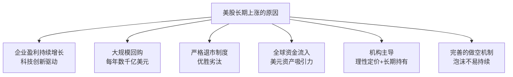
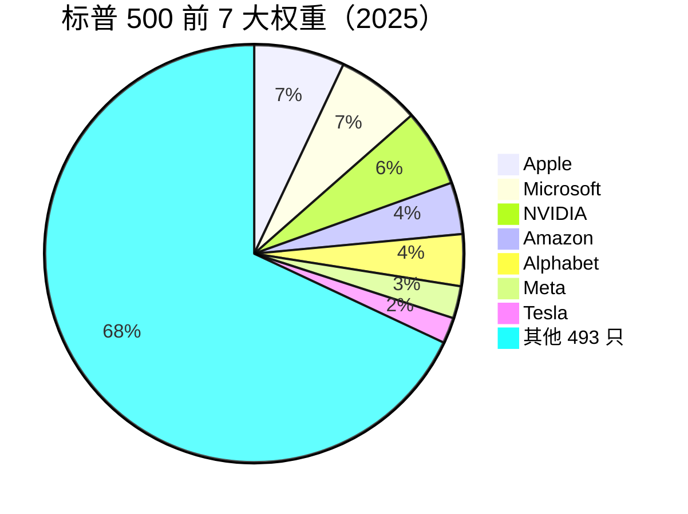
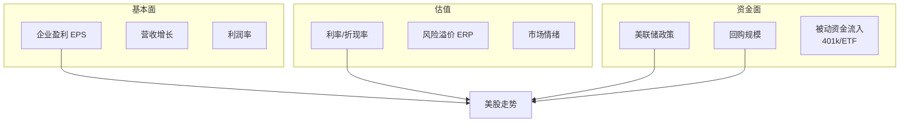
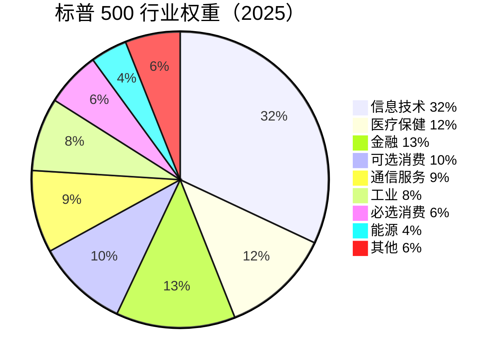

# 🇺🇸 美股市场 | US Stocks

`🟡 进阶`

> 核心问题：美股为什么能长期向上？现在还能买吗？

---

## 一句话总结

**美股 = 全球最优质公司的集合 + 持续回购 + 机构定价 + 美元资产吸引力。长期向上的底层逻辑是美国企业的盈利增长能力。**

---

## 美股为什么长期向上？



### 标普 500 的长期回报

| 时间段 | 年化回报（含分红） |
|--------|-------------------|
| 1926-2025（近 100 年） | ~10% |
| 2010-2025（近 15 年） | ~14% |
| 扣除通胀后实际回报 | ~7% |

> 💡 如果 1926 年投入 $1，到 2025 年约值 **$13,000+**（含分红再投资）。这就是长期复利的力量。

---

## 美股核心指数

| 指数 | 覆盖 | 特点 |
|------|------|------|
| S&P 500 | 美国最大 500 家公司 | 美股核心，全球定价锚 |
| NASDAQ 100 | 纳斯达克最大 100 家（非金融） | 科技股集中 |
| Dow Jones 30 | 30 家蓝筹 | 价格加权，代表性下降 |
| Russell 2000 | 小盘股 2000 家 | 美国经济晴雨表 |

### 标普 500 的集中度问题



> ⚠️ "Magnificent 7" 占标普 500 约 30% 权重。买标普 500 本质上是重仓科技巨头。

---

## 美股的驱动因素



### 美股估值框架

```
股价 = EPS × P/E

标普 500 当前（2025）：
- EPS ≈ $250
- P/E ≈ 21x
- → 指数 ≈ 5,250

如果 EPS 增长 10% → $275
P/E 维持 21x → 指数 5,775
P/E 压缩到 18x → 指数 4,950
```

---

## 美股的风险

| 风险 | 说明 |
|------|------|
| 估值过高 | P/E 长期均值 ~16x，当前 >20x |
| 集中度风险 | 少数科技股主导涨幅 |
| 利率风险 | 高利率压制估值 |
| 地缘风险 | 中美脱钩、全球化逆转 |
| AI 泡沫风险 | 资本开支巨大但变现不确定 |
| 财政赤字 | 美国国债规模持续膨胀 |

---

## 美股行业结构



---

## 中国投资者买美股的方式

| 方式 | 优点 | 缺点 |
|------|------|------|
| QDII 基金（如纳指 ETF） | 合规、门槛低 | 额度限制、费率 |
| 港股通买美股 ETF | 方便 | 品种有限 |
| 海外券商（富途/老虎/IB） | 品种全、T+0 | 换汇额度、税务 |
| 美元理财/QDLP | 机构渠道 | 门槛高 |

---

## 美股 vs A 股投资逻辑差异

| | 美股 | A 股 |
|--|------|------|
| 核心逻辑 | 买盈利增长 | 买流动性+政策 |
| 选股重点 | 护城河、现金流 | 政策方向、资金偏好 |
| 持有周期 | 可以很长（年） | 通常较短（月） |
| 止损 | 基本面恶化时 | 趋势破位时 |
| 最大风险 | 买贵了 | 政策转向 |

---

## 核心概念速查

| 术语 | 英文 | 一句话解释 |
|------|------|-----------|
| 标普 500 | S&P 500 | 美国最大 500 家公司指数 |
| 纳斯达克 | NASDAQ | 科技股为主的交易所 |
| 回购 | Buyback | 公司用利润买回自己的股票 |
| 401(k) | — | 美国退休金计划（持续买入股市） |
| ERP | Equity Risk Premium | 股票相对债券的额外回报要求 |
| Mag 7 | Magnificent Seven | 七大科技巨头 |
| 被动投资 | Passive Investing | 买指数基金，不选股 |
| 期权 | Options | 美股衍生品（影响短期波动） |

---

## 延伸思考

1. 美股的长期上涨是"美国例外论"还是"幸存者偏差"？
2. 被动投资占比越来越高，会不会导致市场失效？
3. AI 是真正的产业革命还是又一个泡沫？
4. 如果美元霸权动摇，美股还能维持高估值吗？

---

## 相关链接

- [美国经济](../../04-global-economy/us/)
- [全球经济关联](../../04-global-economy/connections/)
- [估值方法](../../02-methodology/valuation/)
- [股票基础](../../00-foundations/level-1-beginner/04-stocks-101.md)
