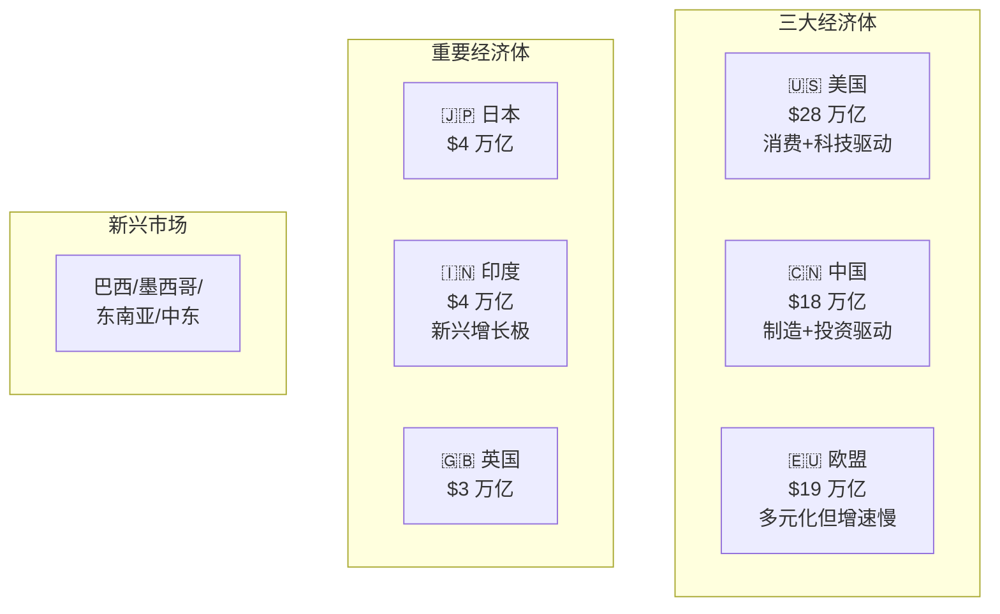
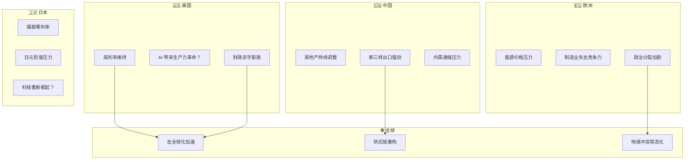
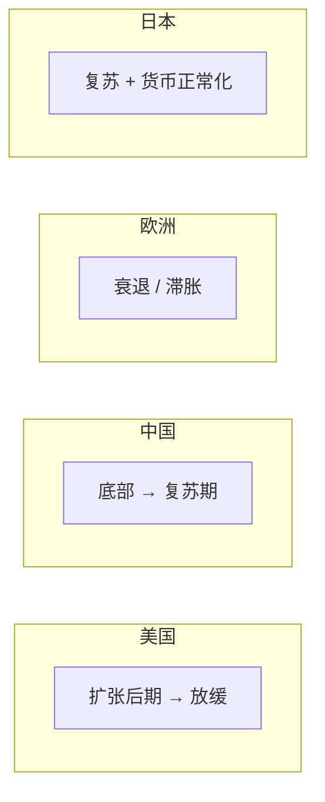
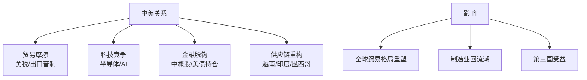
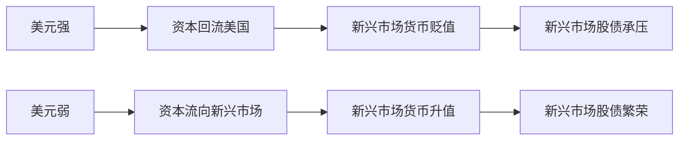

# 🌍 全球经济观察 | Global Economy

> 核心目标：理解世界主要经济体的运行逻辑、相互关系，以及对资产价格的影响。

---

## 全球经济版图



---

## 模块导航

| 目录 | 内容 | 核心问题 |
|------|------|----------|
| [china/](./china/) | 中国经济 | 转型期阵痛与新引擎 |
| [us/](./us/) | 美国经济 | 韧性来自哪里？衰退会来吗？ |
| [eu/](./eu/) | 欧盟经济 | 为何长期低迷？欧元会不会解体？ |
| [japan/](./japan/) | 日本经济 | 失去的三十年还在继续吗？ |
| [emerging-markets/](./emerging-markets/) | 新兴市场 | 哪些国家有结构性机会？ |
| [connections/](./connections/) | 关联分析 | 各经济体如何互相影响？ |

---

## 当前世界经济的核心叙事（2024-2026）



---

## 全球经济体周期错位



> 💡 各国处于不同周期阶段，导致**货币政策方向相反**，**资本在国家间流动**，**汇率剧烈波动**。这是当前全球宏观投资的核心机会和风险来源。

---

## 全球经济的关键关系

### 中美关系



### 美元周期与全球资本流动



---

## 为什么要看全球？

```mermaid
graph TB
    A[即使你只投 A 股] --> B[北向资金来自全球]
    A --> C[人民币汇率受美元影响]
    A --> D[出口型公司受全球需求影响]
    A --> E[大宗商品价格全球定价]
    
    F[结论] --> G[在全球化的世界里<br/>没有"封闭"的市场<br/>必须看全球]
```

---

## 学习路径


---

## 相关链接

- [资产研究](../03-assets/)
- [经济史](../01-history/)
- [每日追踪](../05-daily-tracking/)
