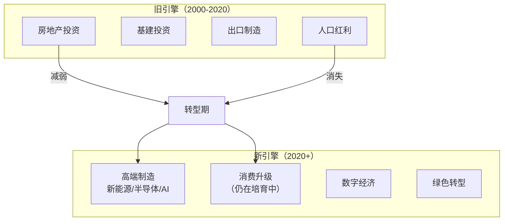
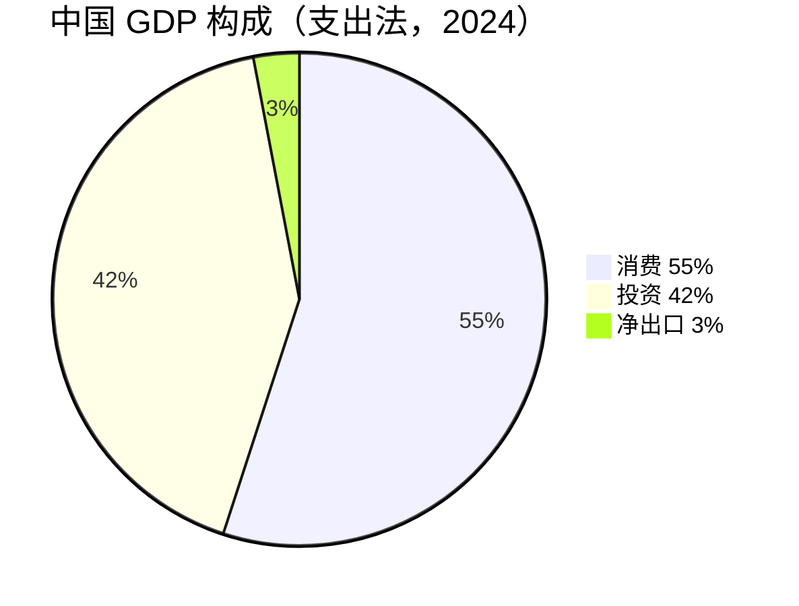
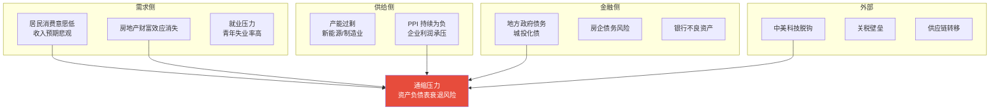
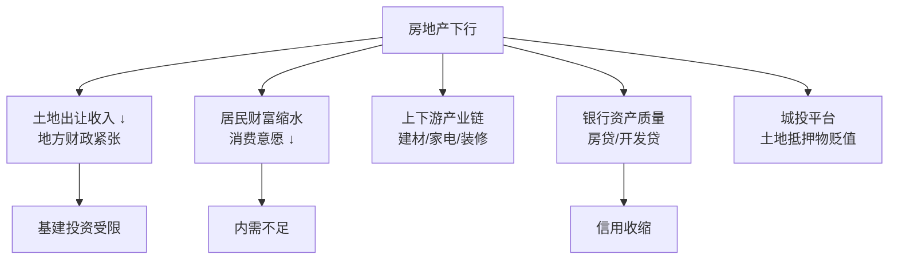
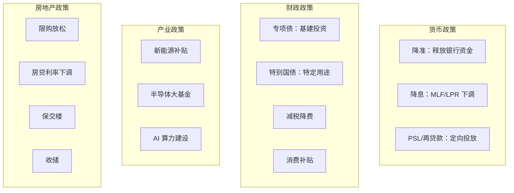

# 🇨🇳 中国经济 | China Economy

`🟡 进阶`

> 核心问题：中国经济的增长模式是什么？当前面临哪些结构性挑战？

---

## 一句话总结

**中国经济正从"投资+出口驱动"转向"消费+科技驱动"，转型期阵痛明显，但体量和韧性不可忽视。**

---

## 中国经济的增长引擎

---

## GDP 三驾马车

| 驱动力 | 现状 | 趋势 |
|--------|------|------|
| 消费 | 疫后恢复缓慢，信心不足 | 政策在推动，但见效慢 |
| 投资 | 房地产拖累，基建托底，制造业亮点 | 结构分化 |
| 出口 | 新三样（电动车/锂电/光伏）强劲 | 面临关税和去全球化压力 |

---

## 当前核心矛盾（2024-2026）

---

## 房地产：最大的灰犀牛

### 房地产周期位置

| 阶段 | 时间 | 特征 |
|------|------|------|
| 黄金时代 | 1998-2017 | 城市化+货币化棚改，房价持续上涨 |
| 白银时代 | 2017-2021 | 分化加剧，"房住不炒" |
| 出清阶段 | 2021-? | 恒大暴雷、销售腰斩、价格调整 |
| 新均衡 | ? | 人口见顶+城市化放缓，回不到过去 |

---

## 政策工具箱

---

## 关键经济指标

| 指标 | 频率 | 看什么 | 数据源 |
|------|------|--------|--------|
| GDP | 季度 | 增速趋势 | 统计局 |
| PMI | 月度 | 荣枯线 50 以上=扩张 | 统计局/财新 |
| 社融/M2 | 月度 | 信用扩张速度 | 央行 |
| CPI/PPI | 月度 | 通胀/通缩 | 统计局 |
| 固定资产投资 | 月度 | 基建/制造业/房地产分项 | 统计局 |
| 社零 | 月度 | 消费恢复情况 | 统计局 |
| 出口 | 月度 | 外需强弱 | 海关总署 |
| 房地产销售 | 月度 | 行业景气度 | 统计局 |
| 青年失业率 | 月度 | 就业压力 | 统计局 |

---

## 中国经济的长期优势

| 优势 | 说明 |
|------|------|
| 完整工业体系 | 全球唯一拥有全部工业门类的国家 |
| 工程师红利 | 每年 ~500 万理工科毕业生 |
| 超大规模市场 | 14 亿人口的内需潜力 |
| 基础设施 | 高铁/5G/物流全球领先 |
| 新能源产业链 | 光伏/锂电/电动车全球主导 |
| 政策执行力 | 集中力量办大事 |

## 中国经济的长期挑战

| 挑战 | 说明 |
|------|------|
| 人口老龄化 | 2022 年人口开始负增长 |
| 债务水平 | 政府+企业+居民总债务/GDP >300% |
| 中美博弈 | 科技封锁、贸易壁垒 |
| 收入分配 | 基尼系数偏高，中产焦虑 |
| 制度改革 | 市场化改革深水区 |

---

## 延伸思考

1. 中国会重蹈日本"失去的三十年"吗？相似点和不同点？
2. "资产负债表衰退"在中国成立吗？
3. 新能源出海能否替代房地产成为新增长极？
4. 人民币国际化对中国经济意味着什么？

---

## 相关链接

- [A 股市场](../../03-assets/a-shares/)
- [人民币汇率](../../03-assets/fx/)
- [中美经济周期错位](../connections/)
- [经济史 → 中国](../../01-history/china/)
