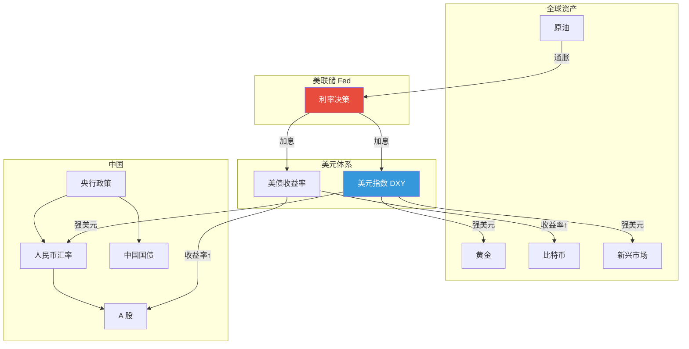
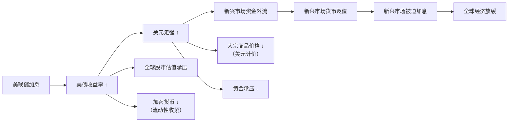
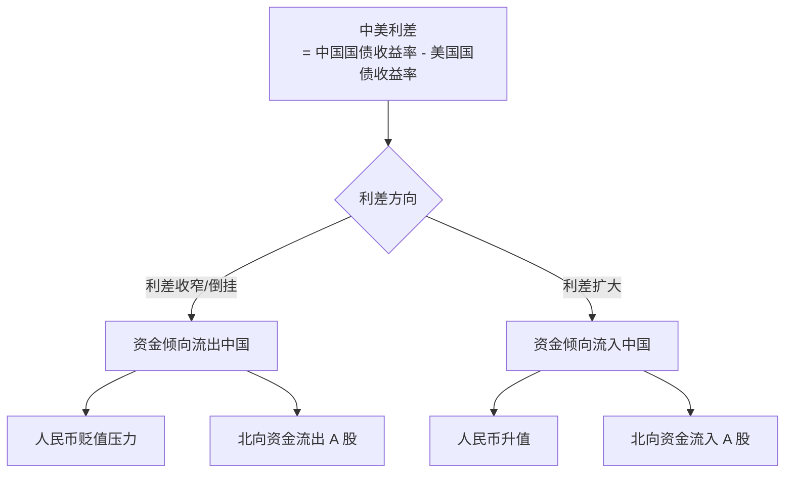
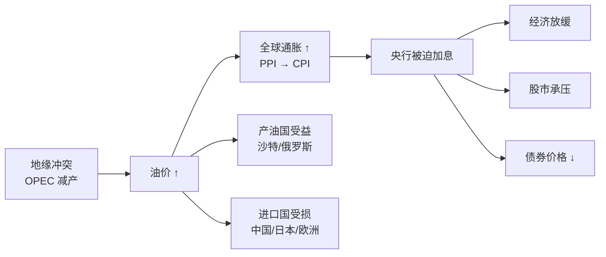
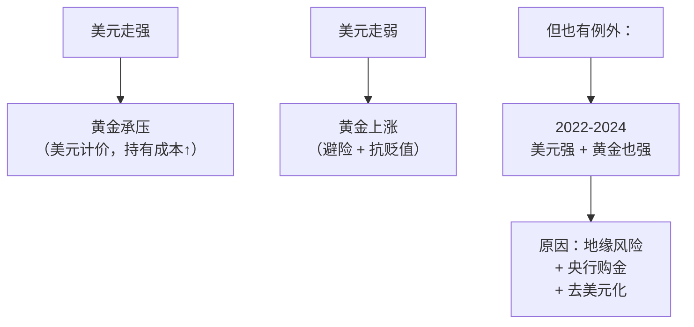
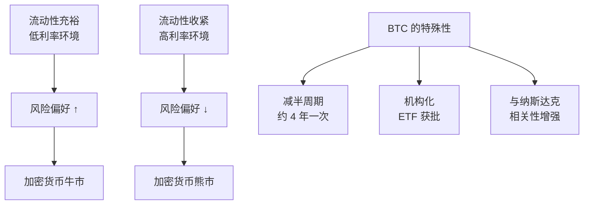
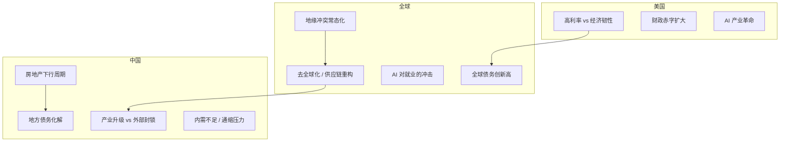

# 🌍 全球经济关联分析 | Global Connections

> 核心目标：理解世界经济中各资产、各经济体之间的传导链条。一个事件发生，能推演出它对其他资产的影响。

---

## 全局关联图

---

## 核心传导链条

### 1. 美联储加息的全球传导

### 2. 中美利差与人民币汇率

### 3. 石油 → 通胀 → 利率 → 资产

### 4. 美元与黄金的跷跷板

### 5. 加密货币与宏观环境

---

## 关键关联矩阵

> 当 X 上涨时，Y 通常怎么走？（基于历史统计，非绝对）

| | 美元↑ | 美债收益率↑ | 油价↑ | 黄金↑ | A股↑ |
|--|-------|------------|-------|-------|------|
| **美股** | 中性 | ↓ 短期 | ↓ | 中性 | 弱正相关 |
| **A 股** | ↓ | ↓ | ↓ | 中性 | — |
| **港股** | ↓ | ↓ | ↓ | 中性 | ↑ 强相关 |
| **黄金** | ↓ | ↓ | ↑ | — | 中性 |
| **BTC** | ↓ | ↓ | 中性 | ↑ 弱 | 中性 |
| **人民币** | ↓ | ↓ | ↓ | 中性 | ↑ |
| **新兴市场** | ↓ | ↓ | 看国家 | 中性 | 弱正 |

> ⚠️ 相关性不是因果性，且会随宏观环境变化。2022 年之后很多传统相关性被打破。

---

## 当前世界经济的核心矛盾（2024-2026）

---

## 如何用这个框架？

1. **看到一条新闻** → 定位它在传导链的哪个环节
2. **推演影响** → 顺着链条往下推，看影响哪些资产
3. **验证** → 看市场实际反应是否符合预期
4. **记录** → 在 [05-daily-tracking](../../05-daily-tracking/) 记下你的推演和结果

---

## 深入阅读

- [美元霸权与全球货币体系](./dollar-hegemony.md)
- [中美经济周期错位分析](./china-us-cycle-divergence.md)
- [大宗商品超级周期](./commodity-supercycle.md)
- [全球央行政策分化](./central-bank-divergence.md)
