# 中美经济周期错位 | China-US Cycle Divergence

`🔴 高级` `预计阅读：20 分钟`

> 核心问题：为什么 2022-2025 年中美经济走势完全相反？这种错位会持续多久？怎么从中找到投资机会？

---

## 一句话总结

**中美正处于完全不同的经济周期：美国是"扩张后期+通胀压力"，中国是"出清期+通缩压力"。这种错位制造了两国政策方向相反、资产表现分化的复杂局面。**

---

## 当前周期位置对比（2024-2025）

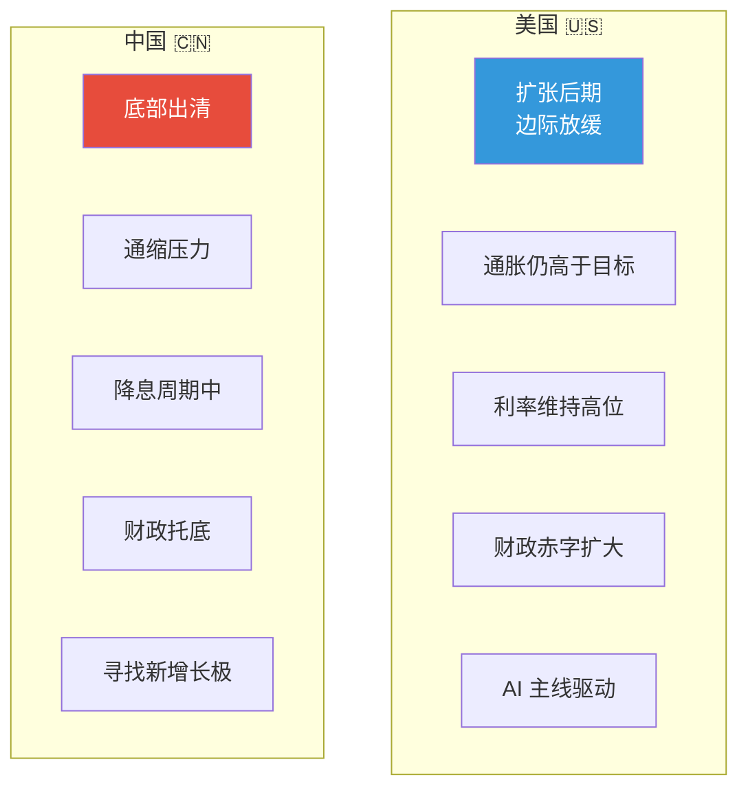

---

## 为什么会错位？

### 时间表对比

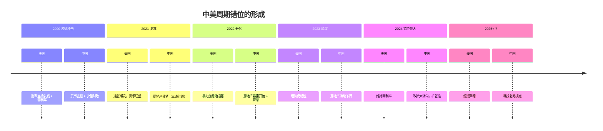

### 根本原因：刺激方式不同

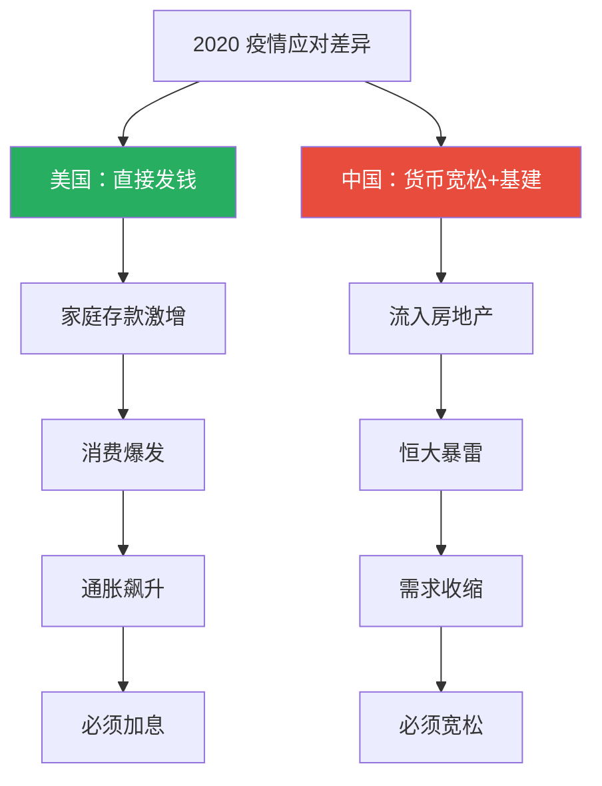

> 💡 这是关键洞察：**2020 年的不同应对，决定了之后 5 年完全不同的路径**。

---

## 错位带来的政策对比

| 政策 | 美国 | 中国 |
|------|------|------|
| 政策利率 | 5.25%（高位维持→缓慢下调） | 1.5%（持续下调） |
| 中央财政 | 大幅赤字（~7%/GDP） | 适度扩张（中央加杠杆） |
| 地方财政 | 健康 | 化债压力大 |
| 量化政策 | QT（缩表） | 各种结构性工具 |
| 监管态度 | 监管收紧（部分） | 政策宽松（房地产/互联网） |

### 政策方向相反的影响

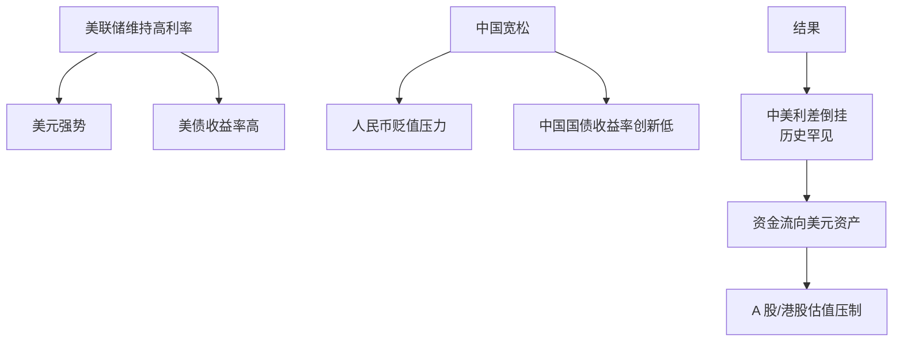

---

## 错位下的资产表现

### 2022-2024 表现对比

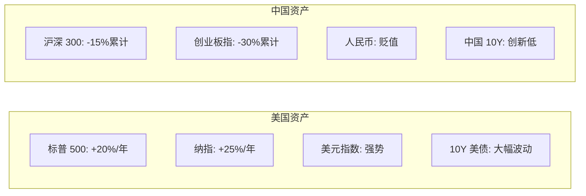

### 错位带来的"分裂"现象

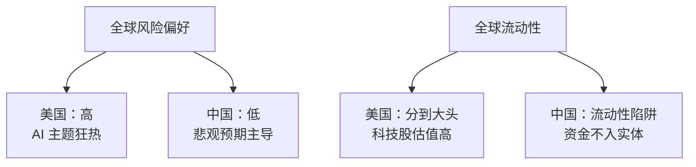

---

## 错位的历史先例

### 1990s 日美错位

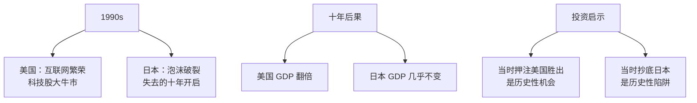

### 2008-2010 中美错位

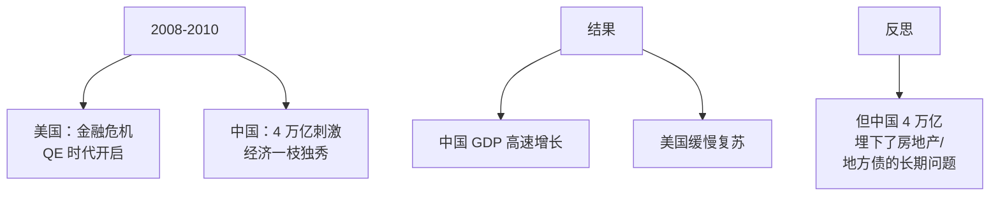

> 💡 历史告诉我们：**短期"赢"的方法，长期可能埋下问题**。

---

## 当前错位的几种结局

### 结局 1：美国软着陆，中国反弹

```mermaid
graph LR
    A[美联储成功降息] --> B[避免衰退]
    B --> C[美国经济持续扩张]
    
    D[中国政策见效] --> E[房地产企稳]
    E --> F[内需复苏]
    
    G[共同结果] --> H[全球资产共同上涨<br/>"金发姑娘"环境]
```

**概率**：30-40%

### 结局 2：美国衰退，中国先复苏

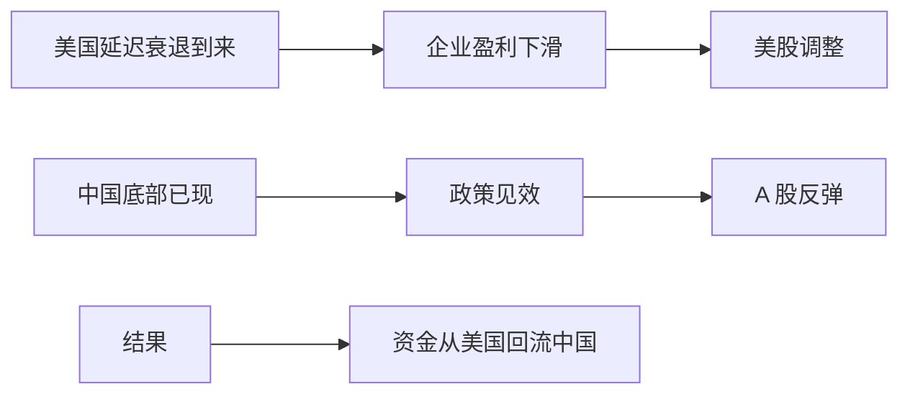

**概率**：20-30%

### 结局 3：美国延续，中国"日本化"

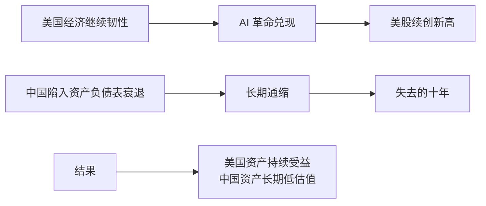

**概率**：20-30%

### 结局 4：全球同步衰退

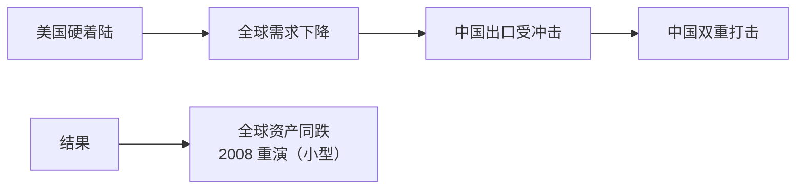

**概率**：10-20%

---

## 怎么用错位赚钱？

### 策略 1：押注收敛

```
判断：错位会收窄
操作：
- 减仓美股科技
- 加仓中国资产
- 等中国政策见效
- 卖空美元/买黄金

风险：错位可能维持更久
```

### 策略 2：押注延续

```
判断：美国例外论延续，中国"日本化"
操作：
- 继续超配美股
- 减仓中国
- 押注 AI 主题
- 持有美元

风险：错位的极致状态难持续
```

### 策略 3：均衡配置

```
判断：不预测，对冲
操作：
- 美股 + A 股 + 港股都配
- 加入黄金作为"宏观对冲"
- 保留现金等极端机会

优势：在任何结局下都能活下来
```

---

## 关键监控指标

### 美国端

| 指标 | 看什么 | 转向信号 |
|------|--------|----------|
| 失业率 | 当前 ~4% | >4.5% 加速恶化 |
| 核心 PCE | 当前 ~2.7% | <2.5% 给降息空间 |
| 美债 10Y | 当前 ~4.5% | <4% 表明衰退预期 |
| 信用利差 | 当前低位 | 扩大 = 风险上升 |
| AI 资本开支 | 持续增长 | 下滑 = 主线转弱 |

### 中国端

| 指标 | 看什么 | 转向信号 |
|------|--------|----------|
| 70 城房价 | 仍在下跌 | 连续 3 月环比正 = 拐点 |
| 社融增速 | 低位 | 触底回升 |
| PMI | 50 附近 | 持续 > 51 |
| 中长期贷款 | 弱 | 企业部门重启加杠杆 |
| 北向资金 | 流出 | 持续流入 = 信心改善 |

### 跨市场指标

| 指标 | 看什么 |
|------|--------|
| 美元指数 DXY | <100 = 弱美元周期开启 |
| 中美利差 | 收窄 = 错位减弱 |
| USD/CNY | <7.0 = 人民币转强 |
| 港股恒生科技 | 突破前高 = 中国资产复苏 |

---

## 错位下的关键投资问题

### 问题 1：现在抄底中国资产是不是好时机？

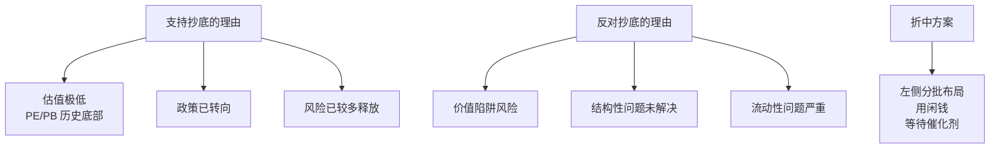

### 问题 2：美股 AI 主题还能追吗？

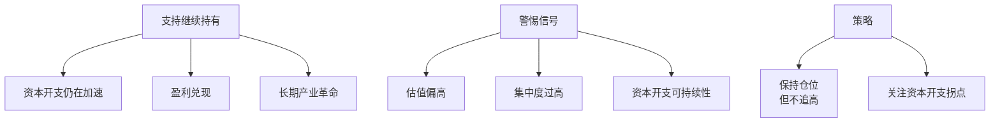

### 问题 3：美元什么时候转弱？

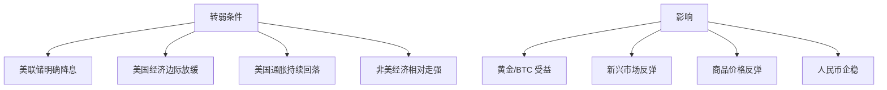

---

## 历史教训

```
1990s：日美错位 → 押注美国大胜
2008-2010：金融危机 → 押注中国 4 万亿
2014-2018：商品熊市 → 美国例外论
2020-2021：疫情应对 → 全球资产泡沫
2022-2024：错位极致 → 美国 vs 中国分化

→ 每次错位都创造了巨大机会和巨大陷阱
→ 关键是判断错位"还会持续多久"
```

---

## 核心概念速查

| 术语 | 英文 | 一句话解释 |
|------|------|-----------|
| 周期错位 | Cycle Divergence | 不同经济体处于不同周期阶段 |
| 政策分化 | Policy Divergence | 央行政策方向相反 |
| 中美利差 | China-US Spread | 中美国债收益率之差 |
| 美国例外论 | US Exceptionalism | 美国经济一枝独秀 |
| 价值陷阱 | Value Trap | 便宜的资产持续便宜 |

---

## 延伸阅读

- @MacroAlf 关于"美国例外论"的分析
- 桥水关于错位的研究
- 中金宏观团队的中美对比研报
- IMF 的 World Economic Outlook

---

## 相关链接

- [美元霸权](./dollar-hegemony.md)
- [中国经济](../china/)
- [美国经济](../us/)
- [跨资产关联分析](../../00-foundations/level-3-advanced/05-cross-asset.md)
