# 美元霸权与全球货币体系 | Dollar Hegemony

`🔴 高级` `预计阅读：25 分钟`

> 核心问题：美元怎么成为全球老大？这个地位还能维持多久？"去美元化"是真的吗？

---

## 一句话总结

**美元霸权 = 二战军事胜利 + 布雷顿森林遗产 + 石油美元 + 金融市场深度。它正在被多重力量侵蚀，但短期内没有真正的替代品。**

---

## 美元霸权的"五大支柱"

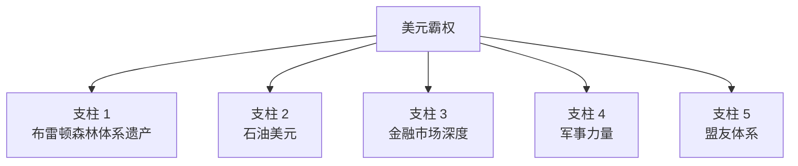

### 支柱 1：布雷顿森林遗产

```
1944 年，44 国签署协议：
- 美元锚定黄金（$35 = 1 oz）
- 各国货币锚定美元
- 美元成为"接近黄金"的硬通货

1971 年虽然脱钩黄金，但：
- 各国央行已经持有大量美元储备
- 全球贸易已经习惯用美元结算
- "美元习惯"形成路径依赖
```

### 支柱 2：石油美元

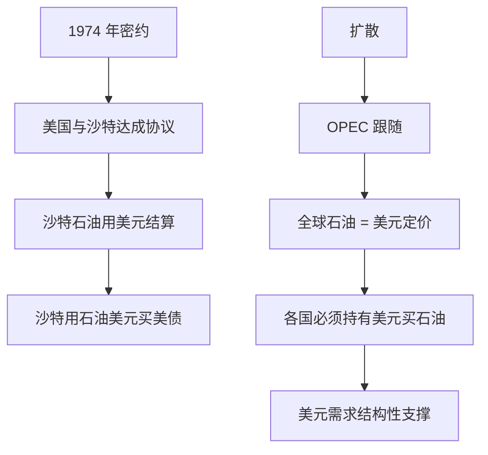

> 💡 这是为什么 2022 年沙特讨论用人民币结算部分石油会引起轰动——动摇了石油美元的根基。

### 支柱 3：金融市场深度

```mermaid
graph TB
    A[美国资本市场<br/>全球最深最大] --> B[美股市值<br/>全球 50%+]
    A --> C[美债市场<br/>$36 万亿，全球最大]
    A --> D[美元外汇市场<br/>占全球 88%]
    
    E[结果] --> F[全球资金<br/>"必须"配置美元资产]
    E --> G[没有真正的替代品]
```

### 支柱 4：军事力量

```
全球 800+ 美军基地，覆盖 80+ 国家
军费占全球 40%

含义：
- 美国能保障美元体系运转
- 不听话的国家会面临制裁
- 历史上：伊拉克（萨达姆想用欧元结算石油）/利比亚（卡扎菲推非洲金币）
```

### 支柱 5：盟友体系

```
七国集团 G7：美国 + 西欧 + 日本 + 加拿大
五眼联盟：美英加澳新
北约：32 国军事同盟

→ 美元体系不只是经济，更是地缘政治联盟
```

---

## "嚣张特权" (Exorbitant Privilege)

```mermaid
graph TB
    A[美国享受的特权] --> B[1. 用美元支付进口<br/>无需赚外汇]
    A --> C[2. 美债是全球安全资产<br/>融资成本低]
    A --> D[3. 美联储政策<br/>影响全球]
    A --> E[4. 制裁工具<br/>SWIFT 武器化]
    A --> F[5. 通胀输出<br/>"美元贬值"全球承担]
    A --> G[6. 巨额贸易逆差<br/>不会引发危机]
```

> 💡 法国前总统戴高乐 1965 年抱怨："美国享受着别人无法享受的过度特权"。这话至今适用。

---

## 全球美元体系的运转

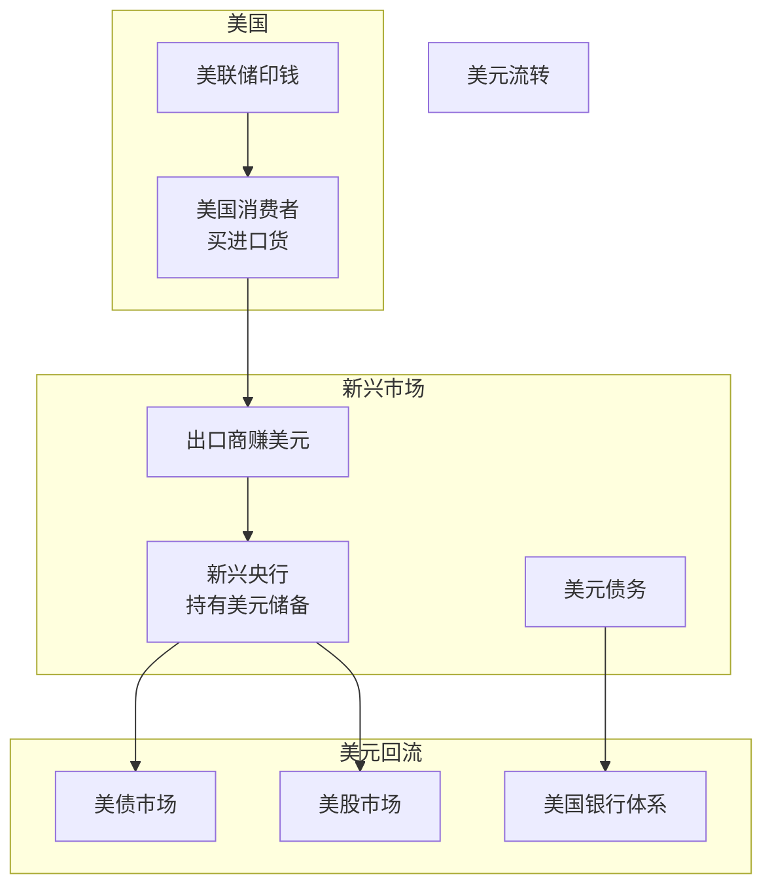

### 关键链条

```
1. 美国进口 → 美元流出
2. 出口国赚到美元
3. 出口国央行用美元买美债（外储）
4. 美债资金回到美国
5. 推动美元资产价格上涨
6. 美国财富效应 → 继续消费

→ 这是一个完美的循环
→ 但需要美国持续保持赤字（特里芬难题）
```

---

## 美元周期

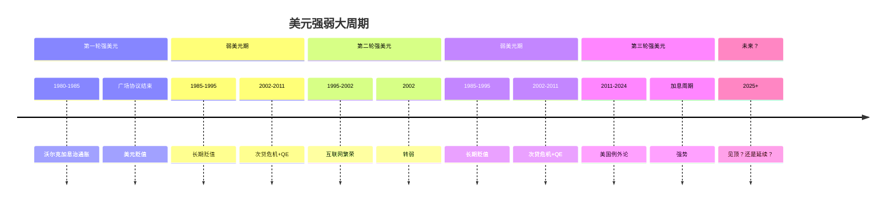

### 美元周期的影响

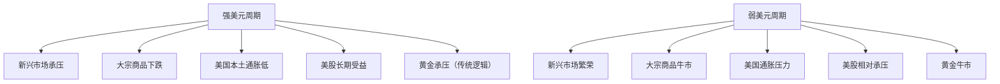

---

## 去美元化：是真是假？

### 数据看变化

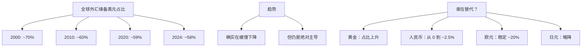

### 推动去美元化的力量

```mermaid
graph TB
    A[去美元化推动力] --> B[1. 美国制裁武器化<br/>俄罗斯/伊朗/委内瑞拉]
    A --> C[2. 美国财政担忧<br/>$36 万亿债务]
    A --> D[3. 中美博弈<br/>"金融脱钩"]
    A --> E[4. BRICS 扩员<br/>探索本币结算]
    A --> F[5. 央行购金潮<br/>2022-2024 创纪录]
    A --> G[6. CBDC 兴起<br/>央行数字货币]
```

### 实际进展

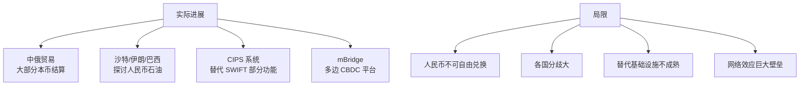

> ⚠️ "去美元化"是真实的趋势，但**速度比想象中慢**。从 70% 降到 58% 用了 24 年。

---

## 美元会失去地位吗？

### 历史先例

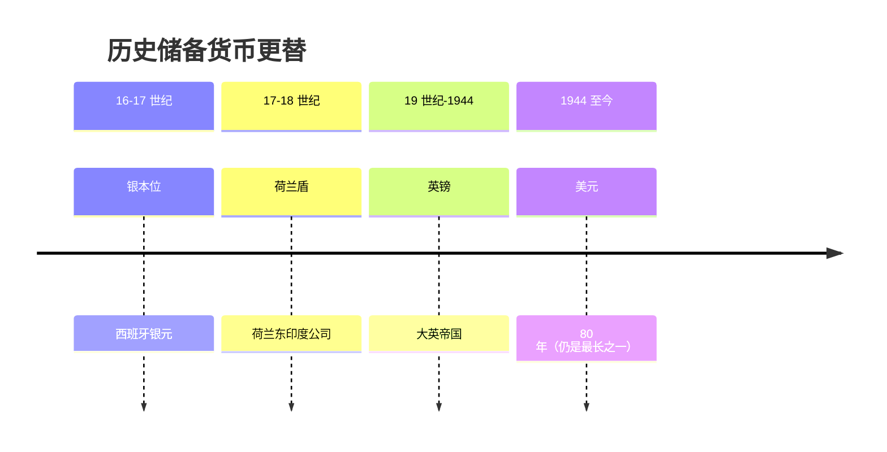

每个储备货币最终都会被替代。但替代过程通常需要：
- 几十年时间
- 一次重大危机/战争
- 一个明确的替代者

### 美元失去地位的可能路径

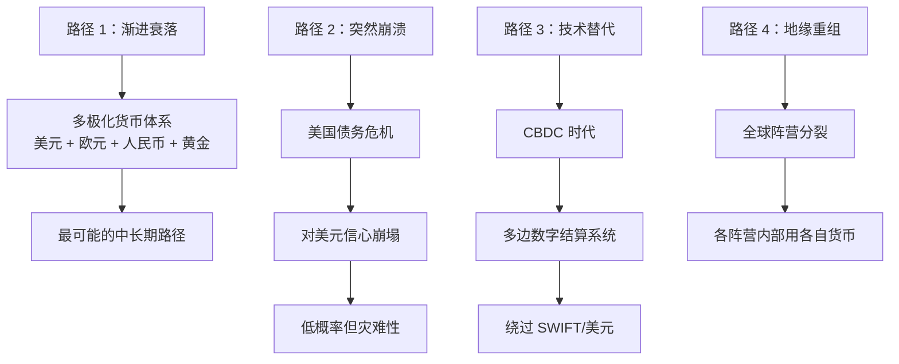

### 为什么短期不会被替代？

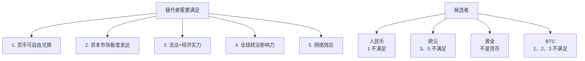

---

## 美元体系下的投资启示

### 1. 美元周期决定全球资产

```
强美元 → 新兴弱、商品弱、黄金弱
弱美元 → 新兴强、商品强、黄金强

→ 判断美元周期是宏观投资的核心
```

### 2. 长期看好"硬资产"

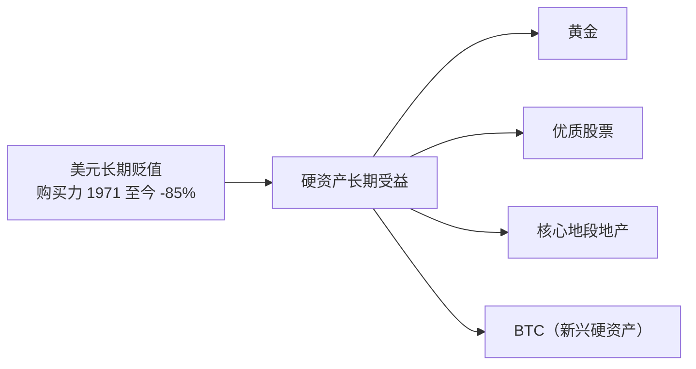

### 3. 关注"去美元化叙事"

```
去美元化叙事的受益资产：
- 黄金（最直接）
- BTC（数字黄金叙事）
- 中国/俄罗斯/中东资产
- 大宗商品（石油定价权）

但这是长期叙事，短期波动大。
```

### 4. 警惕"美元体系危机"

```
极端情况下：
- 全球流动性危机 → 美元升值（避险）
- 美国债务危机 → 美元贬值（信心丧失）

→ 这两种情况方向相反
→ 怎么对冲？黄金 + 美元同时持有
```

---

## 中国的特殊位置

### 美中"金融均势"

```mermaid
graph TB
    A[中国持有美债<br/>~$8000 亿] --> B[美国对中国的"杠杆"]
    
    C[美国主导金融体系] --> D[中国对美国的"杠杆"]
    
    E[互相依赖] --> F[美国需要中国买美债]
    E --> G[中国需要美元保值]
    
    H[2022 年俄罗斯被冻结储备] --> I[让中国意识到风险]
    I --> J[加速持有黄金<br/>减持美债]
```

### 人民币国际化进展

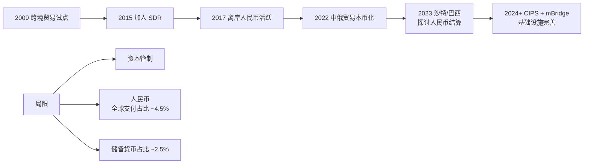

---

## 核心概念速查

| 术语 | 英文 | 一句话解释 |
|------|------|-----------|
| 美元霸权 | Dollar Hegemony | 美元的全球主导地位 |
| 嚣张特权 | Exorbitant Privilege | 美元享受的特殊地位 |
| 石油美元 | Petrodollar | 石油用美元结算 |
| 储备货币 | Reserve Currency | 各国央行持有的外币 |
| 特里芬难题 | Triffin Dilemma | 储备货币的内在矛盾 |
| 去美元化 | De-dollarization | 减少美元依赖 |
| SWIFT | — | 国际银行支付系统 |
| CIPS | — | 中国跨境支付系统 |
| CBDC | Central Bank Digital Currency | 央行数字货币 |
| BRICS | — | 巴西/俄罗斯/印度/中国/南非 + 扩员 |

---

## 推荐阅读

- 《嚣张特权》— Barry Eichengreen
- 《美元的兴衰》— Liaquat Ahamed
- 《Currency Wars》— James Rickards
- 《The Death of Money》— James Rickards
- Zoltan Pozsar 的研究报告（高水平）

---

## 延伸思考

1. 美元霸权终结对中国是好事还是坏事？
2. BTC 真的可能成为"中性储备资产"吗？
3. CBDC 会怎么改变国际货币竞争？
4. 如果美国用 SWIFT 制裁中国，会怎样？

---

## 相关链接

- [国际贸易与汇率](../../00-foundations/level-2-intermediate/05-trade-and-fx.md)
- [外汇市场](../../03-assets/fx/)
- [黄金](../../03-assets/commodities/gold/)
- [1971 关闭黄金窗口](../../01-history/us/1971-gold-window.md)
