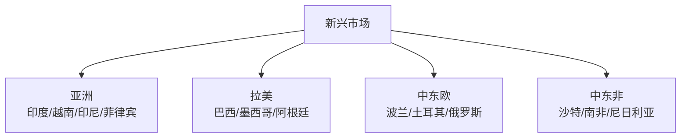
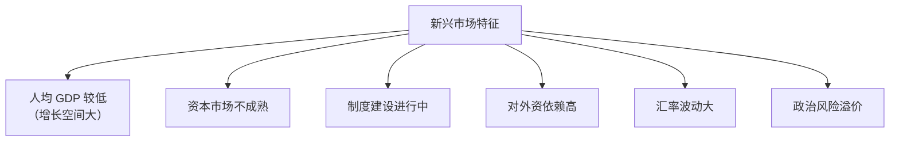
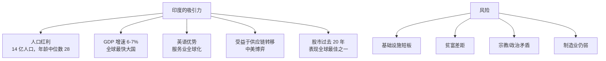

# 🌏 新兴市场 | Emerging Markets

`🟡 进阶`

> 核心问题：哪些新兴市场有结构性机会？投资新兴市场的风险在哪？

---

## 主要新兴经济体

---

## 新兴市场的共同特征

---

## 重点关注：印度

---

## 重点关注：东南亚

| 国家 | 人口 | GDP（万亿） | 特征 |
|------|------|-------------|------|
| 印尼 🇮🇩 | 2.7 亿 | $1.4 | 资源 + 内需 |
| 越南 🇻🇳 | 1.0 亿 | $0.4 | 中国+1，制造业转移 |
| 菲律宾 🇵🇭 | 1.1 亿 | $0.4 | 服务外包/侨汇 |
| 泰国 🇹🇭 | 0.7 亿 | $0.5 | 老龄化压力 |
| 马来西亚 🇲🇾 | 0.3 亿 | $0.4 | 半导体/资源 |

---

## 投资新兴市场的方式

| 工具 | 说明 |
|------|------|
| MSCI 新兴市场 ETF（EEM/VWO） | 一篮子新兴市场 |
| 印度 ETF（INDA） | 印度市场 |
| 越南 ETF（VNM） | 越南市场 |
| 国别 QDII 基金 | 中国可投 |
| 金砖国家基金 | 综合 |

---

## 新兴市场的"魔咒"

> 💡 这就是为什么美联储加息时，新兴市场往往会出现危机（亚洲金融危机、土耳其里拉、阿根廷比索...）。

---

## 待深入

- [ ] 印度经济与股市（india.md）
- [ ] 越南：中国+1 战略受益者（vietnam.md）
- [ ] 印度尼西亚（indonesia.md）
- [ ] 巴西：大宗商品 + 政治（brazil.md）
- [ ] 新兴市场投资框架（em-framework.md）
