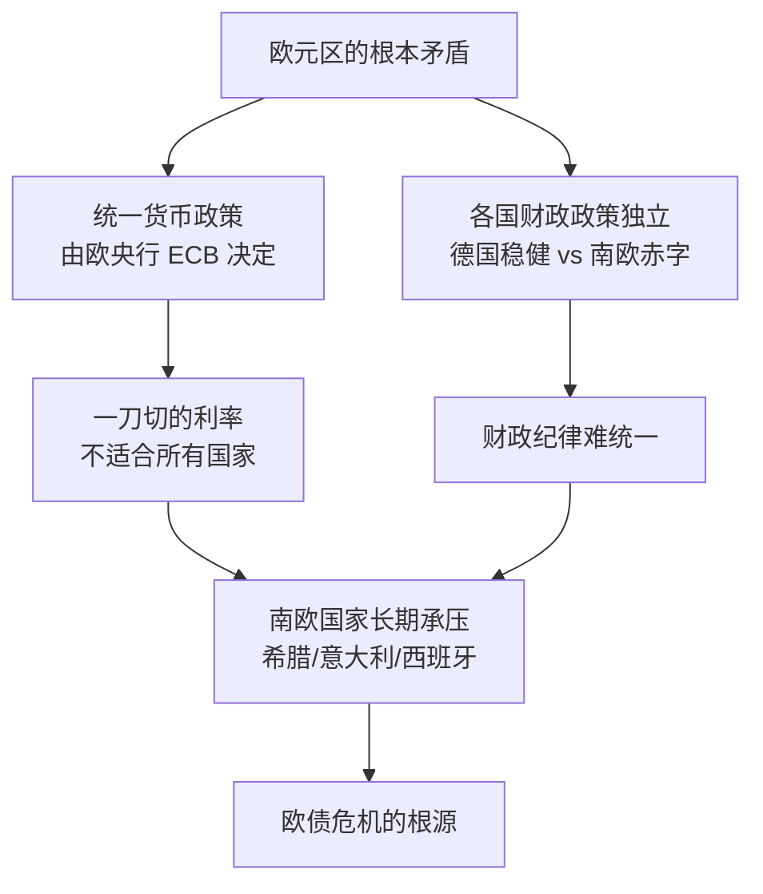
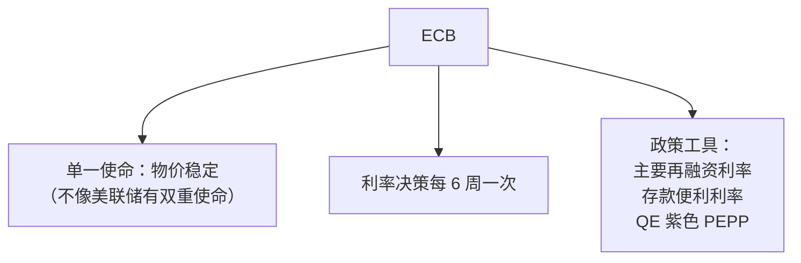

# 🇪🇺 欧盟经济

`🟡 进阶`

> 核心问题：欧洲为什么长期低迷？欧元区有解体风险吗？

---

## 欧元区核心矛盾

---

## 欧洲三大问题

### 1. 制造业失去竞争力

### 2. 老龄化与人口萎缩

| 国家 | 中位年龄 | 总和生育率 |
|------|----------|-----------|
| 德国 | 46 岁 | 1.5 |
| 意大利 | 48 岁 | 1.3 |
| 西班牙 | 45 岁 | 1.2 |
| 法国 | 43 岁 | 1.7 |

### 3. 政治分裂

- 英国脱欧（2020）
- 各国民粹主义崛起
- 对俄、对华、对中东的分歧
- 财政统一遥遥无期

---

## ECB（欧洲央行）

---

## 欧元区主要经济体

| 国家 | GDP（万亿美元） | 特征 |
|------|----------------|------|
| 德国 🇩🇪 | $4.5 | 制造业强国，欧元区核心 |
| 法国 🇫🇷 | $3.0 | 服务业为主，财政赤字大 |
| 意大利 🇮🇹 | $2.2 | 债务/GDP > 130% |
| 西班牙 🇪🇸 | $1.6 | 旅游/服务业 |
| 荷兰 🇳🇱 | $1.1 | 贸易枢纽 |

---

## 待补充

- [ ] 欧债危机详解（european-debt-crisis.md）
- [ ] 德国经济模式（germany.md）
- [ ] 英国脱欧影响（brexit.md）
- [ ] 欧央行政策追踪（ecb-tracking.md）
