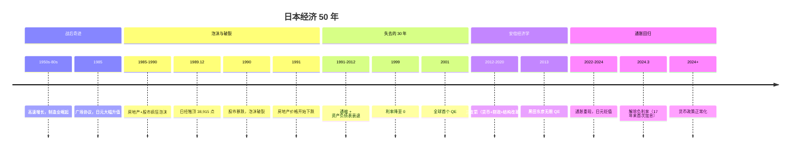
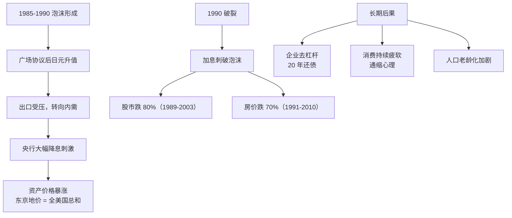
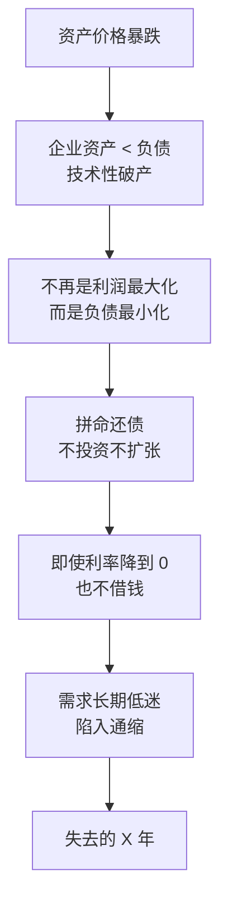
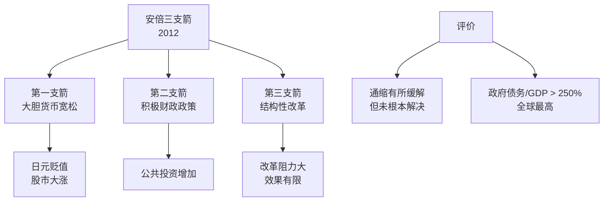
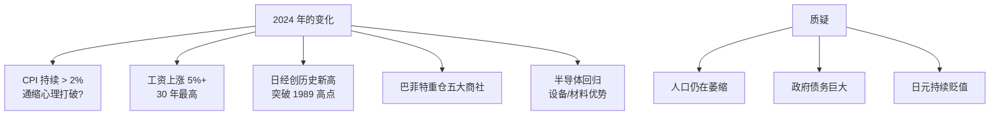

# 🇯🇵 日本经济

`🟡 进阶`

> 核心问题：日本"失去的三十年"是怎么形成的？现在终于走出来了吗？这对中国意味着什么？

---

## 日本经济的关键叙事

---

## 日本泡沫破裂的教训

---

## 资产负债表衰退（辜朝明理论）

> 💡 这就是为什么日本在零利率下仍然不能刺激经济。**这不是"流动性陷阱"，是"资产负债表衰退"**。

---

## 日本 vs 中国：相似与不同

### 相似点

| | 日本（1990） | 中国（2021+） |
|--|-------------|--------------|
| 房地产泡沫 | ✅ 严重 | ✅ 部分城市 |
| 高储蓄率 | ✅ | ✅ |
| 出口导向 | ✅ | ✅ |
| 老龄化 | ✅ | ✅（开始） |
| 政府债务高 | ✅ | ✅（地方为主） |

### 不同点

| | 日本 | 中国 |
|--|------|------|
| 城市化率 | 已 78% | 65%（仍有空间） |
| 经济发展阶段 | 已是发达国家 | 仍是发展中 |
| 人均 GDP | 当时 $30k+ | 现在 $13k |
| 金融对外开放 | 高 | 受管制 |
| 政府干预力度 | 慢/弱 | 快/强 |
| 科技自主 | 强（已有） | 在追赶中 |

---

## 安倍经济学的成与败

---

## 日本"重新崛起"？

---

## 日本经济给中国的启示

| 教训 | 应用 |
|------|------|
| 泡沫破裂后要快速救助 | 中国在 2024 年开始大幅放松 |
| 不要让通缩心理形成 | 防止"资产负债表衰退" |
| 科技自立是出路 | 中国正在做（半导体/AI） |
| 出海是缓解内需不足的方法 | 中国新三样出口 |
| 老龄化是慢变量但杀伤力巨大 | 鼓励生育 + 银发经济 |

---

## 待深入

- [ ] 日本泡沫详解（japan-bubble.md）
- [ ] 资产负债表衰退理论（balance-sheet-recession.md）
- [ ] 安倍经济学评估（abenomics.md）
- [ ] 日本科技产业（japan-tech.md）
- [ ] 中日对比深度分析（china-japan-comparison.md）
