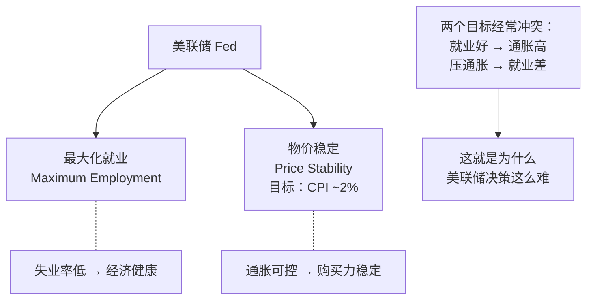
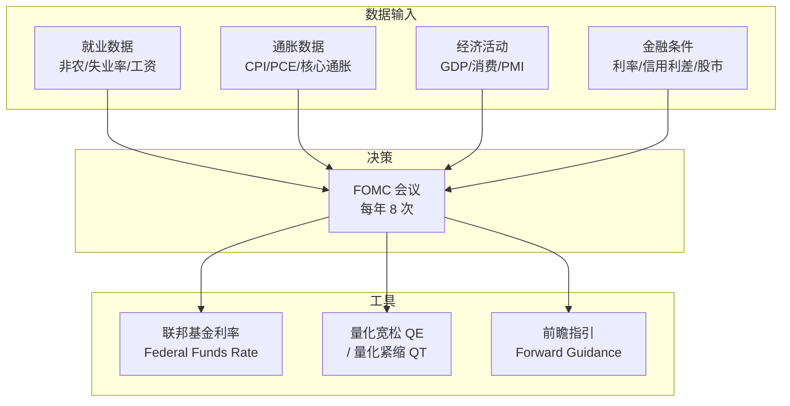
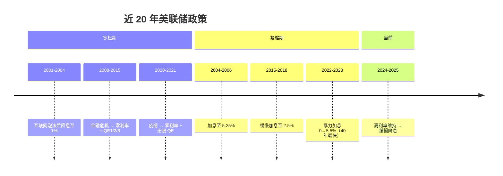
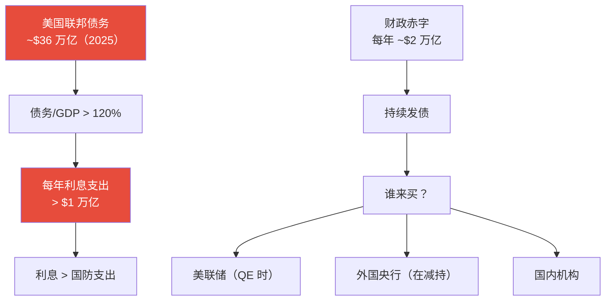
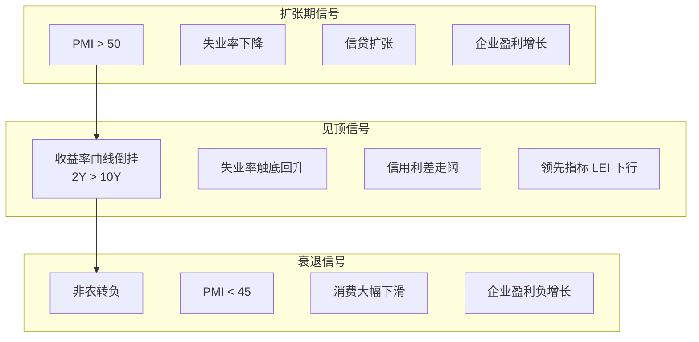

# 🇺🇸 美国经济 | US Economy

`🟡 进阶`

> 核心问题：美国经济为什么这么有韧性？美联储的决策如何影响全球？

---

## 一句话总结

**美国经济 = 消费驱动 + 科技创新 + 美元霸权 + 财政扩张。美联储是全球央行的央行，它的每一个决定都牵动全球资产。**

---

## 美国经济结构

```mermaid
pie title 美国 GDP 构成（2024）
    "个人消费 68%" : 68
    "政府支出 17%" : 17
    "企业投资 18%" : 18
    "净出口 -3%" : -3
```

> 💡 美国是**消费驱动型经济**。消费占 GDP 近 70%，所以就业和工资数据对美国经济至关重要。

---

## 美联储 | The Federal Reserve

### 美联储的双重使命 (Dual Mandate)



### FOMC 决策框架



### 美联储政策周期



---

## 美国经济的核心指标

### 就业（最重要）

| 指标 | 频率 | 关注点 |
|------|------|--------|
| 非农就业 (NFP) | 月度（第一个周五） | 新增就业人数 |
| 失业率 | 月度 | <4% 为充分就业 |
| 时薪增速 | 月度 | 工资通胀压力 |
| 初请失业金 | 每周 | 高频就业风向标 |
| JOLTS 职位空缺 | 月度 | 劳动力市场松紧 |

### 通胀

| 指标 | 频率 | 关注点 |
|------|------|--------|
| CPI | 月度 | 整体通胀 |
| 核心 CPI | 月度 | 剔除食品能源（更稳定） |
| PCE | 月度 | 美联储首选指标 |
| 核心 PCE | 月度 | 美联储决策核心依据 |
| 通胀预期 | 持续 | 密歇根大学/TIPS 隐含 |

### 经济活动

| 指标 | 频率 | 关注点 |
|------|------|--------|
| GDP | 季度 | 经济增速 |
| ISM PMI | 月度 | 制造业/服务业景气 |
| 零售销售 | 月度 | 消费强弱 |
| 消费者信心 | 月度 | 消费意愿 |
| 房屋数据 | 月度 | 利率敏感型行业 |

---

## 美国财政：被忽视的巨大风险



### 为什么这很重要？

- 债务越多 → 利息越多 → 需要借更多钱还利息 → **债务螺旋**
- 外国央行减持美债 → 谁来接盘？→ 美联储可能被迫重启 QE
- 这是黄金长期牛市和"去美元化"叙事的核心逻辑之一

---

## 美国经济的韧性来源

| 因素 | 说明 |
|------|------|
| 消费韧性 | 就业强 + 工资涨 + 财富效应（股市/房价） |
| 科技创新 | AI 革命带来新一轮资本开支和生产力提升 |
| 能源独立 | 页岩油革命后成为净出口国 |
| 美元地位 | 可以"印钱"解决很多问题（短期） |
| 移民 | 补充劳动力，支撑消费和房市 |
| 资本市场深度 | 全球最发达的融资体系 |

## 美国经济的潜在风险

| 风险 | 说明 |
|------|------|
| 财政不可持续 | 赤字和债务持续膨胀 |
| 贫富分化 | 前 10% 持有 70% 股票财富 |
| 政治极化 | 政策不确定性上升 |
| 商业地产 | 远程办公后空置率高 |
| AI 替代就业 | 中期可能冲击服务业 |
| 去全球化成本 | 供应链回流推高成本 |

---

## 美国经济周期判断框架



### 收益率曲线倒挂：最可靠的衰退预警


> ⚠️ 2022 年 7 月开始倒挂，2024 年解除。衰退是否会来？这是当前最大的争论之一。

---

## 核心概念速查

| 术语 | 英文 | 一句话解释 |
|------|------|-----------|
| FOMC | Federal Open Market Committee | 美联储利率决策会议 |
| 非农 | Non-Farm Payrolls (NFP) | 每月新增就业人数（最重要的数据之一） |
| PCE | Personal Consumption Expenditures | 美联储首选通胀指标 |
| QE | Quantitative Easing | 央行买债券向市场注入流动性 |
| QT | Quantitative Tightening | 央行缩减资产负债表 |
| 收益率曲线 | Yield Curve | 不同期限国债收益率的连线 |
| 软着陆 | Soft Landing | 降通胀但不引发衰退 |
| 硬着陆 | Hard Landing | 加息过度导致衰退 |

---

## 延伸思考

1. 美国能实现"软着陆"吗？历史上成功案例极少。
2. AI 是否能带来新一轮生产力革命，延长经济扩张？
3. 美国财政赤字的终局是什么？通胀化解？还是债务危机？
4. 如果美国衰退，对中国是利好还是利空？

---

## 相关链接

- [美股市场](../../03-assets/us-stocks/)
- [美元与外汇](../../03-assets/fx/)
- [全球经济关联](../connections/)
- [经济史 → 美国](../../01-history/us/)
