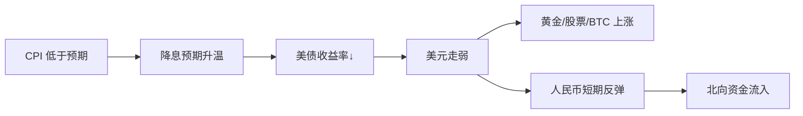

# 📅 2026-05-15 每日追踪（示范）

> 这是一份示范记录，展示日常追踪应该长什么样。请基于 [daily-template.md](../../templates/daily-template.md) 持续记录。

## 市场概览

| 资产 | 收盘/现价 | 涨跌幅 | 备注 |
|------|-----------|--------|------|
| 沪深 300 | - | - | （填写实际数据） |
| 创业板指 | - | - | |
| 恒生指数 | - | - | |
| 标普 500 | - | - | |
| 纳斯达克 | - | - | |
| 美元指数 DXY | - | - | |
| 10Y 美债 | - | - | |
| 10Y 中债 | - | - | |
| 黄金 | - | - | |
| 原油 WTI | - | - | |
| BTC | - | - | |
| 北向资金 | - | - | |

## 今日重要事件（示例结构）

### 事件 1：[假设] 美国 4 月 CPI 数据公布

- **事实**：CPI 同比 2.8%，预期 2.9%，前值 3.0%
- **预期差**：好于预期（通胀回落比预期快）
- **影响链**：

- **市场反应**：（填实际反应）
- **我的判断**：（你的看法）
- **后续跟踪**：下次 FOMC 会议、核心 PCE 数据

---

## 今日思考

> 通过这个事件，我理解了：CPI 数据本身重要，但**预期差**才是市场反应的真正驱动力。下次看到数据，先看市场预期，再看实际值。

## 明日关注

- [ ] 中国 4 月 LPR 公布（每月 20 号）
- [ ] 关注美元指数能否站稳 100
- [ ] 沪深 300 是否能突破年内高点

---

> 💡 这只是一个示范结构。日常记录时根据当天实际事件填写，重点不是"全"，而是**养成思考和记录的习惯**。
