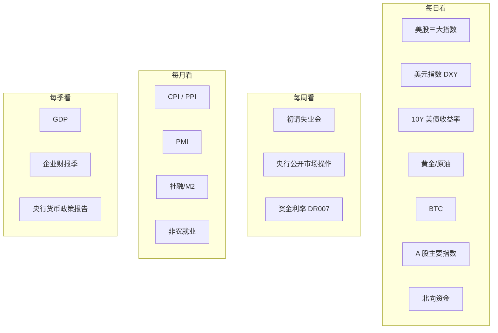

# 📡 每日事件追踪与分析

> 核心目标：记录重要经济事件，分析影响面，训练"事件 → 推演 → 验证"的能力。

---

## 工作流


## 目录结构

```
05-daily-tracking/
├── README.md              ← 你在这里
├── indicators/            ← 重要经济指标解读模板
│   ├── cpi.md
│   ├── pmi.md
│   ├── employment.md
│   └── ...
├── central-banks/         ← 央行会议纪要与解读
│   ├── fed-fomc.md
│   ├── pboc.md
│   └── ...
├── templates/             ← 日志模板
│   ├── daily-template.md
│   └── weekly-template.md
└── 2026/
    ├── 05/
    │   ├── 2026-05-14.md  ← 每日记录
    │   └── ...
    └── ...
```

## 追踪什么？

### 高优先级事件

| 类型 | 例子 | 影响面 |
|------|------|--------|
| 央行决议 | FOMC 加息/降息、PBOC 降准 | 全资产 |
| 重要数据 | 非农就业、CPI、PMI | 利率预期 → 资产价格 |
| 地缘事件 | 战争、制裁、贸易摩擦 | 避险资产、供应链 |
| 政策变化 | 财政刺激、监管新规 | 相关行业/市场 |
| 市场异动 | 单日暴跌 >3%、流动性危机 | 情绪传染 |

### 日常关注指标



## 分析模板

每条事件记录包含：

1. **事实** (What)：发生了什么？数据是多少？
2. **预期差** (vs Expectation)：比市场预期好还是差？
3. **影响链** (Impact Chain)：顺着传导链推演
4. **市场反应** (Market Reaction)：实际怎么走的？
5. **我的判断** (My Take)：我怎么看？
6. **后续跟踪** (Follow-up)：接下来关注什么？

---

## 数据源推荐

| 数据 | 免费来源 | 付费来源 |
|------|----------|----------|
| 美国经济数据 | [FRED](https://fred.stlouisfed.org/) | Bloomberg |
| 中国经济数据 | 国家统计局、央行官网 | Wind、CEIC |
| 全球市场行情 | TradingView、Yahoo Finance | Bloomberg |
| 加密货币 | CoinGecko、Glassnode (部分免费) | Nansen |
| 财经日历 | Investing.com、金十数据 | — |
| 央行声明 | 各央行官网 | — |

---

→ 开始记录：[2026 年 5 月](./2026/05/)
