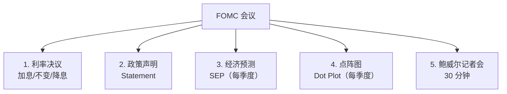
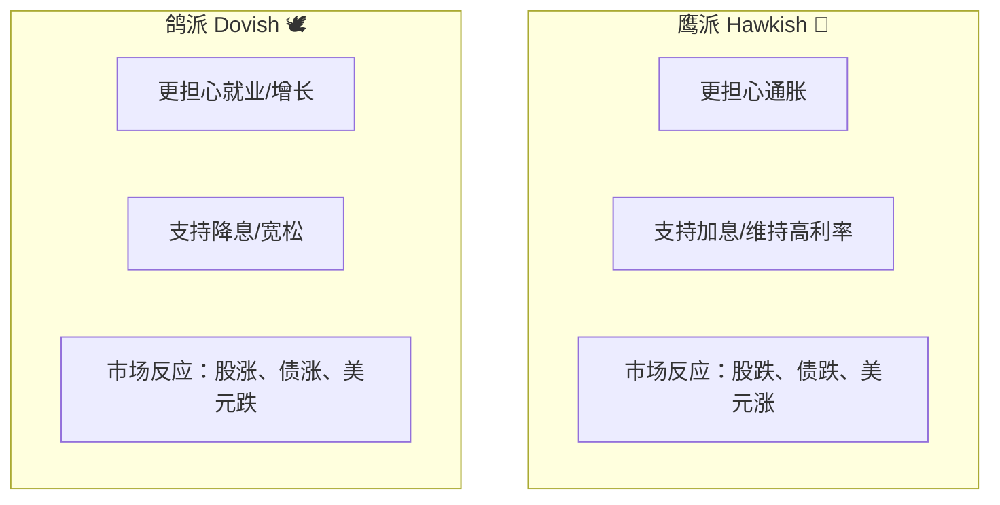
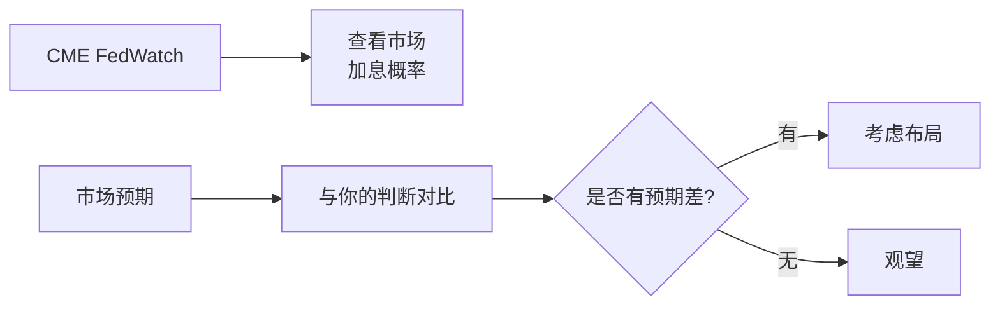

# 美联储 FOMC 会议解读框架

---

## FOMC 基本信息

| 项目 | 内容 |
|------|------|
| 全称 | Federal Open Market Committee |
| 频率 | 每年 8 次（约每 6 周一次） |
| 会议时长 | 2 天 |
| 投票成员 | 12 人（7 理事 + 纽约联储主席 + 4 轮值地区联储主席） |
| 决策内容 | 联邦基金利率、QE/QT 规模、前瞻指引 |

---

## 一次完整 FOMC 的关注点



### 1. 利率决议

| 操作 | 含义 |
|------|------|
| 加息 25bp | 偏鹰，紧缩加强 |
| 加息 50bp | 强鹰，激进紧缩 |
| 不变 | 观望 |
| 降息 25bp | 偏鸽，开始宽松 |
| 降息 50bp | 强鸽，紧急宽松 |

### 2. 政策声明：逐字对比上一次

```mermaid
graph LR
    A[新声明] --> B[逐字对比上次]
    B --> C[找出措辞变化]
    C --> D[判断政策倾向]
    
    E[例如：<br/>"通胀仍然偏高"<br/>→ "通胀有所缓和"<br/>= 鸽派转向]
```

### 3. 经济预测摘要 (SEP)

每季度发布，包含未来 3 年的预测：

| 指标 | 关注什么 |
|------|----------|
| GDP 增速 | 经济判断 |
| 失业率 | 就业判断 |
| PCE 通胀 | 通胀判断 |
| 核心 PCE 通胀 | 美联储最看重 |
| 联邦基金利率 | **未来利率路径** |

### 4. 点阵图 (Dot Plot)

```mermaid
graph TB
    A[19 个 FOMC 成员的<br/>未来利率预测] --> B[每个点 = 一个成员]
    B --> C[中位数 = 市场关注的"共识"]
    C --> D[与上次对比 = 政策转向]
```

> 📊 例：上次中位数显示 2025 年降息 3 次，这次变成 1 次 → 鹰派转向。

### 5. 鲍威尔记者会

通常 30 分钟，**比声明更重要**。

| 关键词 | 鸽派信号 | 鹰派信号 |
|--------|----------|----------|
| 通胀 | "降温"、"取得进展" | "顽固"、"高于目标" |
| 就业 | "降温"、"再平衡" | "强劲"、"紧张" |
| 利率 | "限制性已足够"、"接近目标" | "需要保持限制性" |
| 风险 | "下行风险增加" | "上行风险" |

---

## 鹰派 vs 鸽派



---

## 历次重要 FOMC 回顾

| 时间 | 关键事件 | 影响 |
|------|----------|------|
| 2008.12 | 利率降至 0-0.25%，启动 QE | 开启零利率时代 |
| 2013.5 | 伯南克暗示缩减 QE | "Taper Tantrum"，新兴市场动荡 |
| 2015.12 | 9 年来首次加息 | 美元周期开启 |
| 2020.3 | 紧急降息 + 无限 QE | 史诗级宽松 |
| 2022.3 | 开始加息周期 | 全球资产承压 |
| 2022-2023 | 累计加息 525bp | 40 年最快加息 |
| 2024.9 | 首次降息 50bp | 开启降息周期 |

---

## 怎么交易 FOMC？

### 会议前



### 会议后

| 实际 vs 预期 | 市场反应 |
|-------------|----------|
| 比预期更鹰 | 股跌债跌美元涨 |
| 比预期更鸽 | 股涨债涨美元跌 |
| 完全符合预期 | 反应平淡，看记者会 |

> ⚠️ FOMC 后市场常出现"开始反应一个方向，最后反向"的情况。建议不要追涨杀跌。

---

## 数据获取

- 美联储官网：[federalreserve.gov](https://www.federalreserve.gov/)
- FOMC 日历：[FOMC Calendar](https://www.federalreserve.gov/monetarypolicy/fomccalendars.htm)
- CME FedWatch（加息概率）：[CME Group](https://www.cmegroup.com/markets/interest-rates/cme-fedwatch-tool.html)
- 中文实时：金十数据、华尔街见闻
