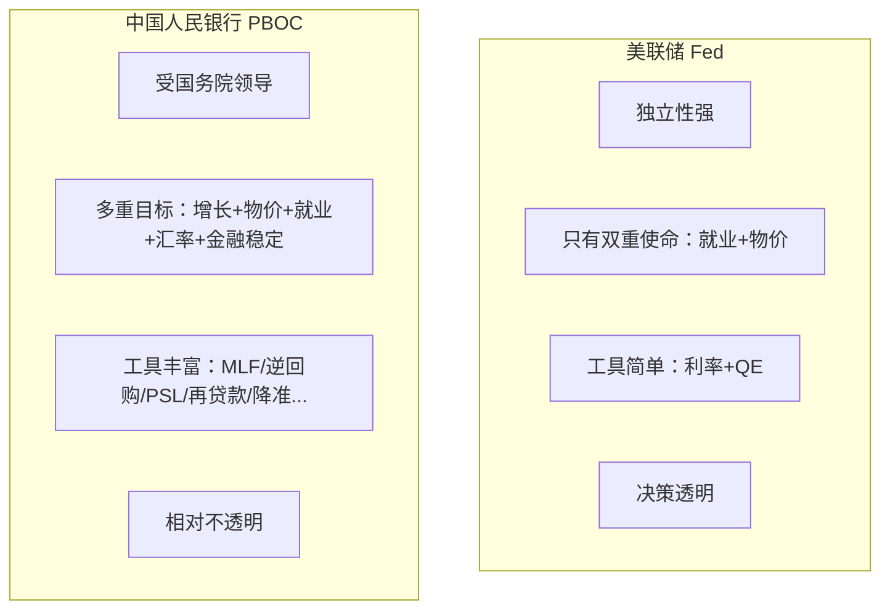
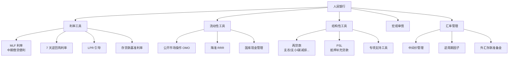
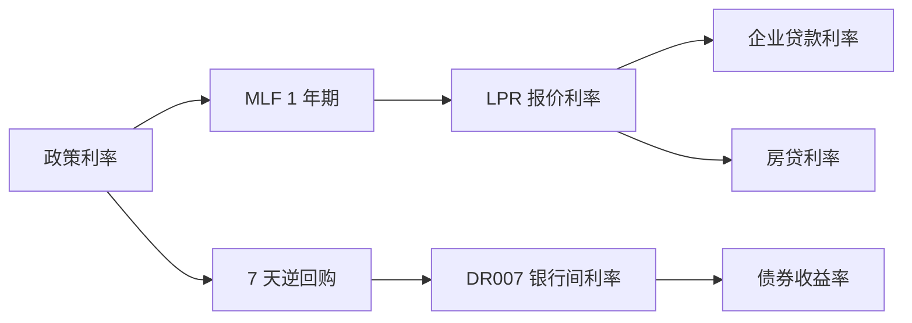

# 中国人民银行 PBOC 政策追踪

---

## PBOC 与美联储的不同

---

## PBOC 的政策工具箱

---

## 关键利率体系

| 利率 | 当前水平参考 | 作用 |
|------|-------------|------|
| MLF（1年） | ~2.0% | 政策中枢 |
| 7天逆回购 | ~1.5% | 短期流动性 |
| 1Y LPR | ~3.1% | 一般企业贷款基准 |
| 5Y LPR | ~3.6% | 房贷基准 |
| DR007 | 围绕逆回购 | 银行间真实利率 |

---

## 怎么追踪 PBOC？

### 高频信号（每日/每周）

| 操作 | 含义 |
|------|------|
| 公开市场净投放 > 0 | 释放流动性 |
| 公开市场净回笼 > 0 | 收紧流动性 |
| 7 天逆回购利率下调 | 宽松信号（近年罕见） |
| DR007 偏离逆回购 | 资金面真实状态 |

### 中频信号（每月）

| 数据 | 频率 | 关注点 |
|------|------|--------|
| MLF 操作 | 月度（每月 15 号） | 利率是否调整 |
| LPR 报价 | 月度（每月 20 号） | 是否调整 |
| 社融/M2 | 月度（10-15 号） | 信用扩张速度 |
| 央行资产负债表 | 月度 | 工具使用情况 |

### 低频信号（每季）

| 内容 | 频率 |
|------|------|
| 货币政策执行报告 | 季度（约滞后 1.5 月） |
| 央行行长讲话 | 不定期 |
| 政策定调（如"稳健"、"积极"） | 中央经济工作会议 |

---

## 政策定调的"暗语"

| 措辞 | 倾向 |
|------|------|
| "稳健中性" | 中性 |
| "稳健灵活适度" | 偏宽松 |
| "稳健精准有力" | 宽松 |
| "保持流动性合理充裕" | 宽松 |
| "保持流动性合理稳定" | 中性 |
| "防范金融风险" | 偏紧 |
| "总闸门" | 紧缩 |

---

## PBOC 政策的几个特点

### 1. "结构性"重于"总量性"

近年中国货币政策更倾向：
- 不大水漫灌
- 通过再贷款定向投放（科技/绿色/小微）
- 控制总量但调结构

### 2. "稳汇率"是硬约束

### 3. 房地产政策与货币政策深度绑定

- 5Y LPR 直接影响房贷
- 经营性物业贷款、保交楼再贷款是房地产专项工具
- "房住不炒" vs "稳楼市" 的反复博弈

---

## 关键事件日历

| 时点 | 事件 |
|------|------|
| 每月 15 号 | MLF 操作 |
| 每月 20 号 | LPR 报价 |
| 每月 10-15 号 | 金融数据（社融/M2/信贷） |
| 每季度 | 货币政策执行报告 |
| 每年 12 月 | 中央经济工作会议（次年定调） |
| 每年 3 月 | 两会政府工作报告（年度目标） |
| 每年 7-8 月 | 中央政治局会议（年中调整） |

---

## 数据获取

- 中国人民银行：[pbc.gov.cn](http://www.pbc.gov.cn/)
- 公开市场操作：央行官网每日发布
- 社融/M2：央行官网"统计数据"
- 中文解读：华尔街见闻、Wind、券商首席宏观研报
