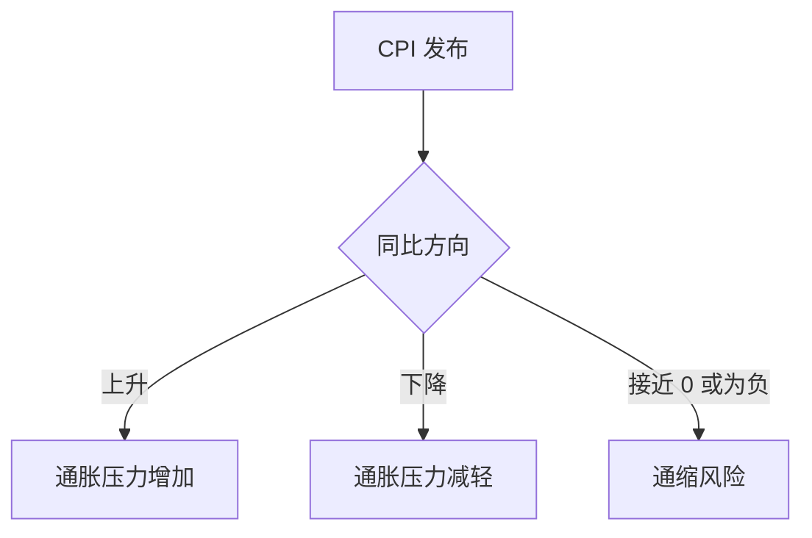
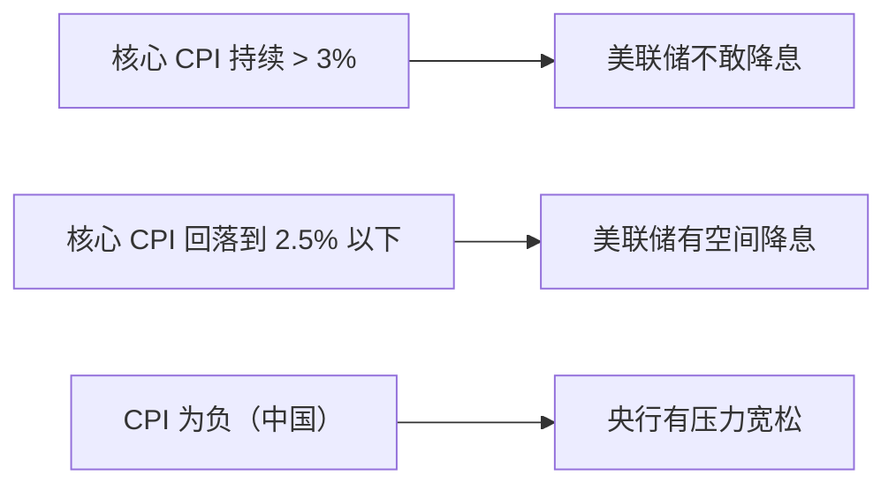

# CPI 解读框架 | Consumer Price Index

---

## 基本信息

| 项目 | 中国 CPI | 美国 CPI |
|------|----------|----------|
| 发布机构 | 国家统计局 | 劳工统计局 (BLS) |
| 频率 | 月度（次月 9-12 号） | 月度（次月 10-13 号） |
| 关注指标 | 同比、环比 | 同比、环比、核心 CPI |
| 健康水平 | 2-3% | ~2%（美联储目标） |

---

## 怎么看 CPI 数据？

### Step 1：看整体方向

### Step 2：看预期差

| 情况 | 市场反应 |
|------|----------|
| CPI > 预期（超预期高） | 加息预期升温 → 股跌债跌美元涨 |
| CPI < 预期（超预期低） | 降息预期升温 → 股涨债涨美元跌 |
| CPI = 预期 | 反应平淡 |

### Step 3：看结构（分项）

**美国 CPI 权重**：
| 分项 | 权重 | 关注点 |
|------|------|--------|
| 住房 (Shelter) | ~36% | 最大权重，滞后反映房租 |
| 食品 | ~13% | 受天气/供应链影响 |
| 能源 | ~7% | 波动大，受油价影响 |
| 交通 | ~16% | 含二手车（疫情后波动大） |
| 医疗 | ~8% | 相对稳定 |

**核心 CPI = 剔除食品和能源**（因为它们波动太大，不反映趋势）

### Step 4：判断对政策的影响

---

## 中国 CPI 的特殊性

- **猪周期**：猪肉在中国 CPI 中权重大，猪价波动经常主导 CPI
- **基数效应**：去年同期基数高/低会扭曲同比数据
- **CPI vs PPI 剪刀差**：PPI 高但 CPI 低 → 上游涨价传不到下游 → 中下游企业利润被挤压

---

## 历史参考

| 时期 | CPI 水平 | 背景 |
|------|----------|------|
| 2021 美国 | 7-9% | 疫情放水 + 供应链断裂 |
| 2022 美国 | 6-9% | 俄乌战争推高能源 |
| 2024 中国 | 0-0.5% | 内需不足，通缩边缘 |
| 2025 中国 | ~0% | 仍在低位徘徊 |

---

## 数据获取

- 美国 CPI：[BLS 官网](https://www.bls.gov/cpi/) / [FRED](https://fred.stlouisfed.org/series/CPIAUCSL)
- 中国 CPI：[国家统计局](https://www.stats.gov.cn/)
- 实时预期：Investing.com 财经日历
