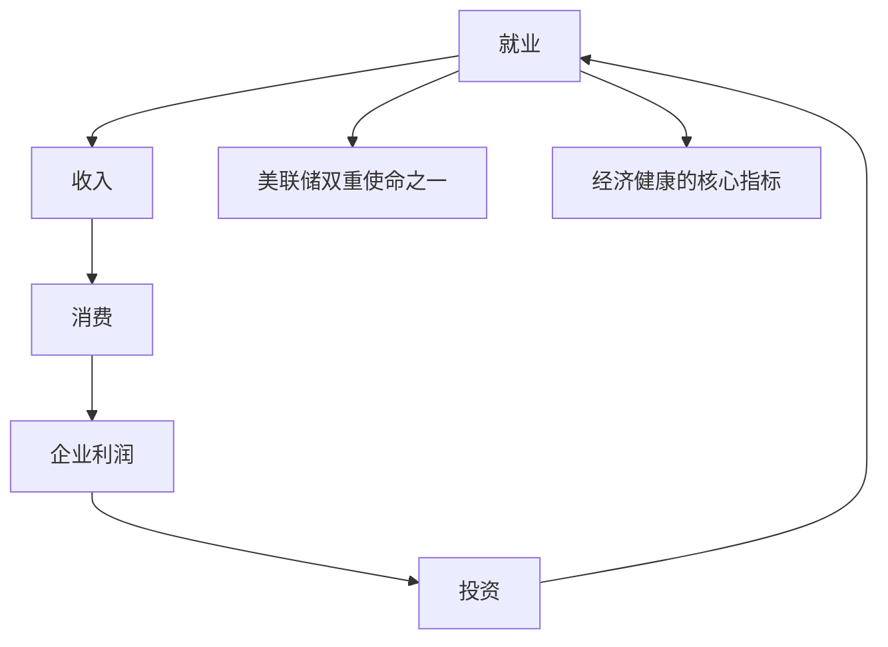
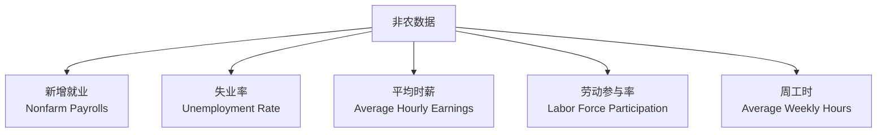

# 就业数据解读框架 | Employment Data

---

## 为什么就业数据这么重要？



> 💡 美国 GDP 中消费占 ~68%，而消费来自就业带来的收入。所以**就业是美国经济的命脉**。

---

## 美国非农 (NFP) — 全球最关注的数据

### 基本信息

| 项目 | 内容 |
|------|------|
| 全称 | Non-Farm Payrolls 非农就业人数 |
| 发布时间 | 每月第一个周五 20:30（北京时间） |
| 发布机构 | 美国劳工统计局 (BLS) |
| 发布内容 | 新增就业人数、失业率、时薪、劳动参与率 |

### 核心数据



### 怎么解读？

| 指标 | 健康水平 | 解读 |
|------|----------|------|
| 新增就业 | 15-25 万/月 | <10 万 = 放缓，>30 万 = 强劲 |
| 失业率 | 3.5-4.5% | 充分就业区间 |
| 时薪同比 | 3-4% | >4% 可能引发工资通胀 |
| 劳动参与率 | 62-63% | 越高越健康 |

---

## 数据组合解读

```mermaid
graph TB
    subgraph "强劲就业"
        A1[新增 > 25 万]
        A2[失业率 < 4%]
        A3[时薪 > 4%]
        A4 --> 通胀压力，加息预期
    end
    
    subgraph "金发姑娘 Goldilocks"
        B1[新增 15-20 万]
        B2[失业率稳定]
        B3[时薪 ~3.5%]
        B4 --> 经济健康，市场最爱
    end
    
    subgraph "衰退信号"
        C1[新增 < 5 万 或负]
        C2[失业率快速上升]
        C3[时薪放缓]
        C4 --> 降息预期，债市利好
    end
```

---

## "好数据是坏消息"现象

```mermaid
graph LR
    A["非农大超预期<br/>（数据"好"）"] --> B["美联储不敢降息"]
    B --> C["利率维持高位"]
    C --> D["股市反而下跌"]
    
    E["非农不及预期<br/>（数据"坏"）"] --> F["降息预期升温"]
    F --> G["股市反而上涨"]
```

> 💡 这就是 2022-2024 年常见的"好数据是坏消息"现象。市场关心的是**美联储会怎么反应**，而不是数据本身。

---

## 萨姆规则 (Sahm Rule) — 衰退预警

```
萨姆规则：失业率 3 个月移动平均值
        相比过去 12 个月最低点上升 0.5 个百分点
        → 美国进入衰退
```

历史准确率：**100%**（自 1950 年以来每次都准确）

> 📊 2024 年 8 月 萨姆规则被触发，但至今未出现明显衰退（首次例外？）。

---

## 中国就业数据

| 指标 | 频率 | 说明 |
|------|------|------|
| 城镇调查失业率 | 月度 | 整体失业率 |
| 31 个大城市失业率 | 月度 | 主要城市失业 |
| 16-24 岁青年失业率 | 月度（2023 改版） | 青年就业压力 |
| 农民工就业 | 季度 | 流动人口就业 |

### 中国就业的特殊性

- 数据覆盖范围有限（不含农村）
- 灵活就业人数大（约 2 亿）
- 青年失业率长期偏高（一度 >20%）
- 真实就业压力可能高于官方数据

---

## 数据获取

- 美国非农：[BLS](https://www.bls.gov/) / FRED
- 美国初请失业金（每周）：FRED
- 中国就业：[国家统计局](http://www.stats.gov.cn/)
- 实时：Investing.com / 金十数据
