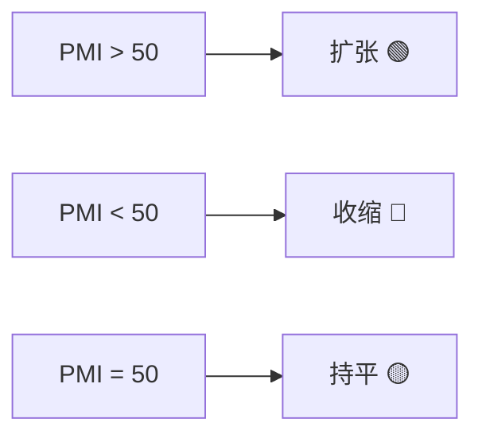
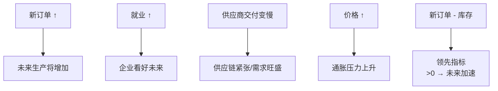
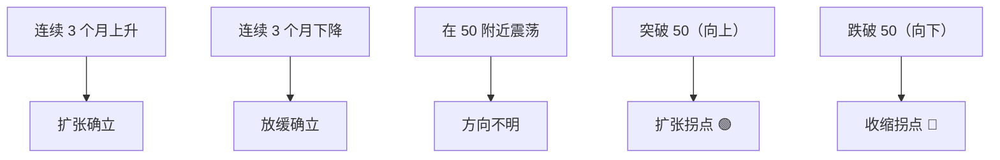

# PMI 解读框架 | Purchasing Managers' Index

---

## 基本信息

| 项目 | 内容 |
|------|------|
| 全称 | 采购经理人指数 |
| 发布频率 | 月度 |
| 荣枯线 | **50** |
| 性质 | 领先指标 |

---

## 中美 PMI 对比

### 中国 PMI

| | 官方 PMI | 财新 PMI |
|--|----------|---------|
| 发布机构 | 国家统计局 | S&P Global + 财新 |
| 调查对象 | 大中型国企为主 | 中小私企为主 |
| 发布时间 | 每月最后一天 | 每月第一个工作日 |
| 特点 | 反映"国家队" | 反映"民营经济" |

**两者经常背离**：官方 PMI 强但财新 PMI 弱 → 国企稳但民企困难。

### 美国 PMI

| | ISM PMI | S&P Global PMI |
|--|---------|----------------|
| 历史 | 老牌（1948-） | 较新 |
| 关注度 | 极高 | 中等 |
| 分类 | 制造业 + 非制造业（服务业） | 制造业 + 服务业 |

> 💡 **服务业 PMI 比制造业 PMI 更重要**（因为美国服务业占 GDP ~80%）。

---

## PMI 分项指标

| 分项 | 权重 | 含义 |
|------|------|------|
| 新订单 | 高 | 未来需求（最重要） |
| 生产 | 高 | 当前生产活动 |
| 就业 | 中 | 用工需求 |
| 供应商交付 | 中 | 供应链状态 |
| 库存 | 中 | 库存水平 |
| 价格 | 低 | 通胀压力 |

### 关键分项解读

---

## 怎么用 PMI 判断经济？

### 看绝对水平

| PMI | 经济状态 |
|-----|----------|
| > 55 | 强劲扩张 |
| 50-55 | 温和扩张 |
| 45-50 | 温和收缩 |
| < 45 | 严重收缩 |

### 看趋势（更重要）

---

## PMI 与资产价格

| PMI 信号 | A 股 | 美股 | 大宗商品 | 债券 |
|----------|------|------|----------|------|
| PMI 突破 50 向上 | 🟢 | 🟢 | 🟢 | 🔴 |
| PMI 持续 > 55 | 🟢 但警惕过热 | 🟢 | 🟢 强 | 🔴 |
| PMI 跌破 50 向下 | 🔴 | 🔴 | 🔴 | 🟢 |
| PMI < 45 | 🔴 衰退预期 | 🔴 衰退预期 | 🔴 | 🟢 强 |

---

## 数据获取

- 中国官方 PMI：[国家统计局](http://www.stats.gov.cn/)
- 财新 PMI：[财新网](https://m.caixin.com/)
- 美国 ISM PMI：[ismworld.org](https://www.ismworld.org/)
- 实时数据：Investing.com 财经日历
