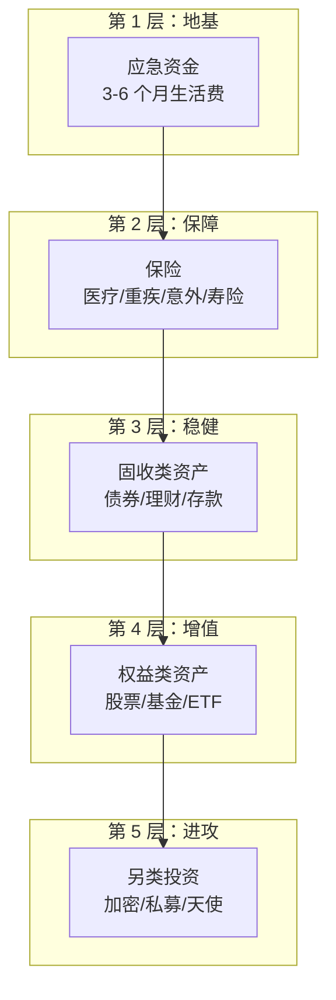
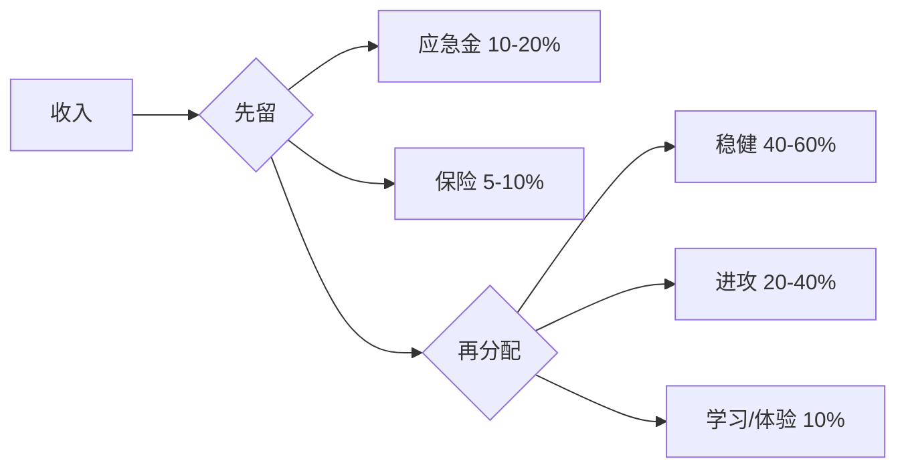

# 🏦 个人理财 | Personal Finance

> 核心目标：管好自己的钱，让财富稳健增长。理论再好，落不到自己口袋里就是空谈。

---

## 理财金字塔



> 💡 **从下往上建**。没有地基就去炒股，等于在沙子上盖楼。

---

## 模块导航

| 文件 | 内容 | 优先级 |
|------|------|--------|
| [basics/cashflow.md](./basics/cashflow.md) | 收支管理与记账 | ⭐⭐⭐ 最先做 |
| [basics/emergency-fund.md](./basics/emergency-fund.md) | 应急资金怎么留 | ⭐⭐⭐ |
| [insurance/](./insurance/) | 保险配置指南 | ⭐⭐⭐ |
| [allocation/](./allocation/) | 资产配置框架 | ⭐⭐ |
| [tax/](./tax/) | 税务优化 | ⭐⭐ |
| [retirement/](./retirement/) | 养老规划 | ⭐ |

---

## 核心原则

### 1. 先防守，再进攻



### 2. 资产配置比选股重要 100 倍

研究表明，投资收益的 **90% 以上由资产配置决定**，而不是择时或选股。

### 3. 不懂的东西不碰

- 不懂期权？别碰。
- 不懂 DeFi？先学再说。
- 别人推荐的"稳赚"？大概率是坑。

### 4. 时间是最大的杠杆

```
复利公式：FV = PV × (1 + r)^n

假设年化 8%：
- 10 年：本金翻 2.16 倍
- 20 年：本金翻 4.66 倍
- 30 年：本金翻 10.06 倍
```

> 25 岁开始每月投 3000 元，年化 8%，60 岁时约 **680 万**。
> 35 岁开始同样操作，60 岁时约 **280 万**。
> 晚 10 年，少 400 万。这就是复利的力量。

---

## 不同阶段的理财重点

| 阶段 | 年龄参考 | 重点 | 风险承受 |
|------|----------|------|----------|
| 起步期 | 22-28 | 攒第一桶金、建立习惯 | 高（时间多） |
| 成长期 | 28-35 | 加速积累、买房决策 | 中高 |
| 稳定期 | 35-50 | 资产配置优化、子女教育 | 中 |
| 收获期 | 50-60 | 降低风险、准备退休 | 中低 |
| 退休期 | 60+ | 保本为主、稳定现金流 | 低 |

---

## 行动清单

新手第一步：
- [ ] 记录一个月的收支（知道钱花哪了）
- [ ] 留出 3 个月应急金（放货币基金）
- [ ] 配置基础保险（医疗险 + 意外险）
- [ ] 开一个基金定投账户（沪深 300 ETF）
- [ ] 读完 [Level 1 基础知识](../00-foundations/level-1-beginner/)
