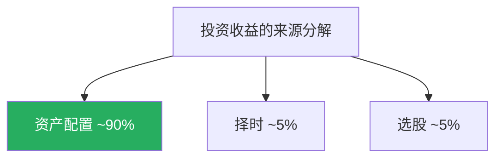
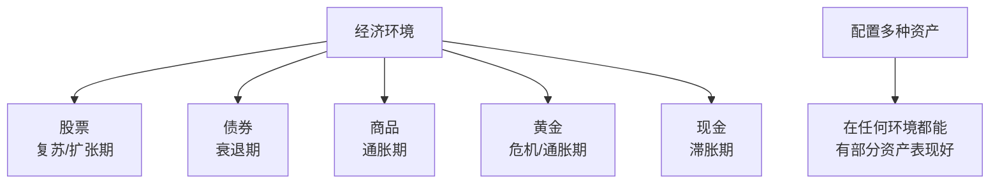
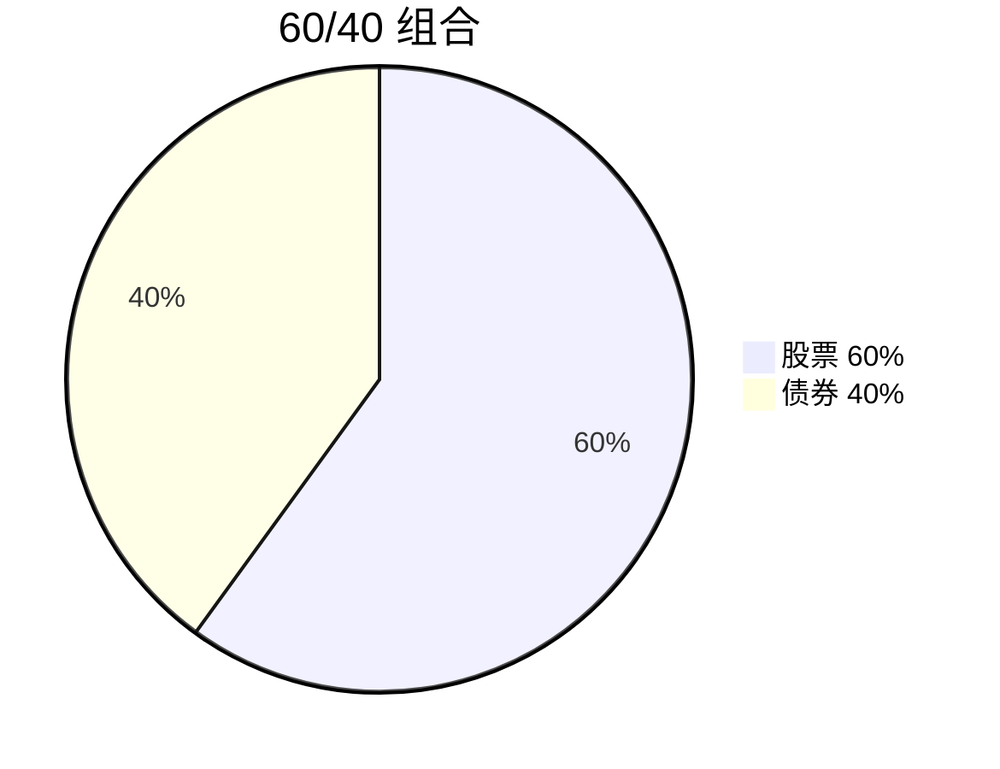
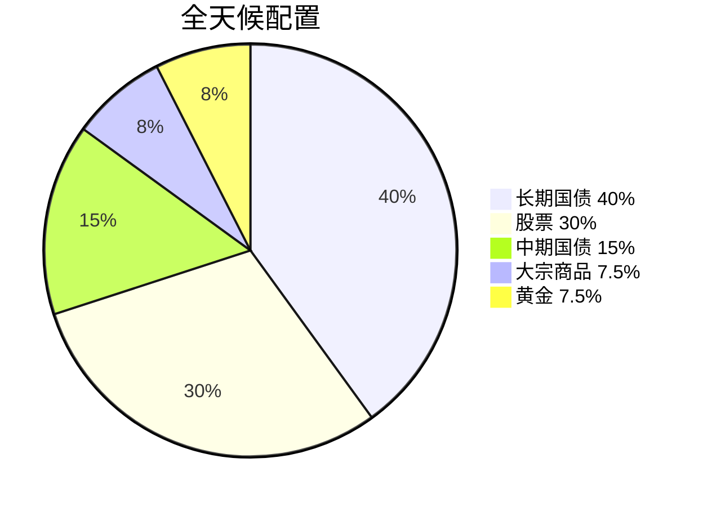
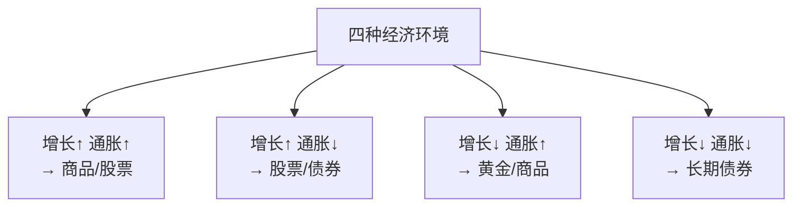
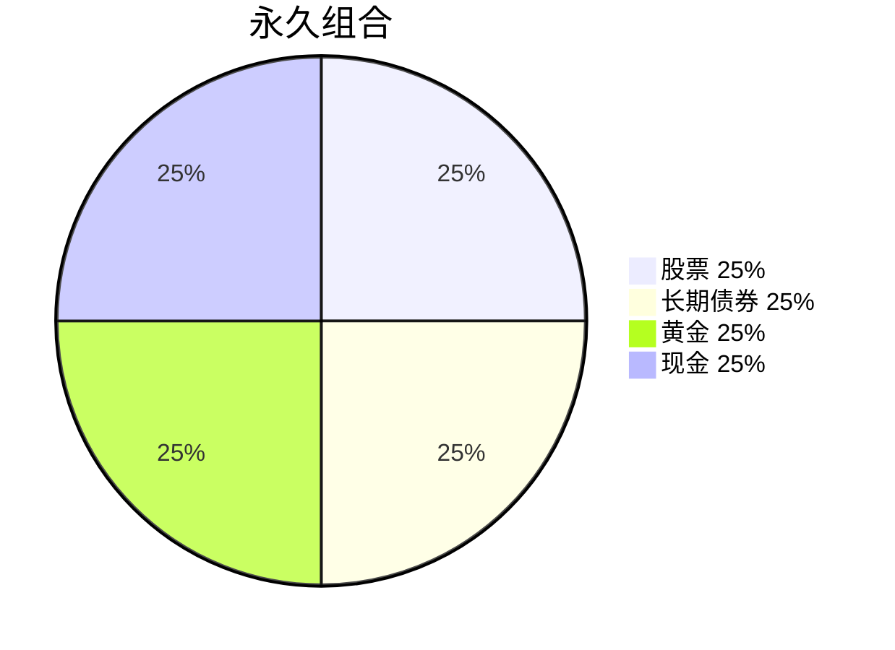
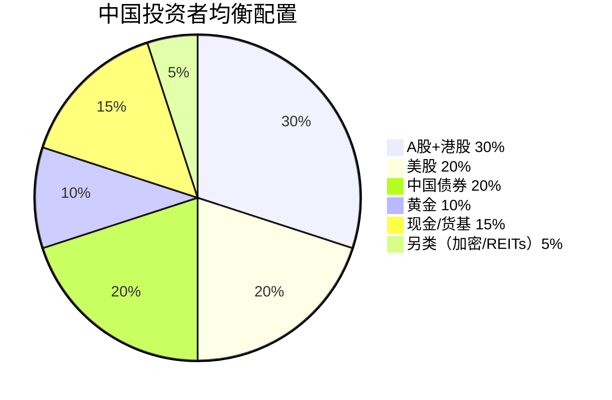
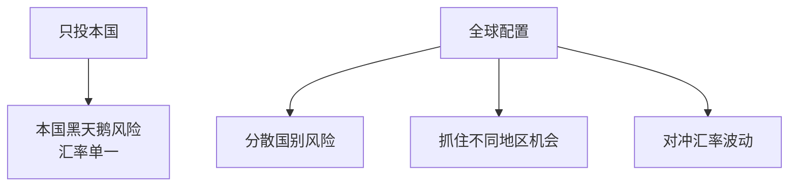

# 📊 资产配置 | Asset Allocation

`🟡 进阶`

> 核心问题：怎么把钱分配到不同资产？比例怎么定？什么时候调整？

---

## 一句话总结

**资产配置 = 投资中最重要的决策。研究表明，长期收益的 90% 由资产配置决定，而不是择时或选股。**

---

## 为什么资产配置这么重要？



> 📊 美国 Brinson 等学者的经典研究表明：**养老金的回报变化 91.5% 来自资产配置决策**。

---

## 资产配置的核心思想

### 1. 不同资产的"季节"不同



### 2. 相关性是关键

| 资产 1 | 资产 2 | 相关性 | 配置效果 |
|--------|--------|--------|----------|
| A 股 | A 股 | 高正 | ❌ 无分散效果 |
| A 股 | 美股 | 中正 | 🟡 部分分散 |
| 股票 | 债券 | 低/负 | ✅ 显著降低波动 |
| 股票 | 黄金 | 弱 | ✅ 危机时对冲 |

---

## 经典配置方案

### 方案 1：60/40 经典组合



| 优点 | 缺点 |
|------|------|
| 简单易懂 | 2022 年股债双杀失效 |
| 长期回报稳定 | 通胀环境下表现差 |
| 适合大多数人 | 没考虑商品/黄金 |

### 方案 2：达里奥全天候 (All Weather)



**核心思想**：每种经济环境都有资产受益。



### 方案 3：永久组合 (Harry Browne)



极简版"全天候"，每年再平衡一次。

### 方案 4：年龄法则

```
股票 % = 100 - 年龄
（或 110 - 年龄，更激进版）
```

| 年龄 | 股票 | 债券 |
|------|------|------|
| 25 | 75% | 25% |
| 35 | 65% | 35% |
| 45 | 55% | 45% |
| 55 | 45% | 55% |
| 65 | 35% | 65% |

---

## 中国投资者的本土化方案

### 推荐基础配置（中等风险）



### 不同风险偏好

| 风险偏好 | 股票 | 债券 | 黄金 | 现金 | 另类 |
|----------|------|------|------|------|------|
| 保守型 | 20% | 50% | 10% | 20% | 0% |
| 稳健型 | 40% | 35% | 10% | 10% | 5% |
| 均衡型 | 50% | 25% | 10% | 10% | 5% |
| 进取型 | 65% | 15% | 10% | 5% | 5% |
| 激进型 | 75% | 5% | 5% | 5% | 10% |

---

## 配置的具体工具

### 股票部分（中国投资者）

| 资产 | 推荐工具 |
|------|----------|
| A 股大盘 | 沪深 300 ETF (510300) |
| A 股中盘 | 中证 500 ETF (510500) |
| A 股科技 | 创业板 ETF / 科创 50 |
| 港股 | 恒生 ETF / 恒生科技 ETF |
| 美股大盘 | 标普 500 ETF (513500) |
| 美股科技 | 纳指 ETF (513100) |

### 债券部分

| 资产 | 推荐工具 |
|------|----------|
| 国债 | 国债 ETF (511010) |
| 信用债 | 中长期纯债基金 |
| 可转债 | 可转债 ETF |
| 美元债 | 美元债 QDII |

### 黄金部分

| 资产 | 推荐工具 |
|------|----------|
| 黄金 | 黄金 ETF (518880) |
| 黄金（实物属性） | 实物金条/金币 |

### 现金/类现金

| 资产 | 推荐工具 |
|------|----------|
| 货币基金 | 余额宝/微信理财通 |
| 短期理财 | 银行 R1 级理财 |

---

## 再平衡 (Rebalancing)

### 什么是再平衡？


### 再平衡的频率

| 方法 | 优点 | 缺点 |
|------|------|------|
| 时间触发（如每年一次） | 简单 | 可能错过机会 |
| 阈值触发（偏离 5% 触发） | 反应及时 | 操作频繁 |
| 混合（每年 + 大幅偏离） | 平衡 | 需要监控 |

### 再平衡的"反人性"


> 💡 这就是为什么再平衡需要**纪律**，不能靠感觉。

---

## 配置的常见错误

### ❌ 1. 过度集中

| 错误 | 后果 |
|------|------|
| 只买 A 股 | 错过美股 + 单一市场风险 |
| 只买一两只股票 | 公司风险 + 极端波动 |
| 全部投房产 | 流动性差 + 政策风险 |

### ❌ 2. 频繁调整


### ❌ 3. 忽略相关性

买 5 只白酒股 ≠ 分散投资。它们涨跌同步。

### ❌ 4. 配置但不再平衡

不再平衡 = 让赢家越来越多，最终风险暴露失控。

---

## 配置的进阶思考

### 1. 战略 vs 战术

| | 战略配置 | 战术配置 |
|--|---------|---------|
| 时间 | 长期（年） | 短中期（月-季） |
| 调整 | 很少 | 较频繁 |
| 依据 | 长期目标 + 风险偏好 | 市场判断 |
| 例子 | 股 50% / 债 30% / 现 20% | 看好科技 → 暂时加配创业板 |

### 2. 全球化配置



### 3. 因子配置（进阶）

| 因子 | 含义 | 工具 |
|------|------|------|
| 价值 | 买便宜的 | 红利 ETF |
| 成长 | 买高速增长的 | 创业板 / 纳指 |
| 质量 | 买高 ROE 的 | 质量因子 ETF |
| 动量 | 买涨势好的 | 动量因子 ETF |
| 规模 | 买小盘 | 中证 1000 |

---

## 行动清单

- [ ] 评估你的风险承受能力（年龄、收入稳定性、家庭责任）
- [ ] 选择一个适合你的基础配置方案
- [ ] 用 ETF/基金实现配置（避免选个股）
- [ ] 设定再平衡规则（每年 1 月 1 日 / 偏离 ±10%）
- [ ] 至少 5 年不要轻易改变战略配置
- [ ] 每年复盘一次：配置是否还符合你的目标？
