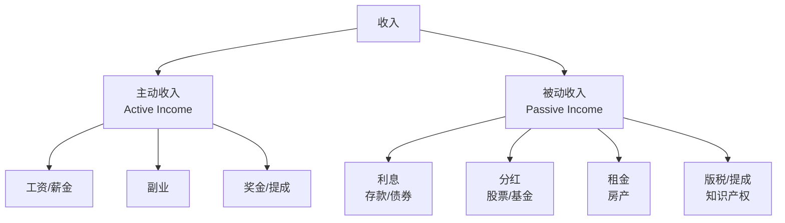
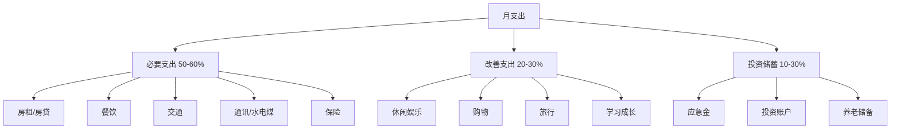
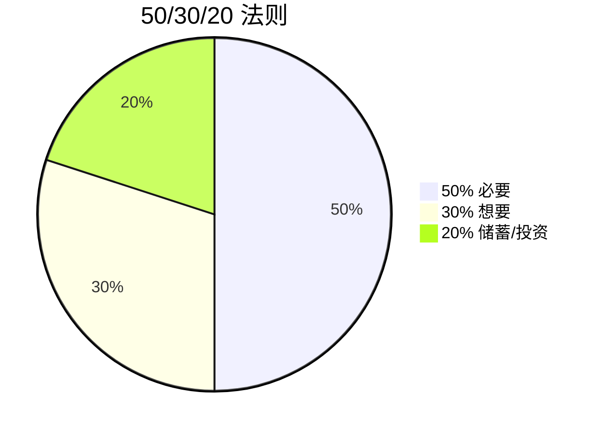
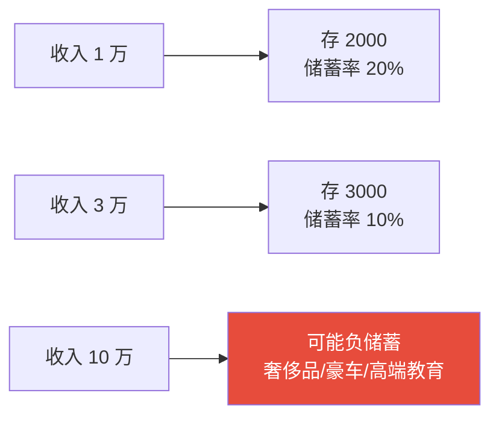

# 现金流管理 | Cash Flow Management

`🟢 入门`

> 核心问题：钱去哪了？怎么知道自己每月的真实结余？

---

## 一句话总结

**理财的第一步不是赚多少，而是知道花多少。不记账的人永远不知道自己的钱漏在哪。**

---

## 核心公式

```
月结余 = 月收入 - 月支出
年结余 = 月结余 × 12 + 年终奖 - 大额支出（旅游/购物等）
储蓄率 = 月结余 / 月收入
```

> 💡 **健康的储蓄率：20-50%**。低于 10% 风险大，高于 70% 可能过度节约影响生活质量。

---

## 收入分类



> 🎯 **理财的终极目标：被动收入 ≥ 必要支出 = 财务自由**。

---

## 支出分类（六分法）



---

## 50/30/20 法则

最简单的预算方法：



| 类别 | 例子 |
|------|------|
| 50% 必要 (Needs) | 房租、吃饭、交通、通讯 |
| 30% 想要 (Wants) | 娱乐、购物、旅游、外食 |
| 20% 储蓄 (Savings) | 应急金、投资、还债 |

> 💡 高收入者建议把储蓄比例提到 30-50%。低收入者先做到 10% 也是好的开始。

---

## 记账的方法

### 工具选择

| 工具 | 优点 | 缺点 |
|------|------|------|
| 手机记账 App（随手记/MoneyWiz/钱迹） | 方便 | 容易遗漏 |
| Excel/飞书表格 | 灵活、可分析 | 需要主动录入 |
| 银行/支付宝月账单 | 自动 | 不分类，难分析 |
| 信用卡账单 | 自动 | 只覆盖刷卡部分 |

### 推荐组合


---

## 月度复盘模板

```markdown
# YYYY-MM 月度财务复盘

## 收入
| 来源 | 金额 |
|------|------|
| 工资 | |
| 副业 | |
| 投资收益 | |
| 合计 | |

## 支出
| 类别 | 金额 | 占比 | 备注 |
|------|------|------|------|
| 必要 | | | |
| 改善 | | | |
| 投资储蓄 | | | |
| 合计 | | | |

## 关键指标
- 储蓄率：___%
- 投资收益率：___%
- 净资产变化：___元

## 复盘
- 这个月最大的"意外支出"是什么？
- 哪类支出超预期？为什么？
- 下个月可以优化什么？
```

---

## 现金流陷阱

### 陷阱 1：收入越高，支出越高（生活方式膨胀）



> 💡 **真正的财富自由不是赚多少，而是支出能控制在多少**。

### 陷阱 2：信用卡/分期付款的隐性成本

```
看起来：12 期免息分期，每月还 1000 元，"等于"省钱。
实际上：
- 你为本来不会买的东西花了钱
- 信用卡分期年化利率常常 13-18%（不要被"月费率 0.65%"骗）
- 各种分期叠加 → 月负债越来越多
```

### 陷阱 3：以"投资"名义的消费

| 看似投资，实际消费 | 真相 |
|-------------------|------|
| 买名牌包"保值" | 大多数贬值 |
| 买学区房"投资" | 自住 + 杠杆 |
| 买黄金首饰"避险" | 工费占 30%，金价涨也覆盖不了 |
| 买保险"理财" | 收益率通常 < 国债 |

---

## 行动清单

新手第一周：
- [ ] 安装一个记账 App
- [ ] 列出所有固定收入和支出
- [ ] 估算储蓄率

第一个月：
- [ ] 完整记录一个月的所有收支
- [ ] 找出 3 个"意外消费"
- [ ] 设定下月的预算目标

三个月后：
- [ ] 优化固定支出（订阅/会员/保险）
- [ ] 增加被动收入来源
- [ ] 制定全年财务目标

---

## 下一篇

→ [应急资金](./emergency-fund.md)：留多少钱、放哪里？
