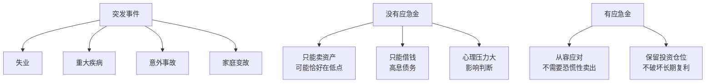
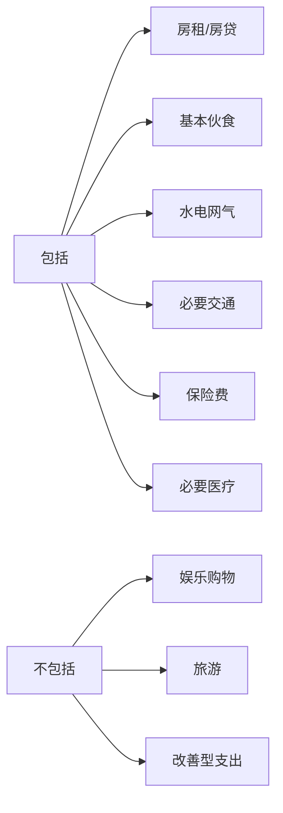
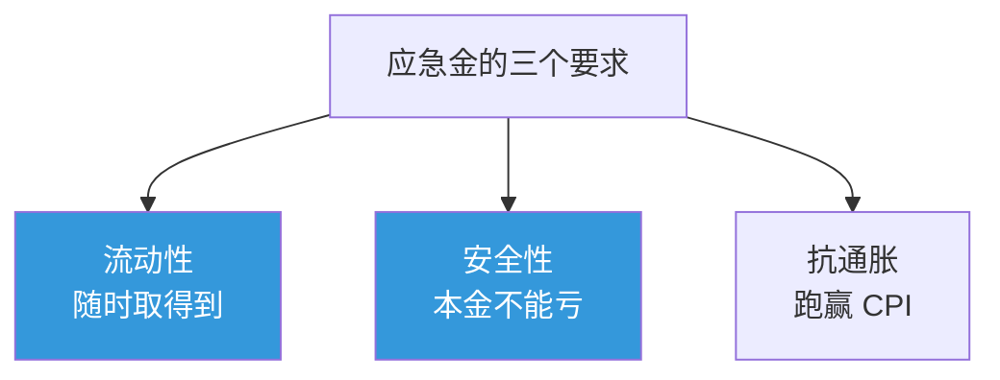
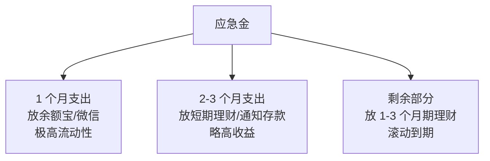

# 应急资金 | Emergency Fund

`🟢 入门`

> 核心问题：留多少钱、放哪里、什么时候用？

---

## 一句话总结

**应急资金 = 你失业/生病时仍能维持基本生活的钱。它不是用来赚钱的，是用来"救命"的。**

---

## 为什么必须要有应急金？



> 💡 应急金的核心价值不是"收益"，而是**让你在危机时不需要做错误的财务决策**。

---

## 留多少？

### 标准公式

```
应急金 = 月必要支出 × N

N = 3-12 个月（看你的风险）
```

### 你需要多少？

| 你的情况 | 建议月数 |
|----------|----------|
| 单身、收入稳定、有家人支持 | 3 个月 |
| 已婚、双职工、无房贷 | 3-6 个月 |
| 有房贷、有孩子 | 6 个月 |
| 单一收入来源、行业不稳定 | 6-12 个月 |
| 自由职业 / 创业者 | 12 个月 |
| 临近退休 | 6-12 个月（流动性更重要） |

### 月必要支出怎么算？



> 💡 计算应急金时，按"过苦日子"的标准算。失业时你不会去吃米其林。

---

## 放哪里？

### 三个标准



> ⚠️ 流动性 > 安全性 > 收益率。**不要用应急金追求高收益**。

### 推荐工具（中国）

| 工具 | 流动性 | 收益 | 安全性 | 推荐度 |
|------|--------|------|--------|--------|
| 银行活期 | T+0 | 0.2% | 极高（50万存保） | ⭐⭐⭐ |
| 货币基金（余额宝/微信） | T+0 限额 1万，T+1 不限 | 1.5-2% | 极高 | ⭐⭐⭐⭐⭐ |
| 银行 7 天通知存款 | T+7 | 1.5-2% | 极高 | ⭐⭐⭐ |
| 短期理财 R1 级 | T+1 到 T+30 | 2-3% | 高 | ⭐⭐⭐⭐ |
| 国债逆回购 | T+1 | 2-4% | 极高 | ⭐⭐⭐ |
| 黄金 ETF | T+1 | 波动 | 中 | ❌ 不推荐做应急金 |
| 股票/基金 | T+1 | 波动大 | 低 | ❌ 千万别 |

### 推荐组合



---

## 应急金的常见误区

### 误区 1：和投资资金混在一起

```mermaid
graph LR
    A[一个账户<br/>"全部资金"] --> B["危险！"]
    B --> C[市场暴跌时<br/>恰好需要用钱]
    C --> D[被迫低价卖出<br/>损失惨重]
```

**正确做法**：应急金单独账户，**物理隔离**，看不见的钱就不会动用。

### 误区 2：应急金"够多就行"

| 错误 | 正确 |
|------|------|
| "我有 50 万存款，肯定够应急了" | 看的是月支出倍数，不是绝对额 |
| 月支出 5 万 × 12 个月 = 60 万都不算多 | |
| 月支出 5000 × 6 个月 = 3 万就够 | |

### 误区 3：用信用卡当应急金


信用卡是**高息短期借款**，不是应急金。

### 误区 4：用了之后不补充

应急金用了之后，**最高优先级是补回来**，不是马上重新投资。

---

## 应急金的"使用守则"

只在以下情况动用：
- ✅ 失业且无新工作
- ✅ 重大疾病（保险不能 cover 的部分）
- ✅ 家庭紧急事件
- ✅ 真正的"意外"

不能用于：
- ❌ "这次股票一定涨"
- ❌ 朋友借钱（不是应急）
- ❌ 大额消费（手机/包包）
- ❌ 生活方式升级

---

## 实操步骤

### 阶段 1：建立 1 个月应急金（1-3 个月内完成）

1. 算出月必要支出
2. 把这个数额转入余额宝（或类似工具）
3. **绝对不动**，看不见的钱

### 阶段 2：扩展到 3-6 个月（6-12 个月内）

1. 每月强制储蓄 20-30%
2. 优先充实应急金，再考虑投资
3. 把超过 1 个月的部分转入收益略高的工具

### 阶段 3：维护期（持续）

1. 每年根据生活成本变化重新计算
2. 用了之后立刻补充
3. 收入大幅上升时，应急金也要相应增加

---

## 行动清单

- [ ] 算出你的月必要支出
- [ ] 决定你需要 X 个月的应急金
- [ ] 在主银行外另开一个账户专门放应急金
- [ ] 设置每月自动转账到该账户
- [ ] 标记"仅供紧急使用"

---

## 下一篇

→ [保险配置](../insurance/)：保险该怎么买？买哪些？
