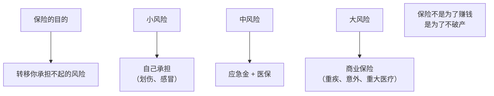
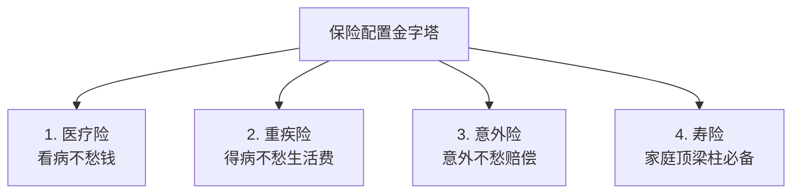
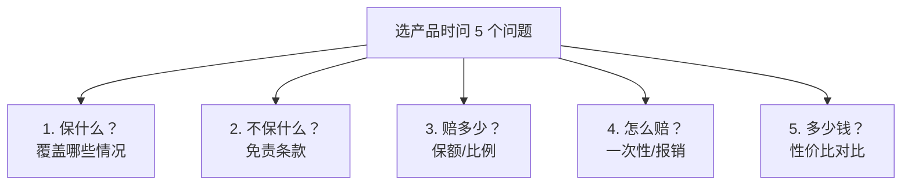

# 🛡️ 保险配置 | Insurance

`🟢 入门`

> 核心问题：哪些保险必须买？哪些是坑？买多少额度合适？

---

## 一句话总结

**保险的本质是"风险转移"，不是"投资"。该买的是消费型保障，不是返还型理财。**

---

## 保险的核心原则



> 💡 **保险是花钱让你"不会变穷"，不是让你"变富"。**

---

## 必备的四张保单（个人）



### 1. 医疗险 (Medical Insurance) ⭐⭐⭐⭐⭐

**作用**：报销医疗费用（医保之外的部分）。

| 类型 | 保费 | 保额 | 推荐度 |
|------|------|------|--------|
| 百万医疗险 | 几百元/年 | 200-600 万 | ⭐⭐⭐⭐⭐ 必买 |
| 高端医疗险 | 几千-几万/年 | 几百万 | 看预算 |

**关键点**：
- 选**续保稳定**的产品（最好保证续保 20 年）
- 注意**免赔额**（通常 1 万）
- 看**报销比例**（社保内 100% / 社保外 100% 是基本款）

> ⚠️ 百万医疗险是**消费型**，每年交，不返还。但每年几百块换 200-600 万保额，性价比极高。

### 2. 重疾险 (Critical Illness) ⭐⭐⭐⭐⭐

**作用**：确诊重疾后，**一次性赔付**保额。这笔钱可以用来：
- 弥补收入损失（治病期间无法工作）
- 改善生活质量（康复期）
- 支付医保不报销的费用

| 类型 | 特点 |
|------|------|
| 消费型重疾险 | 不返还，性价比高（推荐） |
| 储蓄型重疾险 | 满期返本（实际是低收益理财） |

**保额建议**：
- 至少 **30 万起步**
- 标准 = **50 万**（基本能 cover 大部分重疾治疗+康复）
- 充足 = **年收入 × 5 倍**

### 3. 意外险 (Accident Insurance) ⭐⭐⭐⭐⭐

**作用**：意外身故/伤残/医疗的赔付。

| 保障 | 保额建议 |
|------|----------|
| 意外身故 | 50-100 万 |
| 意外伤残 | 50-100 万 |
| 意外医疗 | 1-5 万 |

**特点**：
- 便宜：100-200 元/年可保 100 万
- 短期：通常 1 年期，每年续
- 不审核身体状况

> ⚠️ 注意区分"意外险"和"意外医疗险"——前者保身故/伤残，后者保医疗费。最好买含两者的综合意外险。

### 4. 定期寿险 (Term Life Insurance) ⭐⭐⭐⭐

**作用**：被保人身故/全残时赔付。**核心是给家人留下经济保障**。

**谁需要买？**
- ✅ 家庭主要经济来源者
- ✅ 有房贷/车贷
- ✅ 有需要赡养的老人/孩子
- ❌ 单身、无负债、父母经济独立 → 可以不买

**保额建议**：
```
保额 = 房贷余额 + 子女教育费用 + 父母养老费 + 5-10 年家庭开支
```

通常 **100-300 万** 是基础水平。

> 💡 **选定期不选终身**。终身寿保费贵 5-10 倍，且 80 岁后赔付的钱通胀已经吃掉很多了。

---

## 保险配置参考表

### 单身年轻人（25-30岁）

| 险种 | 保额 | 年保费参考 |
|------|------|-----------|
| 百万医疗险 | 300 万 | 300 元 |
| 重疾险 | 30-50 万 | 1500-3000 元（30 年期） |
| 意外险 | 100 万 | 200 元 |
| **合计** | — | **2000-3500 元/年** |

### 已婚有房贷有娃（30-40岁）

| 险种 | 保额 | 年保费参考 |
|------|------|-----------|
| 百万医疗险 | 600 万 | 500 元 |
| 重疾险 | 50-80 万 | 4000-6000 元 |
| 意外险 | 100 万 | 300 元 |
| 定期寿险 | 200-300 万 | 1500-2500 元 |
| **合计** | — | **6000-9000 元/年** |

> 💡 **保费占比建议：年收入的 5-10%**。超过 15% 通常是过度配置或买错产品。

---

## 这些保险不要买

### ❌ "返还型"保险

```mermaid
graph LR
    A["返还型重疾险<br/>每年交 1 万 × 20 年"] --> B["满期没出险<br/>返还 30 万"]
    B --> C["看似"白嫖"<br/>实际年化收益不到 2.5%"]
    C --> D["还不如买消费型 + 自己理财"]
```

**对比**：
- 消费型重疾：年交 3000，保 50 万
- 返还型重疾：年交 10000，保 50 万 + 30 年后返 30 万
- **差额 7000 × 30 年定投指数基金**（年化 8%）≈ **86 万**

### ❌ "理财型"保险（万能险/分红险）

| 问题 | 说明 |
|------|------|
| 收益低 | 实际收益常 2-3%，跑不过通胀 |
| 流动性差 | 退保损失大（前期甚至本金亏一半） |
| 费用高 | 各种隐性费用扣除 |
| 收益不透明 | "演示利率"≠"实际收益" |

### ❌ 给小孩买寿险

孩子不是家庭收入来源，寿险没意义。给孩子买**重疾 + 医疗 + 意外**就够了。

### ❌ 各种"网红"短期险（除非你研究过）

- 健康宝/相互宝类：互助计划，不是保险，理赔不确定
- "首月 1 元"广告：续保后保费可能暴涨

---

## 投保的几个原则

### 1. 先大人后小孩

家长是经济来源，家长倒下家里就完了。先把家长保障做足。

### 2. 先保障后理财

保障型保险解决"风险问题"，理财型保险解决"收益问题"。两者不要混淆。

### 3. 健康告知一定要如实

保险公司理赔时会调查病历。隐瞒既往病史可能导致理赔被拒。

### 4. 看条款，不看销售话术

> "买保险就是买条款"。条款里写的才算数。

特别看：
- 保障范围
- 免责条款
- 赔付方式（一次性 / 分期 / 报销）
- 续保条件

### 5. 不要怕"贵"，要算性价比

保费 = 保额 × 费率。**别只看保费金额，要看保额和性价比**。

---

## 怎么选产品？

### 推荐路径

1. **不要找"理财顾问"**（业务员有提成偏向）
2. **去专业平台对比**：蚂蚁保、慧择、深蓝保、众安
3. **看测评博主**：保险老炮儿、Lina 看保险（B站/公众号）
4. **找精算师朋友**（如果有）

### 自己研究的核心问题



---

## 行动清单

- [ ] 检查现有保单（很多人不知道自己买了什么）
- [ ] 列出家庭风险敞口（房贷、孩子、父母）
- [ ] 优先级补足：医疗 → 意外 → 重疾 → 寿险
- [ ] 单身：基础三件套（医疗+意外+小额重疾）
- [ ] 家庭：四件套全配齐
- [ ] 每 2-3 年 review 一次
