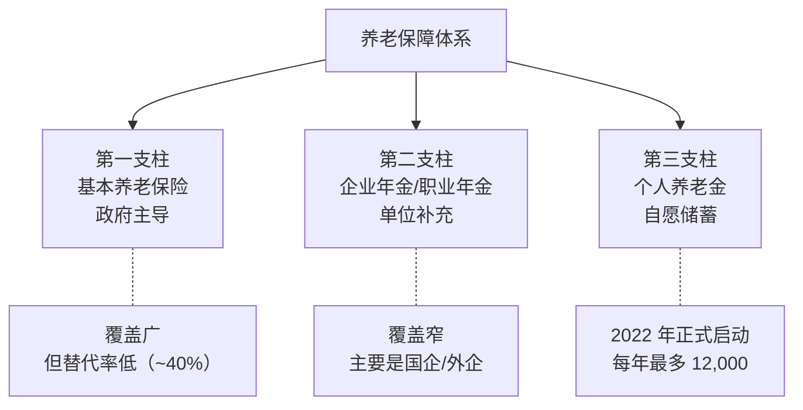
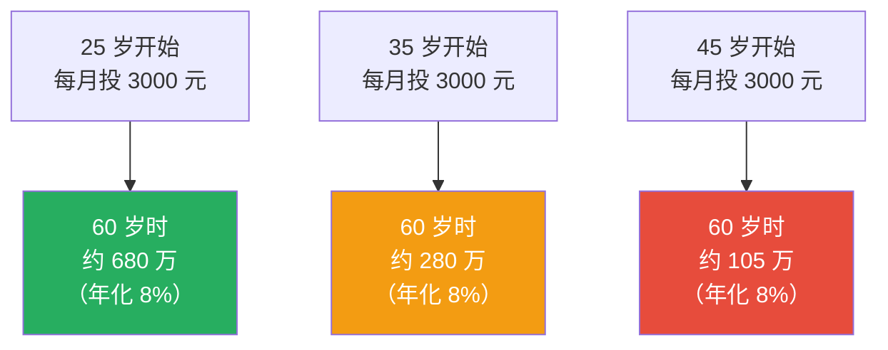
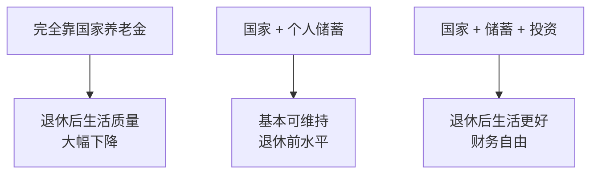

# 👴 养老规划 | Retirement Planning

`🟡 进阶`

> 核心问题：退休需要多少钱？怎么规划才能"老有所养"？

---

## 一句话总结

**养老靠三根支柱：基本养老金 + 企业/商业补充 + 个人储蓄。第一根远远不够，必须早做规划。**

---

## 中国养老体系：三支柱



---

## 退休需要多少钱？

### 简单算法（4% 安全提取规则）

```
退休本金 = 退休后年支出 / 4%
        = 退休后年支出 × 25 倍

例：退休后每月需要 1 万元
年支出 = 12 万
退休本金 = 12 × 25 = 300 万元
```

### 考虑通胀的算法

```
未来年支出 = 当前年支出 × (1 + 通胀率)^年数

例：当前需要 12 万/年，30 年后退休，年通胀 3%
退休时需要 = 12 × 1.03^30 ≈ 29 万/年
退休本金 = 29 × 25 = 728 万
```

> 💡 大多数人**严重低估**退休所需的金额。

---

## 复利的力量（养老规划的核心）



**晚 10 年，差 400 万。这就是复利。**

---

## 个人养老金账户（第三支柱）

### 关键规则

| 项目 | 内容 |
|------|------|
| 启动时间 | 2022 年 11 月（试点）/ 2024 全国推开 |
| 每年限额 | 12,000 元 |
| 税收优惠 | 缴费阶段抵扣个税 / 投资收益免税 / 领取时按 3% 缴税 |
| 投资工具 | 公募基金 / 储蓄 / 商业养老保险 / 理财 |
| 领取条件 | 退休 / 完全失能 / 出国定居 |

### 个人养老金的"得失账"

```
假设你每年存 12,000，投资 30 年，年化 8%，30 年后总额 ≈ 146 万

抵扣：
- 30% 税档每年省 3,600 × 30 = 10.8 万
- 投资收益免税

领取：
- 146 万 × 3% = 4.4 万税

净节税 ≈ 10.8 - 4.4 = 6.4 万 + 复利收益
```

### 谁适合开个人养老金？

| 适合 | 不太适合 |
|------|----------|
| 月工资 > 1 万（边际税率 ≥ 10%） | 月工资 < 5000 |
| 离退休 > 10 年 | 5 年内退休 |
| 有长期闲钱 | 资金紧张 |
| 投资能力一般 | 自己有更高收益策略 |

---

## 养老资产配置策略

### 生命周期策略（Target Date）


**核心思想**：年轻时承担风险（时间多，能扛波动），年长时降低风险（稳定为主）。

### 工具选择

| 阶段 | 推荐工具 |
|------|---------|
| 年轻（25-40） | 沪深 300 + 标普 500 ETF 定投 |
| 中年（40-55） | 加入债券基金、黄金 ETF |
| 临退（55-65） | 增加红利 ETF、债券 |
| 退休后 | 高股息股、长期债券、年金保险 |

---

## 商业养老年金保险

### 优点

- 领取期保证（活到老领到老）
- 安全性高（保险公司刚兑）
- 强制储蓄

### 缺点

- 收益率低（通常 3-4%）
- 流动性差（提前退保亏本）
- 通胀风险（领取时购买力下降）

> 💡 商业年金可以作为养老组合的一部分，但**不能作为主力**。指数基金长期复利远高于年金。

---

## 国家养老金的"陷阱"

| 现象 | 说明 |
|------|------|
| 替代率低 | 退休金/退休前工资 ≈ 40-50% |
| 越来越低 | 2000 年 ~70% → 现在 ~45% → 未来更低 |
| 老龄化压力 | 缴费的人越少，领钱的人越多 |
| 区域不平衡 | 一线城市/事业单位高，普通职工低 |



---

## 行动清单

### 25-35 岁
- [ ] 开始基金定投（每月 1000-3000 元）
- [ ] 配置基础保险
- [ ] 学习投资知识

### 35-45 岁
- [ ] 开通个人养老金账户
- [ ] 资产配置开始多元化
- [ ] 评估退休目标

### 45-55 岁
- [ ] 重新计算退休缺口
- [ ] 增加债券/稳定资产
- [ ] 考虑商业养老年金（如果保守）

### 55-退休
- [ ] 调整为收益型组合
- [ ] 制定具体提取计划
- [ ] 考虑长期护理保险

---

## 国际经验

| 国家 | 养老体系特点 |
|------|-------------|
| 美国 | 401(k) + IRA 第三支柱发达 |
| 日本 | 公共养老金 + NISA（个人投资账户免税） |
| 新加坡 | CPF 强制储蓄（最高 37% 工资） |
| 北欧 | 高福利但高税收 |

中国的个人养老金账户基本参考了美国 IRA 的模式，预计未来会持续完善和扩容。
