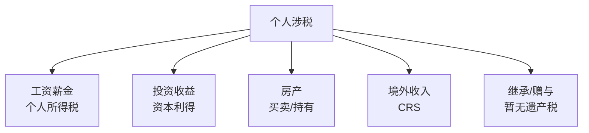
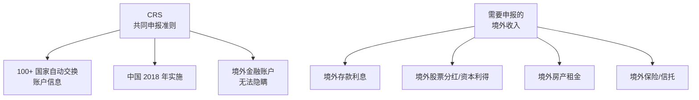

# 💸 税务规划 | Tax Planning

`🟡 进阶`

> 核心问题：合法节税能让你省下多少钱？哪些是必须了解的税务知识？

---

## 一句话总结

**税务不是逃税，是合法利用规则。每年合法节省几万元，长期复利下来是一笔大钱。**

> ⚠️ 本模块是**学习参考**，不是专业税务建议。重大税务决策请咨询专业人士。

---

## 中国个人主要涉税场景



---

## 个人所得税（综合所得）

### 税率表（2025）

| 应纳税所得额（年） | 税率 | 速算扣除数 |
|-------------------|------|-----------|
| ≤ 36,000 | 3% | 0 |
| 36,000 - 144,000 | 10% | 2,520 |
| 144,000 - 300,000 | 20% | 16,920 |
| 300,000 - 420,000 | 25% | 31,920 |
| 420,000 - 660,000 | 30% | 52,920 |
| 660,000 - 960,000 | 35% | 85,920 |
| > 960,000 | 45% | 181,920 |

### 应纳税所得额计算

```
应纳税所得 = 年总收入 - 60,000（起征点）
            - 五险一金
            - 专项附加扣除
            - 其他扣除
```

### 专项附加扣除

| 项目 | 标准 |
|------|------|
| 子女教育 | 每个孩子 2000/月 |
| 婴幼儿照护 | 每个孩子 2000/月 |
| 继续教育 | 400/月 |
| 大病医疗 | 实际发生扣除 |
| 住房贷款利息 | 1000/月 |
| 住房租金 | 800/1100/1500/月（按城市） |
| 赡养老人 | 3000/月（独生子女） |

> 💡 **很多人忘了申报这些扣除，每年白白多交很多税**。一个家庭一年可省 1-3 万。

---

## 投资收益的税务

| 收入类型 | 税务处理 |
|----------|---------|
| 国内股票买卖差价 | **免税**（A 股个人投资者） |
| 股票分红 | 持有 < 1 月：20%；1 月-1 年：10%；> 1 年：免税 |
| 债券利息（国债） | 免税 |
| 债券利息（企业债） | 20% |
| 公募基金分红 | 免税 |
| 银行存款利息 | 免税（暂） |
| 港股通买卖差价 | 暂免征 |
| 港股通分红 | 20% |
| 境外股票 | 20%（自行申报） |

> 💡 中国 A 股**买卖差价免税**，这是相对其他市场的巨大优势。

---

## 房产税务

| 场景 | 税费 |
|------|------|
| 购买首套（家庭唯一） | 契税 1% |
| 购买二套 | 契税 3-5% |
| 卖出（持有 > 5 年且唯一） | 免征个税和增值税 |
| 卖出（其他情况） | 个税 1-2%（差额 20%） |
| 持有 | 暂无房产税（试点中） |

> ⚠️ "满五唯一"是房产交易最优惠的状态。

---

## 境外收入（CRS）



中国税务居民需就**全球收入**纳税。

---

## 合法节税的几种方式

### 1. 用足专项附加扣除

每月通过个税 App 申报。

### 2. 投资收益的税务优化

```
✅ 持有 A 股 > 1 年再卖出（如有分红）
✅ 多投 ETF/指数基金（管理费低 + 分红免税）
✅ 国债逆回购（利息免税）
✅ 货币基金（利息免税）
```

### 3. 房产交易时机

```
✅ 满五唯一再卖（免个税+增值税）
✅ 夫妻间过户（部分情况免税）
```

### 4. 商业养老/医疗保险税前扣除

每年最多 12,000 元/年（企业年金类似）。

### 5. 公益捐赠抵扣

捐赠金额 < 应纳税所得 30% 部分可全额扣除。

---

## 高净值人群的税务考量

| 工具 | 用途 |
|------|------|
| 家族信托 | 资产隔离 + 税务规划 |
| 保险金信托 | 财富传承 |
| 离岸架构 | 国际化资产配置 |
| 慈善基金会 | 长期资产 + 节税 |

> ⚠️ 这些工具复杂且涉及反避税，必须专业人士操作。

---

## 美国与中国税务对比（出海/移民参考）

| | 中国 | 美国 |
|--|------|------|
| 个税最高 | 45% | 联邦 37% + 州税 |
| 资本利得 | A 股免税 | 短期 ~37%, 长期 0-20% |
| 股息 | 持有 > 1 年免 | 0-20% |
| 房产税 | 暂无（试点） | 1-2%/年 |
| 遗产税 | 无 | 40%（高额免税） |
| 税务居民 | 183 天 | 公民身份/绿卡/183 天 |
| 全球征税 | 是 | 是（公民+绿卡） |

> ⚠️ 美国是少数几个对**公民全球征税**的国家。这就是为什么有些人放弃美国国籍（避税考虑）。

---

## 行动清单

- [ ] 每年 3-6 月查看个税年度汇算
- [ ] 申报所有专项附加扣除
- [ ] 投资优先选择税收优惠工具
- [ ] 保留所有税务凭证（5 年）
- [ ] 高收入或复杂情况咨询税务师
