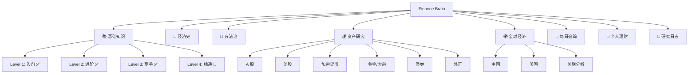
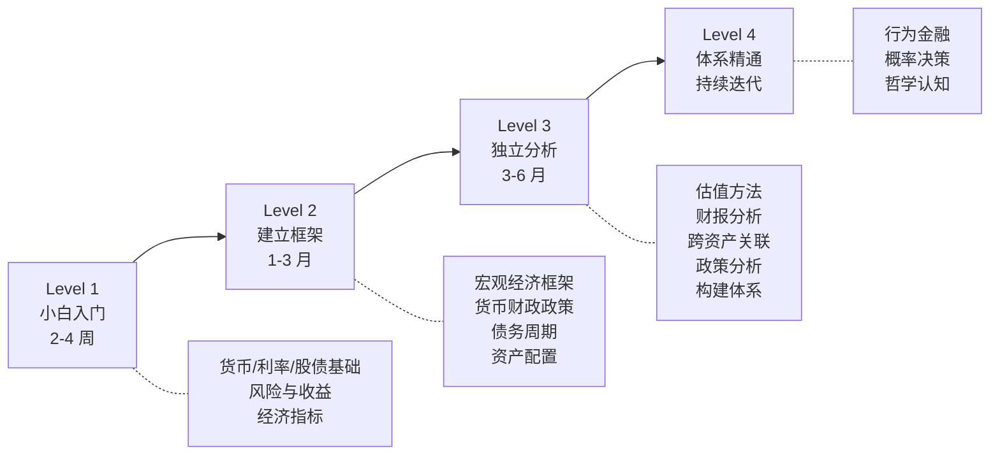

# 🧠 Finance Brain — 个人经济学知识库

> 从零开始，系统学习经济学与金融投资。理解世界经济运转的底层逻辑，做出更好的财务决策。

[]() []() []()

---

## 🗺️ 知识地图



---

## 📂 目录结构

| 目录 | 内容 | 状态 |
|------|------|------|
| [00-foundations](./00-foundations/) | 金融基础知识（小白→精通） | Level 1-3 完成，Level 4 起步 |
| [01-history](./01-history/) | 经济史与危机复盘 | 1929/1971/1989/2008/2020 已写 |
| [02-methodology](./02-methodology/) | 投研方法论与分析框架 | 框架/风险已起步 |
| [03-assets](./03-assets/) | 各资产类别深度研究 | 9 大资产入口完成 |
| [04-global-economy](./04-global-economy/) | 全球经济观察与关联分析 | 6 国 + 关联完成 |
| [05-daily-tracking](./05-daily-tracking/) | 每日/每周事件追踪 | 模板 + 指标解读完成 |
| [06-personal-finance](./06-personal-finance/) | 个人理财实操 | 6 大主题完成 |
| [07-journal](./07-journal/) | 研究日志与决策记录 | 模板 + 示范完成 |
| [08-resources](./08-resources/) | 书单、数据源、课程、论文 | 完成 |

---

## 🎯 学习路线（推荐）



详细学习路径：[ROADMAP.md](./ROADMAP.md)

---

## 📖 已完成的核心内容

### Level 1：小白入门（8 篇全完成 ✅）
1. [货币的本质](./00-foundations/level-1-beginner/01-money.md)
2. [利率与通胀](./00-foundations/level-1-beginner/02-interest-and-inflation.md)
3. [银行体系](./00-foundations/level-1-beginner/03-banking-system.md)
4. [股票基础](./00-foundations/level-1-beginner/04-stocks-101.md)
5. [债券基础](./00-foundations/level-1-beginner/05-bonds-101.md)
6. [基金与 ETF](./00-foundations/level-1-beginner/06-funds-and-etf.md)
7. [风险与收益](./00-foundations/level-1-beginner/07-risk-and-return.md)
8. [经济指标入门](./00-foundations/level-1-beginner/08-economic-indicators.md)

### Level 2：建立框架（8 篇全完成 ✅）
1. [宏观经济学全景图](./00-foundations/level-2-intermediate/01-macro-overview.md)
2. [经济周期](./00-foundations/level-2-intermediate/02-business-cycle.md)
3. [货币政策深入](./00-foundations/level-2-intermediate/03-monetary-policy.md)
4. [财政政策](./00-foundations/level-2-intermediate/04-fiscal-policy.md)
5. [国际贸易与汇率](./00-foundations/level-2-intermediate/05-trade-and-fx.md)
6. [金融市场结构](./00-foundations/level-2-intermediate/06-market-structure.md)
7. [信用与债务周期](./00-foundations/level-2-intermediate/07-credit-cycle.md)
8. [资产配置入门](./00-foundations/level-2-intermediate/08-asset-allocation.md)

### Level 3：独立分析（8 篇全完成 ✅）
1. [估值方法论](./00-foundations/level-3-advanced/01-valuation.md)
2. [财务报表深度分析](./00-foundations/level-3-advanced/02-financial-statements.md)
3. [行业研究框架](./00-foundations/level-3-advanced/03-industry-research.md)
4. [宏观策略分析](./00-foundations/level-3-advanced/04-macro-strategy.md)
5. [跨资产关联分析](./00-foundations/level-3-advanced/05-cross-asset.md)
6. [政策分析框架](./00-foundations/level-3-advanced/06-policy-analysis.md)
7. [市场微观结构](./00-foundations/level-3-advanced/07-market-microstructure.md)
8. [构建投资体系](./00-foundations/level-3-advanced/08-investment-system.md)

### Level 4：体系精通（持续建设中 🚧）
1. [行为金融学](./00-foundations/level-4-expert/01-behavioral-finance.md) ✅
2. 概率与决策（待建）
3. 全球宏观策略（待建）
4. ...

### 经济史专题（5 篇核心 ✅）
- [1929 大萧条](./01-history/crises/1929-great-depression.md)
- [1971 关闭黄金窗口](./01-history/us/1971-gold-window.md)
- [1989 日本泡沫](./01-history/crises/1989-japan-bubble.md)
- [2008 全球金融危机](./01-history/crises/2008-global-financial-crisis.md)
- [2020 新冠疫情冲击](./01-history/crises/2020-covid-shock.md)

### 全球经济关联（核心已完成）
- [全球经济关联总览](./04-global-economy/connections/)
- [美元霸权与全球货币体系](./04-global-economy/connections/dollar-hegemony.md)
- [中美经济周期错位](./04-global-economy/connections/china-us-cycle-divergence.md)

### 资产研究（9 大资产已完成）
- [A 股](./03-assets/a-shares/)
- [美股](./03-assets/us-stocks/)
- [港股](./03-assets/hk-shares/)
- [债券](./03-assets/bonds/)
- [大宗商品](./03-assets/commodities/) | [黄金专题](./03-assets/commodities/gold/)
- [外汇](./03-assets/fx/)
- [加密货币](./03-assets/crypto/)
- [房地产](./03-assets/real-estate/)

---

## 🚀 快速开始

| 你是谁 | 从哪开始 |
|--------|----------|
| **完全零基础** | [Level 1 货币的本质](./00-foundations/level-1-beginner/01-money.md) |
| **想理解世界经济** | [全球经济关联](./04-global-economy/connections/) |
| **想跟踪市场** | [每日追踪框架](./05-daily-tracking/) + [指标解读](./05-daily-tracking/indicators/) |
| **想管好自己的钱** | [个人理财](./06-personal-finance/) |
| **想做投资分析** | [Level 3 估值](./00-foundations/level-3-advanced/01-valuation.md) |
| **看历史镜鉴** | [危机复盘](./01-history/crises/) |

---

## 📌 设计理念

- **中文为主，术语保留英文**（Fed、FOMC、CPI、ETF、DCF…）
- **大量 Mermaid 图表**辅助理解（流程图、时间线、对比矩阵）
- **每篇都有"核心问题"**，避免空泛
- **每篇都有"延伸思考"**，刺激自己深入
- **持续建设，越来越完整**

---

## 🛠️ 工具

- [决策记录模板](./templates/decision-log.md) — 记录每一次操作的"为什么"
- [公司研究模板](./templates/company-research.md) — 系统研究一家公司
- [读书笔记模板](./templates/book-note.md) — 读完写下"我学到了什么"
- [每日追踪模板](./05-daily-tracking/templates/daily-template.md)
- [每周复盘模板](./05-daily-tracking/templates/weekly-template.md)

---

## 💡 持续建设

这个知识库**还在持续填充内容**。当前完成度：

```
基础课程：⬛⬛⬛⬛⬛⬛⬛⬛⬛⬜ 90% (Level 1-3 完成，Level 4 进行中)
经济史：  ⬛⬛⬛⬛⬛⬛⬜⬜⬜⬜ 60%
方法论：  ⬛⬛⬛⬛⬛⬜⬜⬜⬜⬜ 50%
资产研究：⬛⬛⬛⬛⬛⬛⬜⬜⬜⬜ 60% (各资产入口已完成，子专题待深入)
全球经济：⬛⬛⬛⬛⬛⬛⬜⬜⬜⬜ 60%
个人理财：⬛⬛⬛⬛⬛⬛⬜⬜⬜⬜ 60%
每日追踪：⬛⬛⬛⬛⬜⬜⬜⬜⬜⬜ 40% (框架完成，需要持续记录)
```

---

*持续建设中 🏗️ — 一点一点，把经济学的拼图拼完整。*
