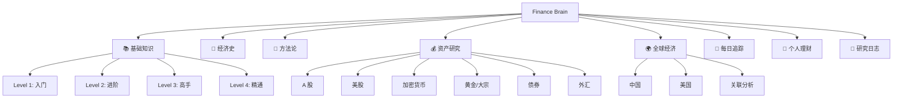
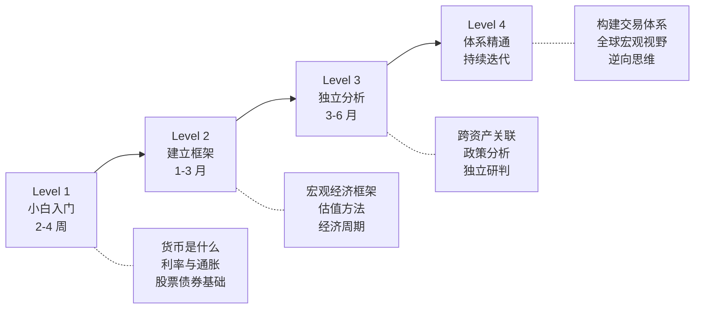

# 🧠 Finance Brain — 个人经济学知识库

> 从零开始，系统学习经济学与金融投资。理解世界经济运转的底层逻辑，做出更好的财务决策。

## 🗺️ 知识地图

## 📂 目录结构

| 目录 | 内容 | 更新频率 |
|------|------|----------|
| [00-foundations](./00-foundations/) | 金融基础知识（小白→精通） | 沉淀型，写一次反复看 |
| [01-history](./01-history/) | 经济史与危机复盘 | 沉淀型 |
| [02-methodology](./02-methodology/) | 投研方法论与分析框架 | 沉淀型 |
| [03-assets](./03-assets/) | 各资产类别深度研究 | 中频更新 |
| [04-global-economy](./04-global-economy/) | 全球经济观察与关联分析 | 中频更新 |
| [05-daily-tracking](./05-daily-tracking/) | 每日/每周事件追踪与分析 | 高频更新 |
| [06-personal-finance](./06-personal-finance/) | 个人理财实操 | 低频更新 |
| [07-journal](./07-journal/) | 个人研究日志与决策记录 | 高频更新 |
| [08-resources](./08-resources/) | 书单、数据源、工具 | 低频更新 |

## 🎯 学习路线

## 🚀 快速开始

1. **零基础？** → 从 [Level 1: 小白入门](./00-foundations/level-1-beginner/) 开始
2. **有基础想深入？** → 看 [方法论](./02-methodology/) 和 [资产研究](./03-assets/)
3. **想跟踪市场？** → 看 [每日追踪](./05-daily-tracking/) 和 [全球经济](./04-global-economy/)
4. **想管好自己的钱？** → 看 [个人理财](./06-personal-finance/)

## 📌 使用说明

- **中文为主，术语保留英文**（如 GDP、CPI、P/E、DeFi）
- 每篇笔记顶部有 **难度标签**：`🟢 入门` `🟡 进阶` `🔴 高级`
- 大量使用 **Mermaid 图表** 辅助理解
- 欢迎通过 Issues 提问讨论，通过 Discussions 分享观点

---

*持续建设中 🏗️ — 一点一点，把经济学的拼图拼完整。*
