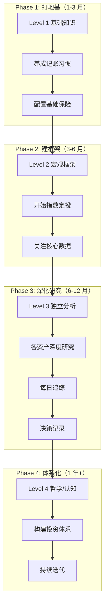
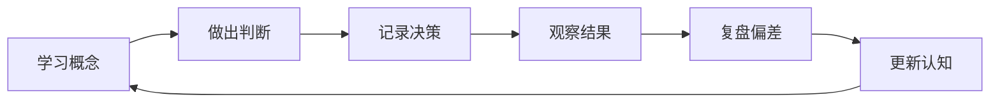

# 🗺️ Finance Brain 学习路线图

> 给自己的指南：如何系统使用这个知识库，建立完整的经济学和投资认知。

---

## 整体框架



---

## Phase 1: 打地基（1-3 月）

### 学习目标

- 理解最基本的金融概念
- 看得懂财经新闻
- 建立基础的财务管理习惯

### 阅读清单

#### 必读（按顺序）
- [ ] [01 货币的本质](./00-foundations/level-1-beginner/01-money.md)
- [ ] [02 利率与通胀](./00-foundations/level-1-beginner/02-interest-and-inflation.md)
- [ ] [03 银行体系](./00-foundations/level-1-beginner/03-banking-system.md)
- [ ] [04 股票基础](./00-foundations/level-1-beginner/04-stocks-101.md)
- [ ] [05 债券基础](./00-foundations/level-1-beginner/05-bonds-101.md)
- [ ] [06 基金与 ETF](./00-foundations/level-1-beginner/06-funds-and-etf.md)
- [ ] [07 风险与收益](./00-foundations/level-1-beginner/07-risk-and-return.md)
- [ ] [08 经济指标入门](./00-foundations/level-1-beginner/08-economic-indicators.md)

#### 实操清单
- [ ] [现金流管理](./06-personal-finance/basics/cashflow.md) — 开始记账
- [ ] [应急资金](./06-personal-finance/basics/emergency-fund.md) — 留 3-6 个月支出
- [ ] [保险配置](./06-personal-finance/insurance/) — 配齐基础保险

#### 推荐书籍
- 📖 《经济学原理》— 曼昆（精读核心章节）
- 📖 《漫步华尔街》— 马尔基尔
- 🎬 《经济机器是怎样运行的》— 达里奥（30 分钟视频）

---

## Phase 2: 建框架（3-6 月）

### 学习目标

- 建立宏观经济分析框架
- 理解经济周期与资产轮动
- 开始系统性投资

### 阅读清单

#### 必读
- [ ] [Level 2 全套 8 篇](./00-foundations/level-2-intermediate/)
- [ ] [资产配置入门](./06-personal-finance/allocation/)
- [ ] [全球经济关联分析](./04-global-economy/connections/)

#### 资产研究入门
- [ ] [A 股市场](./03-assets/a-shares/)
- [ ] [美股市场](./03-assets/us-stocks/)
- [ ] [加密货币](./03-assets/crypto/)
- [ ] [黄金](./03-assets/commodities/gold/)
- [ ] [外汇](./03-assets/fx/)

#### 实操清单
- [ ] 制定个人资产配置方案
- [ ] 开始基金定投（沪深 300 + 标普 500）
- [ ] 开通个人养老金账户（如果适合）
- [ ] 每周看一次 [每日追踪模板](./05-daily-tracking/)

#### 推荐书籍
- 📖 《周期》— 霍华德·马克斯
- 📖 《投资最重要的事》— 霍华德·马克斯
- 📖 《指数基金投资指南》— 银行螺丝钉

---

## Phase 3: 深化研究（6-12 月）

### 学习目标

- 能独立做投研分析
- 形成自己的市场判断
- 建立决策记录系统

### 阅读清单

#### 必读
- [ ] [Level 3 全套](./00-foundations/level-3-advanced/)
- [ ] [估值方法](./02-methodology/valuation/)
- [ ] [风险管理](./02-methodology/risk/)
- [ ] [经典框架](./02-methodology/frameworks/)

#### 经济史
- [ ] [2008 金融危机](./01-history/crises/2008-global-financial-crisis.md)
- [ ] [日本经济](./04-global-economy/japan/)
- [ ] 至少 3 篇其他危机案例

#### 中国经济
- [ ] [中国经济](./04-global-economy/china/)
- [ ] [中国经济史](./01-history/china/)
- [ ] [房地产](./03-assets/real-estate/)

#### 实操清单
- [ ] 每天追踪市场（10 分钟）
- [ ] 每周复盘一次（30 分钟）
- [ ] 每次操作写[决策记录](./templates/decision-log.md)
- [ ] 每月写一份月度宏观分析
- [ ] 至少深度研究 3 个行业 / 3 家公司

#### 推荐书籍
- 📖 《聪明的投资者》— 格雷厄姆
- 📖 《债务危机》— 达里奥
- 📖 《股票大作手回忆录》— 利弗莫尔
- 📖 《这次不一样》— 莱因哈特 & 罗格夫

---

## Phase 4: 体系化（1 年+）

### 学习目标

- 形成自己的投资哲学
- 建立可持续的决策体系
- 持续进化

### 阅读清单

- [ ] [Level 4 全套](./00-foundations/level-4-expert/)
- [ ] 全部资产模块深度阅读
- [ ] 经济史所有重大事件

#### 实操清单
- [ ] 写下你的"投资准则"（10 条以内）
- [ ] 定期复盘（季度 + 年度）
- [ ] 维护个人 Watchlist 和持仓记录
- [ ] 持续迭代和优化体系

#### 推荐书籍
- 📖 《思考，快与慢》— 卡尼曼
- 📖 《反脆弱》— 塔勒布
- 📖 《穷查理宝典》— 芒格
- 📖 《原则》— 达里奥
- 📖 《金融炼金术》— 索罗斯

---

## 学习心法

### 1. 慢就是快

不要赶进度。每个概念真正理解了再前进。比起读完 10 本书，**深度理解 1 本书更有价值**。

### 2. 知行合一

光看不练等于零。学完概念立刻：
- 找一个真实案例对照
- 写一段自己的理解
- 用小钱实战验证

### 3. 建立反馈循环



### 4. 大量阅读，少量行动

```
看 100 个观点 → 记录 10 个有用的 → 测试 3 个 → 长期坚持 1 个
```

### 5. 和聪明人在一起

- 找几个志同道合的朋友定期讨论
- 在 GitHub Discussions 里开放交流
- 关注 5-10 个高质量内容源（不要更多）

---

## 一年后的你

理想状态下，**坚持学习 + 实操 + 记录 1 年**后，你应该：

- ✅ 看任何一条财经新闻，能立刻分析它的影响链
- ✅ 有自己的资产配置方案，不会被市场情绪左右
- ✅ 知道当前世界经济和中国经济的核心矛盾
- ✅ 有 30+ 篇研究笔记和决策记录
- ✅ 投资业绩稳定（不一定多高，但很少犯大错）
- ✅ 对很多"网红观点"有免疫力

---

## 永远记住

> "投资是一场漫长的修行。重要的不是这个月赚了多少，而是 10 年后你站在哪里。"

> "市场永远比你聪明。保持谦逊，保持好奇，保持学习。"
